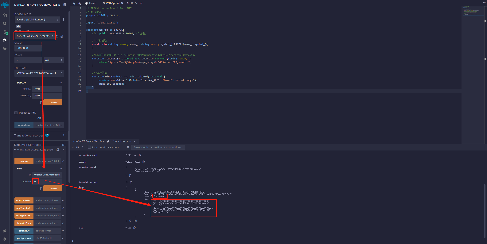
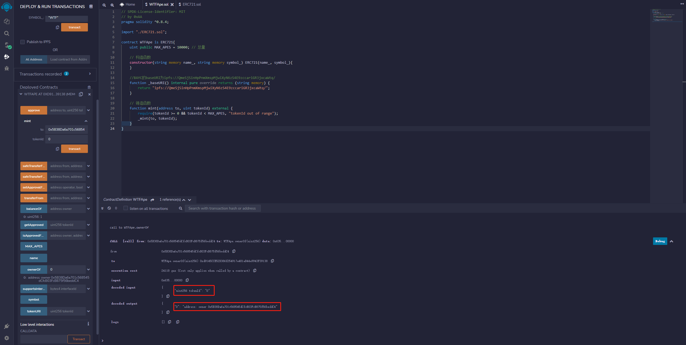

# WTF Introdução Simples ao Solidity: 34. ERC721

Recentemente, tenho estudado Solidity novamente para revisar os detalhes e escrever um "WTF Introdução Simples ao Solidity" para iniciantes (programadores experientes podem procurar outros tutoriais). Serão lançadas de 1 a 3 aulas por semana.

Siga-me no Twitter: [@0xAA_Science](https://twitter.com/0xAA_Science)

Junte-se à comunidade WTF Scientists, há um método para entrar no grupo do WeChat: [link](https://discord.gg/5akcruXrsk)

Todo o código e tutoriais estão disponíveis no GitHub (1024 estrelas para obter certificação do curso, 2048 estrelas para obter um NFT da comunidade): [github.com/AmazingAng/WTFSolidity](https://github.com/AmazingAng/WTFSolidity)

-----

Moedas como `BTC` e `ETH` são exemplos de tokens fungíveis, ou seja, a primeira unidade de `BTC` minerada é igual à décima milésima unidade de `BTC`, elas são equivalentes. No entanto, muitos itens no mundo são únicos, como imóveis, antiguidades, arte virtual, entre outros, e não podem ser representados por tokens fungíveis. Por isso, o padrão `ERC721` foi proposto pelo Ethereum EIP721 para representar itens não fungíveis. Nesta aula, vamos apresentar o padrão `ERC721` e emitir um NFT com base nele.

## EIP e ERC

Aqui está um ponto que precisa ser entendido: o título desta seção é `ERC721`, mas também menciona `EIP721`, qual é a relação entre eles?

`EIP` significa "Ethereum Improvement Proposals" (Propostas de Melhoria do Ethereum) e são propostas de melhorias para o Ethereum feitas pela comunidade de desenvolvedores do Ethereum. Eles são uma série de documentos numerados, semelhantes aos RFCs da IETF na Internet.

Um `EIP` pode ser uma melhoria em qualquer área do ecossistema Ethereum, como novos recursos, padrões de tokens (`ERC20`, `ERC721`), registro de nomes (`ERC26`, `ERC13`), URI (`ERC67`), formato de biblioteca/pacote (`EIP82`), formato de carteira (`EIP75`, `EIP85`), entre outros.

Os padrões `ERC` são um fator importante para o desenvolvimento do Ethereum, como `ERC20`, `ERC223`, `ERC721`, `ERC777`, que tiveram um grande impacto no ecossistema Ethereum.

Portanto, a conclusão final é que o `EIP` inclui o `ERC`.

**Somente após concluir esta aula, você entenderá por que começamos com `ERC165` em vez de `ERC721`. Se quiser ver a conclusão, vá diretamente para a parte inferior.**

## ERC165

Por meio do padrão `ERC165` (https://eips.ethereum.org/EIPS/eip-165), um contrato inteligente pode declarar as interfaces que ele suporta para que outros contratos possam verificar. Em resumo, o `ERC165` é usado para verificar se um contrato inteligente suporta as interfaces `ERC721` e `ERC1155`.

A interface do contrato `IERC165` declara apenas uma função `supportsInterface`, que recebe o `interfaceId` da interface a ser verificada e retorna `true` se o contrato implementar essa interface:

```solidity
interface IERC165 {
    /**
     * @dev Retorna true se o contrato implementar o `interfaceId` consultado
     * Veja as regras em: https://eips.ethereum.org/EIPS/eip-165#how-interfaces-are-identified[Seção do EIP]
     *
     */
    function supportsInterface(bytes4 interfaceId) external view returns (bool);
}
```

Podemos ver como o `ERC721` implementa a função `supportsInterface()`:

```solidity
    function supportsInterface(bytes4 interfaceId) external pure override returns (bool)
    {
        return
            interfaceId == type(IERC721).interfaceId ||
            interfaceId == type(IERC165).interfaceId;
    }
```

Quando o `interfaceId` consultado é o da interface `IERC721` ou `IERC165`, ele retorna `true`; caso contrário, retorna `false`.

## IERC721

`IERC721` é a interface do padrão `ERC721` e define as funções básicas que o `ERC721` deve implementar. Ele usa o `tokenId` para representar um token não fungível específico, e tanto a autorização quanto a transferência de tokens devem especificar o `tokenId`, enquanto o `ERC20` só precisa especificar a quantidade de tokens a serem transferidos.

```solidity
/**
 * @dev Interface do padrão ERC721.
 */
interface IERC721 is IERC165 {
    event Transfer(address indexed from, address indexed to, uint256 indexed tokenId);
    event Approval(address indexed owner, address indexed approved, uint256 indexed tokenId);
    event ApprovalForAll(address indexed owner, address indexed operator, bool approved);

    function balanceOf(address owner) external view returns (uint256 balance);

    function ownerOf(uint256 tokenId) external view returns (address owner);

    function safeTransferFrom(
        address from,
        address to,
        uint256 tokenId,
        bytes calldata data
    ) external;

    function safeTransferFrom(
        address from,
        address to,
        uint256 tokenId
    ) external;

    function transferFrom(
        address from,
        address to,
        uint256 tokenId
    ) external;

    function approve(address to, uint256 tokenId) external;

    function setApprovalForAll(address operator, bool _approved) external;

    function getApproved(uint256 tokenId) external view returns (address operator);

    function isApprovedForAll(address owner, address operator) external view returns (bool);
}
```

### Eventos do IERC721
`IERC721` inclui três eventos, sendo que `Transfer` e `Approval` também estão presentes no `ERC20`.
- Evento `Transfer`: é emitido ao transferir um token, registrando o endereço de envio `from`, o endereço de recebimento `to` e o `tokenId`.
- Evento `Approval`: é emitido ao autorizar um endereço, registrando o endereço do proprietário `owner`, o endereço autorizado `approved` e o `tokenId`.
- Evento `ApprovalForAll`: é emitido ao autorizar vários endereços, registrando o endereço do proprietário `owner`, o endereço autorizado `operator` e se a autorização está ativada ou desativada `approved`.

### Funções do IERC721
- `balanceOf`: retorna a quantidade de NFTs que um endereço possui.
- `ownerOf`: retorna o endereço do proprietário de um determinado `tokenId`.
- `transferFrom`: transfere um NFT, especificando o endereço de envio `from`, o endereço de recebimento `to` e o `tokenId`.
- `safeTransferFrom`: transfere um NFT com segurança (se o endereço de recebimento for um contrato, ele deve implementar a interface `ERC721Receiver`). Especifica o endereço de envio `from`, o endereço de recebimento `to` e o `tokenId`.
- `approve`: autoriza outro endereço a usar seu NFT. Especifica o endereço autorizado `approve` e o `tokenId`.
- `getApproved`: consulta qual endereço foi autorizado para um determinado `tokenId`.
- `setApprovalForAll`: autoriza um endereço a gerenciar todos os NFTs de um determinado proprietário `operator`.
- `isApprovedForAll`: consulta se um endereço autorizou outro endereço a gerenciar todos os NFTs de um determinado proprietário `operator`.
- `safeTransferFrom`: sobrecarga da função `safeTransferFrom`, que inclui o parâmetro `data`.

## IERC721Receiver

Se um contrato não implementar as funções relacionadas ao `ERC721`, o NFT transferido para ele será perdido e não poderá ser transferido novamente. Para evitar transferências acidentais, o `ERC721` implementa a função `safeTransferFrom()`, que exige que o contrato de destino implemente a interface `IERC721Receiver` para receber o token `ERC721`, caso contrário, a transferência será revertida. A interface `IERC721Receiver` inclui apenas uma função `onERC721Received()`.

```solidity
// Interface do receptor ERC721: o contrato deve implementar esta interface para receber ERC721 por transferência segura
interface IERC721Receiver {
    function onERC721Received(
        address operator,
        address from,
        uint tokenId,
        bytes calldata data
    ) external returns (bytes4);
}
```

Podemos ver como o `ERC721` usa o `_checkOnERC721Received` para garantir que o contrato de destino implemente a função `onERC721Received()` (retornando o seletor `onERC721Received`):

```solidity
    function _checkOnERC721Received(
        address from,
        address to,
        uint tokenId,
        bytes memory _data
    ) private returns (bool) {
        if (to.isContract()) {
            return
                IERC721Receiver(to).onERC721Received(
                    msg.sender,
                    from,
                    tokenId,
                    _data
                ) == IERC721Receiver.onERC721Received.selector;
        } else {
            return true;
        }
    }
```

## IERC721Metadata
`IERC721Metadata` é uma interface de extensão do `ERC721` que define três funções comuns para consultar metadados:

- `name()`: retorna o nome do token.
- `symbol()`: retorna o símbolo do token.
- `tokenURI()`: consulta o URL do metadado com base no `tokenId`, uma função específica do `ERC721`.

```solidity
interface IERC721Metadata is IERC721 {
    function name() external view returns (string memory);

    function symbol() external view returns (string memory);

    function tokenURI(uint256 tokenId) external view returns (string memory);
}
```

## Contrato Principal do ERC721
O contrato principal do `ERC721` implementa todas as funcionalidades definidas pelas interfaces `IERC721`, `IERC165` e `IERC721Metadata`. Ele inclui 4 variáveis de estado e 17 funções. A implementação é bastante simples, e a funcionalidade de cada função está documentada nos comentários do código:

```solidity
// SPDX-License-Identifier: MIT
// por 0xAA
pragma solidity ^0.8.4;

import "./IERC165.sol";
import "./IERC721.sol";
import "./IERC721Receiver.sol";
import "./IERC721Metadata.sol";
import "./Address.sol";
import "./String.sol";

contract ERC721 is IERC721, IERC721Metadata{
    using Address for address; // usando a biblioteca Address para verificar se um endereço é um contrato
    using Strings for uint256; // usando a biblioteca Strings para converter um uint256 em uma string

    // Nome do token
    string public override name;
    // Símbolo do token
    string public override symbol;
    // Mapeamento do tokenId para o endereço do proprietário
    mapping(uint => address) private _owners;
    // Mapeamento do endereço para a quantidade de tokens que ele possui
    mapping(address => uint) private _balances;
    // Mapeamento do tokenId para o endereço autorizado
    mapping(uint => address) private _tokenApprovals;
    // Mapeamento do endereço do proprietário para o endereço autorizado
    mapping(address => mapping(address => bool)) private _operatorApprovals;

    /**
     * Construtor, inicializa o `name` e o `symbol`.
     */
    constructor(string memory name_, string memory symbol_) {
        name = name_;
        symbol = symbol_;
    }

    // Implementação da função supportsInterface da interface IERC165
    function supportsInterface(bytes4 interfaceId)
        external
        pure
        override
        returns (bool)
    {
        return
            interfaceId == type(IERC721).interfaceId ||
            interfaceId == type(IERC165).interfaceId ||
            interfaceId == type(IERC721Metadata).interfaceId;
    }

    // Implementação da função balanceOf da interface IERC721, usando a variável _balances para consultar a quantidade de tokens de um endereço
    function balanceOf(address owner) external view override returns (uint) {
        require(owner != address(0), "owner = zero address");
        return _balances[owner];
    }

    // Implementação da função ownerOf da interface IERC721, usando a variável _owners para consultar o proprietário de um tokenId
    function ownerOf(uint tokenId) public view override returns (address owner) {
        owner = _owners[tokenId];
        require(owner != address(0), "token doesn't exist");
    }

    // Implementação da função isApprovedForAll da interface IERC721, usando a variável _operatorApprovals para consultar se um endereço autorizou outro endereço a gerenciar todos os NFTs
    function isApprovedForAll(address owner, address operator)
        external
        view
        override
        returns (bool)
    {
        return _operatorApprovals[owner][operator];
    }

    // Implementação da função setApprovalForAll da interface IERC721, autorizando um endereço a gerenciar todos os NFTs de um proprietário. Chama a função _setApprovalForAll.
    function setApprovalForAll(address operator, bool approved) external override {
        _operatorApprovals[msg.sender][operator] = approved;
        emit ApprovalForAll(msg.sender, operator, approved);
    }

    // Implementação da função getApproved da interface IERC721, usando a variável _tokenApprovals para consultar o endereço autorizado de um tokenId
    function getApproved(uint tokenId) external view override returns (address) {
        require(_owners[tokenId] != address(0), "token doesn't exist");
        return _tokenApprovals[tokenId];
    }
     
    // Função de autorização. Ajusta a variável _tokenApprovals para autorizar o endereço to a operar o tokenId e emite o evento Approval.
    function _approve(
        address owner,
        address to,
        uint tokenId
    ) private {
        _tokenApprovals[tokenId] = to;
        emit Approval(owner, to, tokenId);
    }

    // Implementação da função approve da interface IERC721, autorizando um endereço a operar um tokenId. Condições: to não é o proprietário e msg.sender é o proprietário ou um endereço autorizado. Chama a função _approve.
    function approve(address to, uint tokenId) external override {
        address owner = _owners[tokenId];
        require(
            msg.sender == owner || _operatorApprovals[owner][msg.sender],
            "not owner nor approved for all"
        );
        _approve(owner, to, tokenId);
    }

    // Consulta se o spender pode usar o tokenId (ele é o proprietário ou um endereço autorizado).
    function _isApprovedOrOwner(
        address owner,
        address spender,
        uint tokenId
    ) private view returns (bool) {
        return (spender == owner ||
            _tokenApprovals[tokenId] == spender ||
            _operatorApprovals[owner][spender]);
    }

    /*
     * Função de transferência. Ajusta as variáveis _balances e _owners para transferir o tokenId de from para to e emite o evento Transfer.
     * Condições:
     * 1. O tokenId é possuído por from.
     * 2. to não é o endereço zero.
     */
    function _transfer(
        address owner,
        address from,
        address to,
        uint tokenId
    ) private {
        require(from == owner, "not owner");
        require(to != address(0), "transfer to the zero address");

        _approve(owner, address(0), tokenId);

        _balances[from] -= 1;
        _balances[to] += 1;
        _owners[tokenId] = to;

        emit Transfer(from, to, tokenId);
    }
    
    // Implementação da função transferFrom da interface IERC721, uma transferência normal. Chama a função _transfer.
    function transferFrom(
        address from,
        address to,
        uint tokenId
    ) external override {
        address owner = ownerOf(tokenId);
        require(
            _isApprovedOrOwner(owner, msg.sender, tokenId),
            "not owner nor approved"
        );
        _transfer(owner, from, to, tokenId);
    }

    /**
     * Transferência segura. Transfere o tokenId de from para to com segurança, verificando se o contrato de destino implementa a interface ERC721Receiver para evitar que o tokenId seja perdido. Chama as funções _transfer e _checkOnERC721Received. Condições:
     * from não é o endereço zero.
     * to não é o endereço zero.
     * O tokenId existe e é possuído por from.
     * Se to for um contrato, ele deve implementar a função onERC721Received.
     */
    function _safeTransfer(
        address owner,
        address from,
        address to,
        uint tokenId,
        bytes memory _data
    ) private {
        _transfer(owner, from, to, tokenId);
        require(_checkOnERC721Received(from, to, tokenId, _data), "not ERC721Receiver");
    }

    /**
     * Implementação da função safeTransferFrom da interface IERC721, uma transferência segura. Chama a função _safeTransfer.
     */
    function safeTransferFrom(
        address from,
        address to,
        uint tokenId,
        bytes memory _data
    ) public override {
        address owner = ownerOf(tokenId);
        require(
            _isApprovedOrOwner(owner, msg.sender, tokenId),
            "not owner nor approved"
        );
        _safeTransfer(owner, from, to, tokenId, _data);
    }

    // Sobrecarga da função safeTransferFrom
    function safeTransferFrom(
        address from,
        address to,
        uint tokenId
    ) external override {
        safeTransferFrom(from, to, tokenId, "");
    }

    /** 
     * Função de criação. Ajusta as variáveis _balances e _owners para criar o tokenId e transferir para o endereço `to`, e emite o evento `Transfer`. Esta função pode ser chamada por qualquer pessoa, mas é recomendado que os desenvolvedores a modifiquem e adicionem condições específicas.

```solidity
function _mint(address to, uint tokenId) internal virtual {
    require(to != address(0), "mint to zero address");
    require(_owners[tokenId] == address(0), "token already minted");

    _balances[to] += 1;
    _owners[tokenId] = to;

    emit Transfer(address(0), to, tokenId);
}
```

## Emitindo um NFT ERC721

Com o padrão `ERC721`, é muito fácil emitir um NFT na rede Ethereum. Agora, vamos emitir nosso próprio NFT.

Compile os contratos `ERC721` e `WTFApe` no Remix (na ordem correta) e clique no botão de deploy. Insira os parâmetros do construtor, definindo `name_` e `symbol_` como "WTF", e clique em "transact" para fazer o deploy.


Agora, criamos o NFT "WTF". Precisamos executar a função `mint()` para criar alguns tokens para nós mesmos. Na seção da função `mint`, clique no botão à direita para abrir o menu suspenso, insira o endereço da sua conta e o `tokenId`, e clique em "mint" para criar o NFT "WTF" com o `tokenId` 0 para você mesmo.

Você pode abrir o menu de depuração à direita para ver os logs detalhados.

Existem quatro informações importantes dentro dele:
- O evento `Transfer`
- O endereço de criação `0x0000000000000000000000000000000000000000`
- O endereço de recebimento `0x5B38Da6a701c568545dCfcB03FcB875f56beddC4`
- O `tokenId` 0



Usando a função `balanceOf()`, você pode verificar o saldo da sua conta. Insira o seu endereço atual e você verá que possui um NFT, o que significa que a criação foi bem-sucedida.

As informações da conta estão à esquerda, e à direita estão as informações específicas da execução da função.


Você também pode usar a função `ownerOf()` para verificar a qual conta o NFT pertence. Insira o `tokenId` e você verá que o endereço é o seu, confirmando que a consulta está correta.



## Explicação detalhada do ERC165 e ERC721
Como mencionado anteriormente, para evitar que um NFT seja transferido para um contrato que não tenha a capacidade de lidar com NFTs, o contrato de destino deve implementar a interface `ERC721TokenReceiver`:

```solidity
interface ERC721TokenReceiver {
    function onERC721Received(address _operator, address _from, uint256 _tokenId, bytes _data) external returns(bytes4);
}
```

No mundo da programação, seja com interfaces em Java ou traits em Rust (ou bibliotecas em Solidity), todas elas têm um significado semelhante: uma interface é um conjunto de comportamentos (no caso do Solidity, é equivalente a um conjunto de seletores de função), e quando um tipo implementa uma interface, ele indica que possui essa funcionalidade. Portanto, quando um contrato implementa a interface `ERC721TokenReceiver` (mais especificamente, quando implementa a função `onERC721Received`), ele está indicando que possui a capacidade de gerenciar NFTs. A lógica para lidar com NFTs é implementada em outras funções desse contrato.

O padrão ERC721 verifica se o contrato de destino implementa a função `onERC721Received()` por meio do `ERC165`. Mas afinal, o que é o ERC165?

O ERC165 é um padrão técnico que indica quais interfaces um contrato implementa. Como mencionado anteriormente, implementar uma interface significa que o contrato possui uma determinada funcionalidade. Quando um contrato deseja interagir com outro contrato, ele espera que o contrato de destino possua certas funcionalidades. Portanto, os contratos podem usar o padrão ERC165 para consultar se o contrato de destino possui as capacidades desejadas. 

Tomando como exemplo o contrato ERC721, quando alguém deseja verificar se um contrato é um ERC721, como fazer isso? De acordo com [este link](https://eips.ethereum.org/EIPS/eip-165#how-to-detect-if-a-contract-implements-erc-165), o procedimento de verificação é o seguinte: primeiro, verifique se o contrato implementa o ERC165; em seguida, verifique se o contrato implementa as interfaces específicas desejadas. Neste caso, a interface específica é a IERC721. A IERC721 é a interface básica do ERC721 (existem outras interfaces de extensão, como `ERC721Metadata` e `ERC721Enumerable`):

```solidity
/// Observe que o identificador ERC-165 para esta interface é 0x80ac58cd.
interface ERC721 /* is ERC165 */ {
    event Transfer(address indexed _from, address indexed _to, uint256 indexed _tokenId);

    event Approval(address indexed _owner, address indexed _approved, uint256 indexed _tokenId);

    event ApprovalForAll(address indexed _owner, address indexed _operator, bool _approved);

    function balanceOf(address _owner) external view returns (uint256);

    function ownerOf(uint256 _tokenId) external view returns (address);

    function safeTransferFrom(address _from, address _to, uint256 _tokenId, bytes data) external payable;

    function safeTransferFrom(address _from, address _to, uint256 _tokenId) external payable;

    function transferFrom(address _from, address _to, uint256 _tokenId) external payable;

    function approve(address _approved, uint256 _tokenId) external payable;

    function setApprovalForAll(address _operator, bool _approved) external;

    function getApproved(uint256 _tokenId) external view returns (address);

    function isApprovedForAll(address _owner, address _operator) external view returns (bool);
}
```

O valor **0x80ac58cd** é calculado como `bytes4(keccak256(ERC721.Transfer.selector) ^ keccak256(ERC721.Approval.selector) ^ ··· ^keccak256(ERC721.isApprovedForAll.selector))`, que é a forma definida pelo ERC165.

Portanto, quando alguém deseja verificar se um contrato é um ERC721, ele pode seguir os passos mencionados acima. Se o contrato implementar o ERC165 e o valor de entrada for **0x80ac58cd**, isso significa que o contrato é um ERC721 e a função `supportsInterface` deve retornar `true`.

Além disso, como a função `supportsInterface` é declarada como `virtual`, os usuários desse contrato podem herdar dele e implementar a interface `ERC721Enumerable`. Após implementar as funções necessárias, eles podem substituir a função `supportsInterface` da seguinte forma:

```solidity
function supportsInterface(bytes4 interfaceId) public view virtual returns (bool) {
    return
        interfaceId == 0x01ffc9a7 || // ERC165 Interface ID for ERC165
        interfaceId == 0x80ac58cd || // ERC165 Interface ID for ERC721
        interfaceId == 0x5b5e139f || // ERC165 Interface ID for ERC721Metadata
        interfaceId == 0x780e9d63;   // ERC165 Interface ID for ERC721Enumerable
}
```

**Elegante, simples e altamente expansível.**

## Conclusão
Nesta aula, apresentei o padrão `ERC721`, suas interfaces e sua implementação, com comentários em chinês no código do contrato. Também criamos um NFT gratuito chamado "WTF APE" usando o `ERC721`, com os metadados sendo chamados diretamente do `BAYC`. O padrão `ERC721` está em constante evolução, e as versões mais populares atualmente são `ERC721Enumerable` (para melhorar a acessibilidade dos NFTs) e `ERC721A` (para economizar `gas` na criação).

<!-- This file was translated using AI by repo_ai_translate. For more information, visit https://github.com/marcelojsilva/repo_ai_translate -->