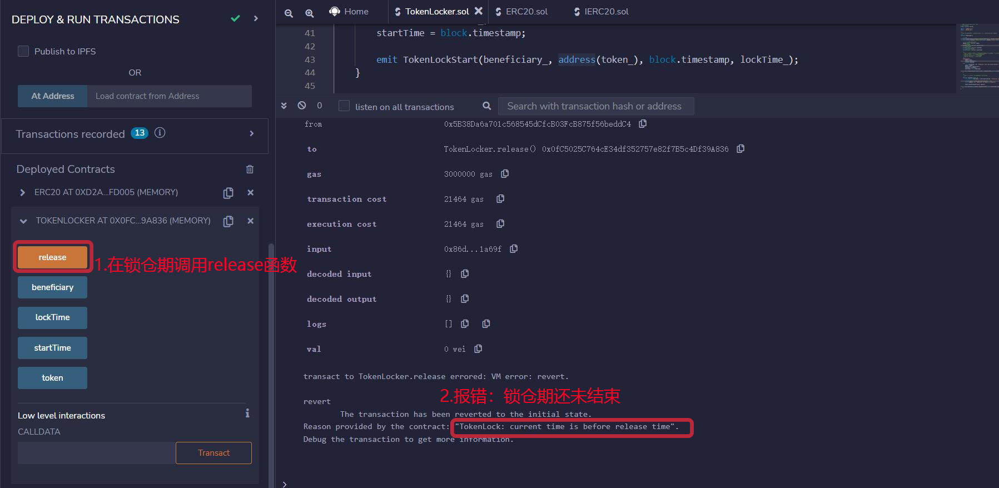

# WTF Solidity Simplified: 44. Token Locker

Recentemente, tenho estudado solidity novamente para revisar os detalhes e escrever um "WTF Solidity Simplified" para iniciantes (programadores experientes podem procurar outros tutoriais). Serão lançadas de 1 a 3 aulas por semana.

Twitter: [@0xAA_Science](https://twitter.com/0xAA_Science)

Comunidade: [Discord](https://discord.gg/5akcruXrsk)｜[Grupo do WeChat](https://docs.google.com/forms/d/e/1FAIpQLSe4KGT8Sh6sJ7hedQRuIYirOoZK_85miz3dw7vA1-YjodgJ-A/viewform?usp=sf_link)｜[Site oficial wtf.academy](https://wtf.academy)

Todo o código e tutoriais estão disponíveis no GitHub: [github.com/AmazingAng/WTFSolidity](https://github.com/AmazingAng/WTFSolidity)

-----

Nesta aula, vamos falar sobre o que são tokens de provedores de liquidez (LP tokens), por que é importante bloquear a liquidez e como escrever um contrato simples de bloqueio de tokens ERC20.

## Token Locker


O Token Locker é um contrato de bloqueio de tempo simples que permite bloquear tokens em um contrato por um determinado período de tempo. Após o término do período de bloqueio, o beneficiário pode resgatar os tokens bloqueados. O Token Locker é geralmente usado para bloquear tokens de provedores de liquidez (LP tokens).

### O que são tokens LP?

No blockchain, os usuários negociam tokens em exchanges descentralizadas (DEX), como a Uniswap. Diferentemente das exchanges centralizadas (CEX), as DEXs usam um mecanismo de provedor de liquidez automatizado (AMM) que requer que os usuários ou projetos forneçam pools de liquidez para permitir que outros usuários comprem e vendam instantaneamente. Simplificando, os usuários/projetos precisam depositar um par de tokens (como ETH/DAI) em um pool de liquidez e, em troca, a DEX emite tokens de provedor de liquidez (LP tokens) para eles, provando que eles depositaram uma determinada quantidade de tokens e permitindo que eles recebam taxas.

### Por que bloquear a liquidez?

Se um projeto retirar repentinamente os tokens LP do pool de liquidez, os investidores não poderão mais resgatar seus tokens, que se tornarão inúteis. Esse tipo de ação é conhecido como "rug-pull" e, somente em 2021, golpes de "rug-pull" enganaram os investidores em mais de US$ 2,8 bilhões em criptomoedas.

No entanto, se os tokens LP estiverem bloqueados em um contrato de Token Locker, o projeto não poderá retirá-los do pool de liquidez antes do término do período de bloqueio, evitando assim o "rug-pull". Portanto, o Token Locker pode impedir que o projeto saia prematuramente (mas cuidado com o risco de o projeto sair após o término do período de bloqueio).

## Contrato de Token Locker

A seguir, vamos escrever um contrato TokenLocker para bloquear tokens ERC20. A lógica do contrato é simples:

- O desenvolvedor define o endereço do token, o endereço do beneficiário e o tempo de bloqueio ao implantar o contrato.
- O desenvolvedor transfere os tokens para o contrato TokenLocker.
- Após o término do período de bloqueio, o beneficiário pode resgatar os tokens do contrato.

### Eventos

O contrato TokenLocker possui dois eventos.

- `TokenLockStart`: evento de início do bloqueio, acionado ao implantar o contrato, registra o endereço do beneficiário, o endereço do token, o horário de início do bloqueio e o horário de término.
- `Release`: evento de liberação de tokens, acionado quando o beneficiário resgata os tokens, registra o endereço do beneficiário, o endereço do token, o horário de liberação e a quantidade de tokens.

```solidity
    // Eventos
    event TokenLockStart(address indexed beneficiary, address indexed token, uint256 startTime, uint256 lockTime);
    event Release(address indexed beneficiary, address indexed token, uint256 releaseTime, uint256 amount);
```

### Variáveis de estado

O contrato TokenLocker possui quatro variáveis de estado.

- `token`: endereço do token bloqueado.
- `beneficiary`: endereço do beneficiário.
- `locktime`: tempo de bloqueio (em segundos).
- `startTime`: timestamp de início do bloqueio (em segundos).

```solidity
    // Contrato ERC20 do token bloqueado
    IERC20 public immutable token;
    // Endereço do beneficiário
    address public immutable beneficiary;
    // Tempo de bloqueio (em segundos)
    uint256 public immutable lockTime;
    // Timestamp de início do bloqueio (em segundos)
    uint256 public immutable startTime;
```

### Funções

O contrato TokenLocker possui duas funções.

- Construtor: inicializa o contrato com o endereço do token, o endereço do beneficiário e o tempo de bloqueio.
- `release()`: após o término do período de bloqueio, transfere os tokens para o beneficiário. O beneficiário precisa chamar a função `release()` para resgatar os tokens.

```solidity
    /**
     * @dev Implanta o contrato de bloqueio de tokens, inicializando o endereço do token, o endereço do beneficiário e o tempo de bloqueio.
     * @param token_: contrato ERC20 do token bloqueado
     * @param beneficiary_: endereço do beneficiário
     * @param lockTime_: tempo de bloqueio (em segundos)
     */
    constructor(
        IERC20 token_,
        address beneficiary_,
        uint256 lockTime_
    ) {
        require(lockTime_ > 0, "TokenLock: lock time should greater than 0");
        token = token_;
        beneficiary = beneficiary_;
        lockTime = lockTime_;
        startTime = block.timestamp;

        emit TokenLockStart(beneficiary_, address(token_), block.timestamp, lockTime_);
    }

    /**
     * @dev Após o término do período de bloqueio, transfere os tokens para o beneficiário.
     */
    function release() public {
        require(block.timestamp >= startTime+lockTime, "TokenLock: current time is before release time");

        uint256 amount = token.balanceOf(address(this));
        require(amount > 0, "TokenLock: no tokens to release");

        token.transfer(beneficiary, amount);

        emit Release(msg.sender, address(token), block.timestamp, amount);
    }
```

## Demonstração no Remix

### 1. Implante o contrato ERC20 do [tutorial 31](../31_ERC20/readme.md) e mint 10000 tokens para si mesmo.


### 2. Implante o contrato TokenLocker com o endereço do token sendo o endereço do contrato ERC20, o beneficiário sendo você mesmo e o período de bloqueio sendo 180 segundos.


### 3. Transfira 10000 tokens para o contrato.


### 4. Tente chamar a função `release()` durante o período de bloqueio de 180 segundos e observe que não é possível resgatar os tokens.



### 5. Após o término do período de bloqueio, chame a função `release()` e observe que os tokens são resgatados com sucesso.


## Conclusão

Nesta aula, falamos sobre o contrato Token Locker. Os projetos geralmente fornecem liquidez em DEXs para que os investidores possam negociar. Se o projeto retirar os tokens LP do pool de liquidez repentinamente, ocorrerá um "rug-pull". No entanto, bloquear os tokens LP em um contrato Token Locker pode evitar essa situação.
.

