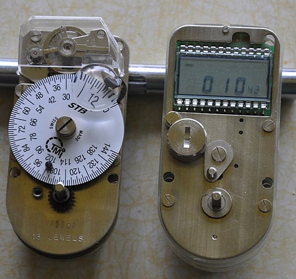
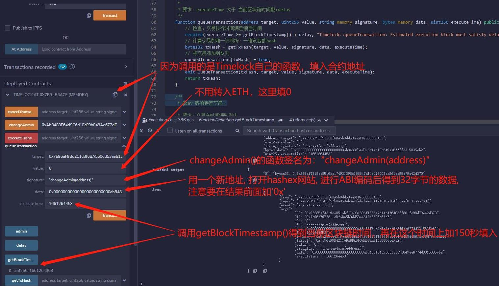
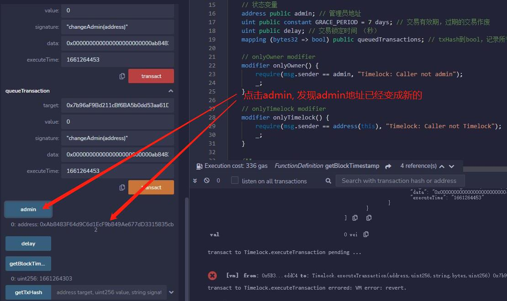

# WTF Solidity Introdução Simples: 45. Time Lock

Recentemente, tenho estudado solidity novamente para revisar os detalhes e escrever um "WTF Solidity Introdução Simples" para iniciantes (programadores experientes podem procurar outros tutoriais). Serão lançadas de 1 a 3 aulas por semana.

Twitter: [@0xAA_Science](https://twitter.com/0xAA_Science)

Comunidade: [Discord](https://discord.gg/5akcruXrsk)｜[Grupo WeChat](https://wechat.wtf.academy)｜[Site oficial wtf.academy](https://wtf.academy)

Todo o código e tutoriais estão disponíveis no GitHub: [github.com/AmazingAng/WTFSolidity](https://github.com/AmazingAng/WTFSolidity)

-----

Nesta aula, vamos falar sobre time lock (bloqueio de tempo) e contratos de time lock. O código é uma simplificação do contrato Timelock do Compound [Timelock.sol](https://github.com/compound-finance/compound-protocol/blob/master/contracts/Timelock.sol).

## Time Lock



Time lock (bloqueio de tempo) é um mecanismo de bloqueio comum em cofres bancários e outros recipientes de alta segurança. É um tipo de temporizador projetado para evitar que um cofre ou depósito seja aberto antes de um determinado tempo, mesmo que a pessoa que está abrindo o cofre conheça a senha correta.

Na blockchain, o time lock é amplamente utilizado em DeFi e DAOs. É um trecho de código que pode bloquear certas funcionalidades de um smart contract por um determinado período de tempo. Isso pode melhorar significativamente a segurança de um smart contract. Por exemplo, se um hacker invadir uma carteira multi-assinatura do Uniswap e tentar retirar os fundos, mas o contrato do cofre tiver um time lock de 2 dias, o hacker terá que esperar 2 dias desde a criação da transação até a retirada dos fundos. Durante esse período, a equipe do projeto pode tomar medidas para lidar com a situação e os investidores podem vender seus tokens antecipadamente para minimizar as perdas.

## Contrato de Time Lock

A seguir, vamos apresentar o contrato Timelock. A lógica do contrato não é complexa:

- Ao criar o contrato Timelock, o projeto pode definir o período de bloqueio e definir a si mesmo como o administrador do contrato.

- O time lock tem três principais funcionalidades:
    - Criar uma transação e adicioná-la à fila do time lock.
    - Executar uma transação após o período de bloqueio.
    - Cancelar uma ou mais transações na fila do time lock.

- Geralmente, o contrato de time lock é definido como o administrador de contratos importantes, como o contrato do cofre, e é usado para operá-los.
- O administrador do contrato de time lock geralmente é uma carteira multi-assinatura do projeto, garantindo a descentralização.

### Eventos
O contrato Timelock possui quatro eventos.
- `QueueTransaction`: evento disparado quando uma transação é criada e adicionada à fila do time lock.
- `ExecuteTransaction`: evento disparado quando uma transação é executada após o período de bloqueio.
- `CancelTransaction`: evento disparado quando uma transação é cancelada.
- `NewAdmin`: evento disparado quando o endereço do administrador é alterado.

```solidity
    // Eventos
    // Evento disparado quando uma transação é cancelada
    event CancelTransaction(bytes32 indexed txHash, address indexed target, uint value, string signature,  bytes data, uint executeTime);
    // Evento disparado quando uma transação é executada
    event ExecuteTransaction(bytes32 indexed txHash, address indexed target, uint value, string signature,  bytes data, uint executeTime);
    // Evento disparado quando uma transação é criada e adicionada à fila
    event QueueTransaction(bytes32 indexed txHash, address indexed target, uint value, string signature, bytes data, uint executeTime);
    // Evento disparado quando o endereço do administrador é alterado
    event NewAdmin(address indexed newAdmin);
```

### Variáveis de Estado
O contrato Timelock possui quatro variáveis de estado.
- `admin`: endereço do administrador.
- `delay`: período de bloqueio.
- `GRACE_PERIOD`: tempo de expiração da transação. Se a transação estiver pronta para ser executada, mas não for executada dentro do `GRACE_PERIOD`, ela será considerada expirada.
- `queuedTransactions`: mapeamento do hash da transação para um booleano, indicando se a transação está na fila do time lock.

```solidity
    // Variáveis de Estado
    address public admin; // endereço do administrador
    uint public constant GRACE_PERIOD = 7 days; // tempo de expiração da transação, transações expiradas são canceladas
    uint public delay; // período de bloqueio (em segundos)
    mapping (bytes32 => bool) public queuedTransactions; // mapeamento do hash da transação para um booleano, indicando se a transação está na fila do time lock
```

### Modificadores
O contrato Timelock possui dois modificadores.
- `onlyOwner()`: o contrato só pode ser executado pelo administrador.
- `onlyTimelock()`: o contrato só pode ser executado pelo contrato de time lock.

```solidity
    // Modificador onlyOwner
    modifier onlyOwner() {
        require(msg.sender == admin, "Timelock: Caller not admin");
        _;
    }

    // Modificador onlyTimelock
    modifier onlyTimelock() {
        require(msg.sender == address(this), "Timelock: Caller not Timelock");
        _;
    }
```

### Funções
O contrato Timelock possui sete funções.
- Construtor: inicializa o período de bloqueio (em segundos) e o endereço do administrador.
- `queueTransaction()`: cria uma transação e a adiciona à fila do time lock. Os parâmetros são complexos porque descrevem uma transação completa:
    - `target`: endereço do contrato de destino.
    - `value`: quantidade de ETH a ser enviada.
    - `signature`: assinatura da função a ser chamada.
    - `data`: dados da chamada da transação.
    - `executeTime`: timestamp da blockchain para a execução da transação.
    
    Ao chamar essa função, é necessário garantir que o tempo de execução da transação `executeTime` seja maior que o timestamp atual da blockchain mais o período de bloqueio `delay`. O hash dos parâmetros é usado como identificador exclusivo da transação, calculado pela função `getTxHash()`. A transação adicionada à fila é atualizada na variável `queuedTransactions` e o evento `QueueTransaction` é emitido.
- `executeTransaction()`: executa uma transação. Os parâmetros são os mesmos da função `queueTransaction()`. A transação a ser executada deve estar na fila do time lock, ter atingido o tempo de execução e não ter expirado. A função utiliza a função de baixo nível `call` do Solidity, que foi explicada na [aula 22](../22_Call/readme.md).
- `cancelTransaction()`: cancela uma transação. Os parâmetros são os mesmos da função `queueTransaction()`. A transação a ser cancelada deve estar na fila e é atualizada na variável `queuedTransactions` e o evento `CancelTransaction` é emitido.
- `changeAdmin()`: altera o endereço do administrador, só pode ser chamada pelo contrato de time lock.
- `getBlockTimestamp()`: obtém o timestamp atual da blockchain.
- `getTxHash()`: retorna o identificador da transação, que é o hash dos parâmetros da transação.

```solidity
    /**
     * @dev Construtor, inicializa o período de bloqueio (em segundos) e o endereço do administrador.
     */
    constructor(uint delay_) {
        delay = delay_;
        admin = msg.sender;
    }

    /**
     * @dev Altera o endereço do administrador, só pode ser chamada pelo contrato de time lock.
     */
    function changeAdmin(address newAdmin) public onlyTimelock {
        admin = newAdmin;

        emit NewAdmin(newAdmin);
    }

    /**
     * @dev Cria uma transação e a adiciona à fila do time lock.
     * @param target: endereço do contrato de destino.
     * @param value: quantidade de ETH a ser enviada.
     * @param signature: assinatura da função a ser chamada.
     * @param data: dados da chamada da transação.
     * @param executeTime: timestamp da blockchain para a execução da transação.
     *
     * Requer: executeTime seja maior que o timestamp atual da blockchain mais o período de bloqueio.
     */
    function queueTransaction(address target, uint256 value, string memory signature, bytes memory data, uint256 executeTime) public onlyOwner returns (bytes32) {
        // Requer: o tempo de execução da transação seja maior que o período de bloqueio
        require(executeTime >= getBlockTimestamp() + delay, "Timelock::queueTransaction: Estimated execution block must satisfy delay.");
        // Calcula o identificador exclusivo da transação: hash dos parâmetros
        bytes32 txHash = getTxHash(target, value, signature, data, executeTime);
        // Adiciona a transação à fila
        queuedTransactions[txHash] = true;

        emit QueueTransaction(txHash, target, value, signature, data, executeTime);
        return txHash;
    }

    /**
     * @dev Cancela uma transação específica.
     *
     * Requer: a transação esteja na fila do time lock.
     */
    function cancelTransaction(address target, uint256 value, string memory signature, bytes memory data, uint256 executeTime) public onlyOwner{
        // Calcula o identificador exclusivo da transação: hash dos parâmetros
        bytes32 txHash = getTxHash(target, value, signature, data, executeTime);
        // Requer: a transação esteja na fila do time lock
        require(queuedTransactions[txHash], "Timelock::cancelTransaction: Transaction hasn't been queued.");
        // Remove a transação da fila
        queuedTransactions[txHash] = false;

        emit CancelTransaction(txHash, target, value, signature, data, executeTime);
    }

    /**
     * @dev Executa uma transação específica.
     *
     * Requer:
     * 1. A transação esteja na fila do time lock.
     * 2. Tenha atingido o tempo de execução.
     * 3. Não tenha expirado.
     */
    function executeTransaction(address target, uint256 value, string memory signature, bytes memory data, uint256 executeTime) public payable onlyOwner returns (bytes memory) {
        bytes32 txHash = getTxHash(target, value, signature, data, executeTime);
        // Requer: a transação esteja na fila do time lock
        require(queuedTransactions[txHash], "Timelock::executeTransaction: Transaction hasn't been queued.");
        // Requer: tenha atingido o tempo de execução
        require(getBlockTimestamp() >= executeTime, "Timelock::executeTransaction: Transaction hasn't surpassed time lock.");
        // Requer: não tenha expirado
       require(getBlockTimestamp() <= executeTime + GRACE_PERIOD, "Timelock::executeTransaction: Transaction is stale.");
        // Remove a transação da fila
        queuedTransactions[txHash] = false;

        // Obtém os dados da chamada
        bytes memory callData;
        if (bytes(signature).length == 0) {
            callData = data;
        } else {
            callData = abi.encodePacked(bytes4(keccak256(bytes(signature))), data);
        }
        // Executa a transação usando call
        (bool success, bytes memory returnData) = target.call{value: value}(callData);
        require(success, "Timelock::executeTransaction: Transaction execution reverted.");

        emit ExecuteTransaction(txHash, target, value, signature, data, executeTime);

        return returnData;
    }

    /**
     * @dev Obtém o timestamp atual da blockchain.
     */
    function getBlockTimestamp() public view returns (uint) {
        return block.timestamp;
    }

    /**
     * @dev Retorna o identificador da transação, que é o hash dos parâmetros da transação.
     */
    function getTxHash(
        address target,
        uint value,
        string memory signature,
        bytes memory data,
        uint executeTime
    ) public pure returns (bytes32) {
        return keccak256(abi.encode(target, value, signature, data, executeTime));
    }
```

## Demonstração no Remix
### 1. Implante o contrato Timelock com um período de bloqueio de 120 segundos.


### 2. Chame diretamente a função `changeAdmin()` e você receberá um erro.


### 3. Construa uma transação para alterar o administrador.
Para construir a transação, você precisa preencher os seguintes parâmetros:
address target, uint256 value, string memory signature, bytes memory data, uint256 executeTime
- `target`: como estamos chamando uma função do próprio contrato Timelock, preencha com o endereço do contrato.
- `value`: não é necessário enviar ETH, então preencha com `0`.
- `signature`: a assinatura da função `changeAdmin()` é `"changeAdmin(address)"`.
- `data`: preencha com os parâmetros da função, que é o endereço do novo administrador. No entanto, você precisa preencher o endereço com 32 bytes de dados para atender ao [padrão de codificação ABI do Ethereum](../27_ABIEncode/readme.md). Você pode usar o site [hashex](https://abi.hashex.org/) para codificar os parâmetros. Exemplo:
    ```solidity
    Endereço antes da codificação: 0xAb8483F64d9C6d1EcF9b849Ae677dD3315835cb2
    Endereço após a codificação: 0x000000000000000000000000ab8483f64d9c6d1ecf9b849ae677dd3315835cb2
    ```
- `executeTime`: obtenha o timestamp atual da blockchain chamando a função `getBlockTimestamp()` e adicione 150 segundos.


### 4. Chame a função `queueTransaction()` para adicionar a transação à fila do time lock.


### 5. Chame a função `executeTransaction()` durante o período de bloqueio e a chamada falhará.


### 6. Chame a função `executeTransaction()` após o período de bloqueio e a chamada será bem-sucedida.


### 7. Verifique o novo endereço do `admin`.



## Conclusão

O time lock pode bloquear certas funcionalidades de um smart contract por um determinado período de tempo, reduzindo significativamente as chances de um projeto fazer um "rug pull" e aumentando a segurança contra ataques de hackers. É amplamente utilizado em DeFi e DAOs, incluindo Uniswap e Compound. Os projetos em que você investe utilizam time lock?

