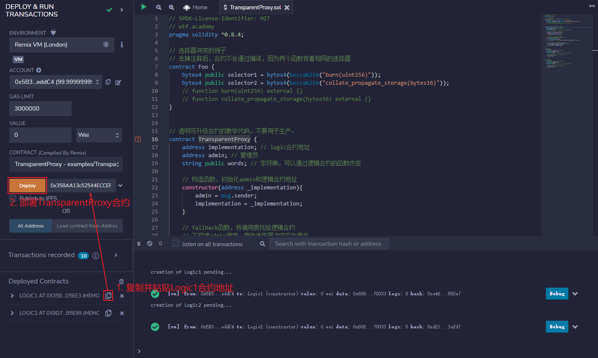
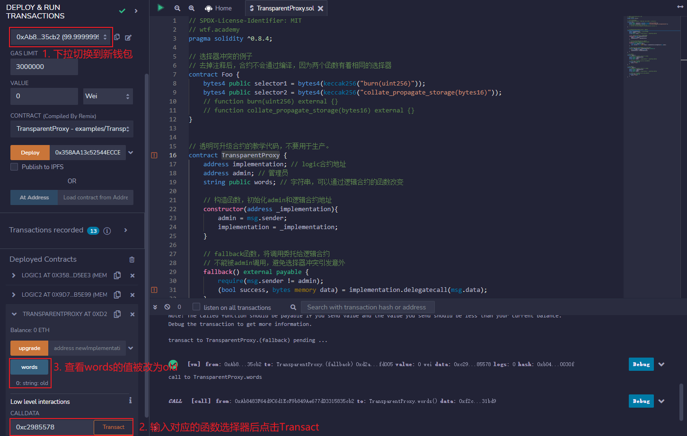
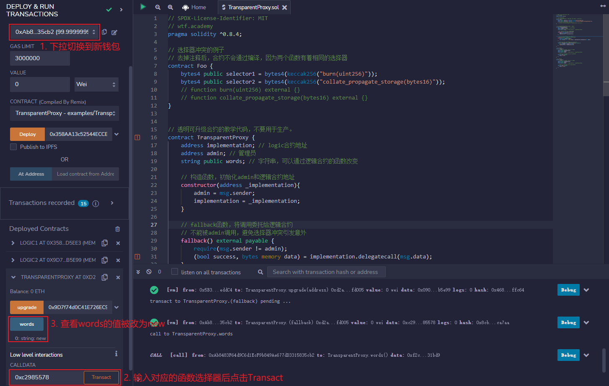

# WTF Introdução Simples ao Solidity: 48. Proxy Transparente

Recentemente, tenho revisado meus conhecimentos em solidity, reforçando os detalhes e escrevendo um "WTF Introdução Simples ao Solidity" para iniciantes (programadores experientes devem procurar outros tutoriais). Atualizo de 1 a 3 lições por semana.

Twitter: [@0xAA_Science](https://twitter.com/0xAA_Science)

Comunidade: [Discord](https://discord.gg/5akcruXrsk) | [Grupo no WeChat](https://docs.google.com/forms/d/e/1FAIpQLSe4KGT8Sh6sJ7hedQRuIYirOoZK_85miz3dw7vA1-YjodgJ-A/viewform?usp=sf_link) | [Website wtf.academy](https://wtf.academy)

Todo o código e tutoriais são de código aberto no GitHub: [github.com/AmazingAng/WTFSolidity](https://github.com/AmazingAng/WTF-Solidity)

---

Nesta lição, vamos falar sobre o conflito de seletores em contratos de proxy e como resolver esse problema com o Proxy Transparente. O código educacional foi simplificado a partir do [TransparentUpgradeableProxy](https://github.com/OpenZeppelin/openzeppelin-contracts/blob/master/contracts/proxy/transparent/TransparentUpgradeableProxy.sol) do OpenZeppelin e não deve ser usado em produção.

## Conflito de Seletores

Em contratos inteligentes, o seletor de uma função (selector) são os primeiros 4 bytes do hash da assinatura da função. Por exemplo, o seletor de `mint(address account)` é `bytes4(keccak256("mint(address)"))`, que é `0x6a627842`. Para mais informações sobre seletores, veja a [Aula 29 do WTF Solidity: Seletores de Funções](../29_Selector/readme_pt-br.md).

Devido ao fato dos seletores serem compostos por apenas 4 bytes, é possível que duas funções diferentes tenham o mesmo seletor. Por exemplo, as funções a seguir:

```solidity
// Exemplo de conflito de seletores
contract Foo {
    function burn(uint256) external {}
    function collate_propagate_storage(bytes16) external {}
}
```


No exemplo acima, as funções `burn()` e `collate_propagate_storage()` têm o mesmo seletor `0x42966c68`, o que é um conflito de seletores. Nesse caso, o EVM não consegue distinguir qual função o usuário está tentando chamar, impossibilitando a compilação do contrato.

Mesmo que exista um conflito de seletores entre um contrato de lógica e um contrato de proxy, ainda é possível compilar o código. No entanto, isso pode levar a sérios problemas de segurança. Por exemplo, se a função `a` do contrato de lógica tiver o mesmo seletor que a função de atualização do contrato de proxy, o administrador poderá inadvertidamente transformar o contrato em um buraco negro ao chamar a função `a`. As consequências seriam catastróficas.

Atualmente, existem dois padrões de contratos atualizáveis que resolvem esse problema: Proxy Transparente e UUPS (Universal Upgradeable Proxy System).

## Proxy Transparente

A lógica por trás de um Proxy Transparente é muito simples: o administrador pode, por causa de um "conflito de seletores", chamar acidentalmente a função de atualização do contrato de proxy ao tentar chamar uma função do contrato de lógica. Para evitar isso, a solução é restringir os poderes do administrador da seguinte maneira:

- O administrador se torna um executor de tarefas e pode chamar apenas as funções de atualização do contrato de proxy para mudanças, sem poder chamar funções de chamada de volta para o contrato de lógica.
- Os demais usuários não conseguem chamar as funções de atualização do contrato, mas podem chamar as funções do contrato de lógica.

### Contrato de Proxy

O contrato de Proxy deste exemplo é muito semelhante ao [da 47ª aula](../47_Upgrade/readme_pt-br.md), com a diferença de que a função `fallback()` agora tem uma verificação adicional para evitar que o administrador chame as funções da lógica.

Ele contém `3` variáveis:
- `implementation`: endereço do contrato de lógica.
- `admin`: endereço do administrador.
- `words`: uma string que pode ser alterada pelas funções do contrato de lógica.

Este contrato contém `3` funções:

- Construtor: inicializa o administrador e o endereço do contrato de lógica.
- `fallback()`: função de chamada de volta que delega a chamada para o contrato de lógica, mas não pode ser chamada pelo administrador.
- `upgrade()`: função de atualização que altera o endereço do contrato de lógica, só pode ser chamada pelo administrador.

```solidity
// Código de exemplo de um contrato de proxy transparente, não use em produção.
contract TransparentProxy {
    address implementation; // endereço do contrato de lógica
    address admin; // administrador
    string public words; // uma string que pode ser alterada pelas funções do contrato de lógica

    // Construtor, inicializa o administrador e o endereço do contrato de lógica
    constructor(address _implementation){
        admin = msg.sender;
        implementation = _implementation;
    }

    // Função de chamada de volta, delega a chamada para o contrato de lógica
    // Não pode ser chamada pelo administrador para evitar conflitos de seletores
    fallback() external payable {
        require(msg.sender != admin);
        (bool success, bytes memory data) = implementation.delegatecall(msg.data);
    }

    // Função de atualização, altera o endereço do contrato de lógica. Só pode ser chamada pelo administrador
    function upgrade(address newImplementation) external {
        if (msg.sender != admin) revert();
        implementation = newImplementation;
    }
}
```

### Contrato de Lógica

Os contratos de lógica novo e antigo são idênticos à [47ª aula](../47_Upgrade/readme_pt-br.md). Eles contêm `3` variáveis de estado para manter a consistência com o contrato de proxy e uma função `foo()`. O contrato antigo altera o valor de `words` para `"old"`, enquanto o novo altera para `"new"`.

```solidity
// Contrato de lógica antigo
contract Logic1 {
    // Variáveis de estado que devem ser compatíveis com o contrato de proxy para evitar a colisão de slots
    address public implementation; 
    address public admin; 
    string public words; // uma string que pode ser alterada pelas funções do contrato de lógica

    // Altera as variáveis de estado do contrato de proxy, seletor: 0xc2985578
    function foo() public{
        words = "old";
    }
}

// Contrato de lógica novo
contract Logic2 {
    // Variáveis de estado que devem ser compatíveis com o contrato de proxy para evitar a colisão de slots
    address public implementation; 
    address public admin; 
    string public words; // uma string que pode ser alterada pelas funções do contrato de lógica

    // Altera as variáveis de estado do contrato de proxy, seletor: 0xc2985578
    function foo() public{
        words = "new";
    }
}
```

## Implementação no Remix

1. Implemente os contratos de lógica antigo e novo, `Logic1` e `Logic2`, respectivamente.


2. Implemente o contrato de proxy transparente `TransparentProxy` e aponte o endereço de `implementation` para o contrato de lógica antigo.


3. Utilizando o seletor `0xc2985578`, chame a função `foo()` do contrato de lógica antigo `Logic1` no contrato de proxy. A chamada falhará, pois o administrador não pode chamar funções de lógica.


4. Troque para uma nova carteira e, usando o seletor `0xc2985578`, chame a função `foo()` do contrato de lógica antigo `Logic1` no contrato de proxy. A chamada será bem-sucedida e a variável `words` será alterada para `"old"`.


5. Troque de volta para a carteira do administrador, chame a função `upgrade()` e aponte o endereço de `implementation` para o novo contrato de lógica `Logic2`.


6. Troque para uma nova carteira e, utilizando o seletor `0xc2985578`, chame a função `foo()` do novo contrato de lógica `Logic2` no contrato de proxy. A variável `words` será alterada para `"new"`.


## Conclusão

Nesta lição, explicamos o conflito de seletores em contratos de proxy e como evitar esse problema com um Proxy Transparente. O Proxy Transparente resolve esse problema limitando as ações do administrador. Embora essa solução gere um custo adicional de gás a cada chamada de função pelos usuários, o Proxy Transparente ainda é a escolha favorita da maioria dos projetos.

Na próxima lição, abordaremos o sistema de proxy universal de atualização (UUPS), que é mais complexo, porém exige menos gás.

<!-- This file was translated using AI by repo_ai_translate. For more information, visit https://github.com/marcelojsilva/repo_ai_translate -->