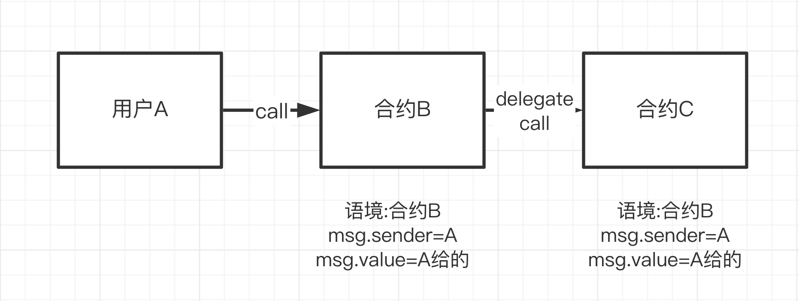
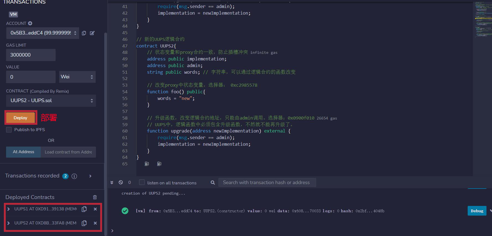
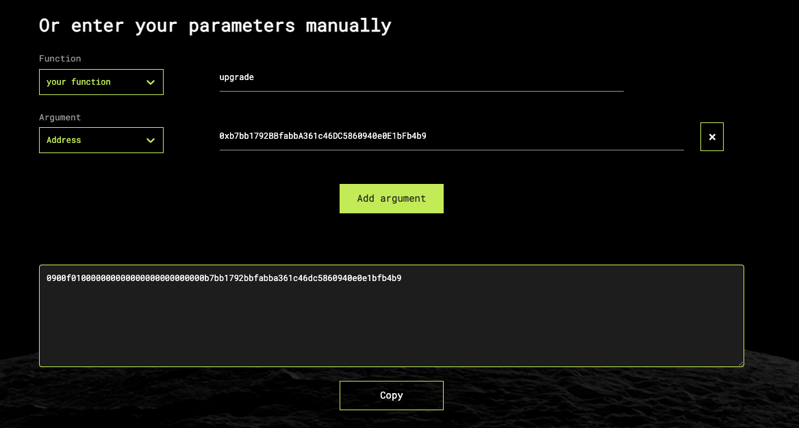
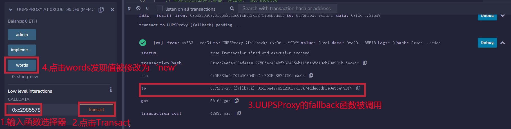

# WTF Solidity: 49. Proxy Universal Atualizável

Recentemente, estou revisando Solidity para consolidar alguns detalhes e escrever um "WTF Solidity: Guia Básico" para iniciantes (programadores experientes podem procurar outros tutoriais). Serão lançadas de 1 a 3 aulas por semana.

Twitter: [@0xAA_Science](https://twitter.com/0xAA_Science)

Comunidade: [Discord](https://discord.gg/5akcruXrsk) | [Grupo do WeChat](https://docs.google.com/forms/d/e/1FAIpQLSe4KGT8Sh6sJ7hedQRuIYirOoZK_85miz3dw7vA1-YjodgJ-A/viewform?usp=sf_link) | [Site oficial wtf.academy](https://wtf.academy)

Todo o código e tutoriais estão disponíveis no GitHub: [github.com/AmazingAng/WTFSolidity](https://github.com/AmazingAng/WTFSolidity)

-----

Nesta aula, vamos apresentar outra solução para o problema de conflito de seletores (Selector Clash) em contratos de proxy: o Proxy Universal Atualizável (UUPS, universal upgradeable proxy standard). O código do tutorial é simplificado a partir do contrato UUPSUpgradeable da OpenZeppelin e não deve ser usado em produção.

## UUPS

Na [aula anterior](../48_TransparentProxy/readme.md), aprendemos sobre o "conflito de seletores" (Selector Clash), que ocorre quando um contrato possui duas funções com o mesmo seletor, o que pode causar sérios problemas. Como uma alternativa ao proxy transparente, o UUPS também pode resolver esse problema.

O Proxy Universal Atualizável (UUPS, universal upgradeable proxy standard) coloca a função de atualização no contrato lógico. Dessa forma, se houver outras funções que entrem em conflito com a função de atualização, um erro de compilação será gerado.

A tabela a seguir resume as diferenças entre contratos atualizáveis comuns, proxies transparentes e UUPS:


## Contrato UUPS

Primeiro, vamos revisar a [Aula 23 do WTF Solidity: Delegatecall](../23_Delegatecall/readme.md). Se o usuário A fizer um `delegatecall` para o contrato C (contrato lógico) por meio do contrato B (contrato de proxy), o contexto ainda será o do contrato B e o `msg.sender` será o usuário A, não o contrato B. Portanto, o contrato UUPS pode colocar a função de atualização no contrato lógico e verificar se o chamador é o administrador.



### Contrato de Proxy UUPS

O contrato de proxy UUPS se parece com um contrato de proxy não atualizável e é muito simples, porque a função de atualização está no contrato lógico. Ele contém três variáveis:
- `implementation`: endereço do contrato lógico.
- `admin`: endereço do administrador.
- `words`: uma string que pode ser alterada por meio de funções do contrato lógico.

Ele contém duas funções:

- Construtor: inicializa o endereço do administrador e do contrato lógico.
- `fallback()`: função de fallback que delega a chamada para o contrato lógico.

```solidity
contract UUPSProxy {
    address public implementation; // endereço do contrato lógico
    address public admin; // endereço do administrador
    string public words; // uma string que pode ser alterada por meio de funções do contrato lógico

    // Construtor: inicializa o endereço do administrador e do contrato lógico
    constructor(address _implementation){
        admin = msg.sender;
        implementation = _implementation;
    }

    // fallback: delega a chamada para o contrato lógico
    fallback() external payable {
        (bool success, bytes memory data) = implementation.delegatecall(msg.data);
    }
}
```

### Contrato Lógico UUPS

O contrato lógico UUPS é diferente do contrato apresentado na [Aula 47](../47_Upgrade/readme.md) porque agora possui uma função de atualização. O contrato lógico UUPS contém três variáveis de estado, que são as mesmas do contrato de proxy para evitar conflitos de slots. Ele contém duas funções:
- `upgrade()`: função de atualização que altera o endereço do contrato lógico `implementation` e só pode ser chamada pelo `admin`.
- `foo()`: a versão antiga do contrato UUPS altera o valor de `words` para `"old"`, enquanto a nova versão altera para `"new"`.

```solidity
// Contrato lógico UUPS (função de atualização no contrato lógico)
contract UUPS1{
    // Variáveis de estado que são as mesmas do contrato de proxy para evitar conflitos de slots
    address public implementation; 
    address public admin; 
    string public words; // uma string que pode ser alterada por meio de funções do contrato lógico

    // Altera a variável de estado do contrato de proxy, seletor: 0xc2985578
    function foo() public{
        words = "old";
    }

    // Função de atualização que altera o endereço do contrato lógico e só pode ser chamada pelo admin, seletor: 0x0900f010
    // No UUPS, o contrato lógico deve conter a função de atualização, caso contrário, não poderá ser atualizado novamente.
    function upgrade(address newImplementation) external {
        require(msg.sender == admin);
        implementation = newImplementation;
    }
}

// Nova versão do contrato lógico UUPS
contract UUPS2{
    // Variáveis de estado que são as mesmas do contrato de proxy para evitar conflitos de slots
    address public implementation; 
    address public admin; 
    string public words; // uma string que pode ser alterada por meio de funções do contrato lógico

    // Altera a variável de estado do contrato de proxy, seletor: 0xc2985578
    function foo() public{
        words = "new";
    }

    // Função de atualização que altera o endereço do contrato lógico e só pode ser chamada pelo admin, seletor: 0x0900f010
    // No UUPS, o contrato lógico deve conter a função de atualização, caso contrário, não poderá ser atualizado novamente.
    function upgrade(address newImplementation) external {
        require(msg.sender == admin);
        implementation = newImplementation;
    }
}
```

## Implementação no Remix

1. Implante as versões antigas e novas do contrato lógico UUPS, `UUPS1` e `UUPS2`.



2. Implante o contrato de proxy UUPS, `UUPSProxy`, e defina o endereço de `implementation` como o do contrato lógico antigo, `UUPS1`.


3. Usando o seletor `0xc2985578`, chame a função `foo()` do contrato lógico antigo, `UUPS1`, no contrato de proxy para alterar o valor de `words` para `"old"`.


4. Usando um codificador ABI online, como o [HashEx](https://abi.hashex.org/), obtenha a codificação binária e chame a função de atualização `upgrade()` para definir o endereço de `implementation` como o do contrato lógico novo, `UUPS2`.




5. Usando o seletor `0xc2985578`, chame a função `foo()` do contrato lógico novo, `UUPS2`, no contrato de proxy para alterar o valor de `words` para `"new"`.



## Conclusão

Nesta aula, apresentamos outra solução para o problema de "conflito de seletores" em contratos de proxy: o UUPS. Ao contrário do proxy transparente, o UUPS coloca a função de atualização no contrato lógico, o que impede que ocorra um conflito de seletores durante a compilação. Comparado ao proxy transparente, o UUPS consome menos gas, mas também é mais complexo.

