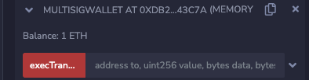
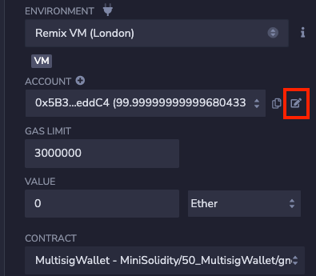

# WTF Solidity para Iniciantes: 50. Carteira Multisig

Recentemente, tenho estudado Solidity novamente para revisar os detalhes e escrever um "WTF Solidity para Iniciantes" para ajudar os novatos (os programadores experientes podem procurar outros tutoriais). Serão lançadas de 1 a 3 lições por semana.

Twitter: [@0xAA_Science](https://twitter.com/0xAA_Science)

Comunidade: [Discord](https://discord.gg/5akcruXrsk) | [Grupo do WeChat](https://docs.google.com/forms/d/e/1FAIpQLSe4KGT8Sh6sJ7hedQRuIYirOoZK_85miz3dw7vA1-YjodgJ-A/viewform?usp=sf_link) | [Site oficial wtf.academy](https://wtf.academy)

Todo o código e tutoriais estão disponíveis no GitHub: [github.com/AmazingAng/WTFSolidity](https://github.com/AmazingAng/WTFSolidity)

-----

Vitalik Buterin já disse que uma carteira multisig é mais segura do que uma carteira de hardware ([tweet](https://twitter.com/VitalikButerin/status/1558886893995134978?s=20&t=4WyoEWhwHNUtAuABEIlcRw)). Nesta lição, vamos falar sobre carteiras multisig e escrever um contrato de carteira multisig simplificado. O código de ensino (150 linhas de código) é uma simplificação do contrato Gnosis Safe (com milhares de linhas de código).


## Carteira Multisig

Uma carteira multisig é uma carteira eletrônica que requer a autorização de múltiplos detentores de chaves privadas (signatários) para executar uma transação. Por exemplo, uma carteira gerenciada por 3 signatários, onde cada transação requer pelo menos 2 assinaturas para ser autorizada. As carteiras multisig podem evitar falhas de ponto único (perda de chave privada, má fé de um único indivíduo), são mais descentralizadas e mais seguras, sendo amplamente adotadas por várias DAOs.

A carteira multisig Gnosis Safe é a carteira multisig mais popular do Ethereum, gerenciando quase US$ 40 bilhões em ativos. O contrato foi auditado e testado em produção, suporta várias redes (Ethereum, BSC, Polygon, etc.) e oferece suporte a uma ampla variedade de DApps. Para mais informações, você pode ler o tutorial de uso do Gnosis Safe que escrevi em dezembro de 2021 [aqui](https://peopledao.mirror.xyz/nFCBXda8B5ZxQVqSbbDOn2frFDpTxNVtdqVBXGIjj0s).

## Contrato de Carteira Multisig

No Ethereum, uma carteira multisig é, na verdade, um contrato inteligente, conhecido como carteira de contrato. Abaixo, vamos escrever um contrato de carteira multisig simplificado chamado `MultisigWallet`. A lógica do contrato é bastante simples:

1. Configurar signatários e limite (on-chain): Ao implantar o contrato de carteira multisig, precisamos inicializar a lista de signatários e o limite de execução (ou seja, o número mínimo de signatários necessários para autorizar uma transação). A carteira multisig Gnosis Safe suporta adicionar/remover signatários e alterar o limite de execução, mas não consideraremos essa funcionalidade em nossa versão simplificada.

2. Criar transação (off-chain): Uma transação pendente de autorização contém as seguintes informações:
    - `to`: endereço do contrato de destino.
    - `value`: quantidade de Ether a ser enviada na transação.
    - `data`: calldata, incluindo o seletor e os parâmetros da função chamada.
    - `nonce`: inicialmente definido como `0` e incrementado a cada transação bem-sucedida executada pelo contrato multisig, para evitar ataques de repetição de assinatura.
    - `chainid`: ID da rede, para evitar ataques de repetição de assinatura em redes diferentes.

3. Coletar assinaturas multisig (off-chain): Codificar a transação do passo anterior usando ABI e calcular o hash para obter o hash da transação. Em seguida, cada signatário deve assinar a transação e as assinaturas são concatenadas para formar uma assinatura compactada. Se você não está familiarizado com a codificação ABI e o cálculo de hash, pode conferir as lições 27 e 28 do WTF Solidity [aqui](../27_ABIEncode/readme.md) e [aqui](../28_Hash/readme.md).

    ```solidity
    Hash da transação: 0xc1b055cf8e78338db21407b425114a2e258b0318879327945b661bfdea570e66

    Assinatura do signatário A: 0x014db45aa753fefeca3f99c2cb38435977ebb954f779c2b6af6f6365ba4188df542031ace9bdc53c655ad2d4794667ec2495196da94204c56b1293d0fbfacbb11c

    Assinatura do signatário B: 0xbe2e0e6de5574b7f65cad1b7062be95e7d73fe37dd8e888cef5eb12e964ddc597395fa48df1219e7f74f48d86957f545d0fbce4eee1adfbaff6c267046ade0d81c

    Assinatura compactada:
    0x014db45aa753fefeca3f99c2cb38435977ebb954f779c2b6af6f6365ba4188df542031ace9bdc53c655ad2d4794667ec2495196da94204c56b1293d0fbfacbb11cbe2e0e6de5574b7f65cad1b7062be95e7d73fe37dd8e888cef5eb12e964ddc597395fa48df1219e7f74f48d86957f545d0fbce4eee1adfbaff6c267046ade0d81c
    ```

4. Chamar a função de execução do contrato multisig, verificar as assinaturas e executar a transação (on-chain). Se você não está familiarizado com a verificação de assinaturas e a execução de transações, pode conferir as lições 22 e 37 do WTF Solidity [aqui](../22_Call/readme.md) e [aqui](../37_Signature/readme.md).

### Eventos

O contrato `MultisigWallet` possui dois eventos: `ExecutionSuccess` e `ExecutionFailure`, que são emitidos quando uma transação é executada com sucesso ou falha, respectivamente. O parâmetro desses eventos é o hash da transação.

```solidity
    event ExecutionSuccess(bytes32 txHash);    // Evento de sucesso de execução
    event ExecutionFailure(bytes32 txHash);    // Evento de falha de execução
```

### Variáveis de Estado

O contrato `MultisigWallet` possui cinco variáveis de estado:
1. `owners`: array de endereços dos signatários.
2. `isOwner`: mapeamento `address => bool` que registra se um endereço é um signatário.
3. `ownerCount`: número de signatários.
4. `threshold`: limite de execução multisig, ou seja, o número mínimo de signatários necessários para autorizar uma transação.
5. `nonce`: inicialmente definido como `0` e incrementado a cada transação bem-sucedida executada pelo contrato multisig, para evitar ataques de repetição de assinatura.

```solidity
    address[] public owners;                   // Array de endereços dos signatários
    mapping(address => bool) public isOwner;   // Mapeamento que registra se um endereço é um signatário
    uint256 public ownerCount;                 // Número de signatários
    uint256 public threshold;                  // Limite de execução multisig, número mínimo de signatários necessários para autorizar uma transação
    uint256 public nonce;                      // Nonce, para evitar ataques de repetição de assinatura
```

### Funções

O contrato `MultisigWallet` possui seis funções:

1. Construtor: chama a função `_setupOwners()` para inicializar as variáveis relacionadas aos signatários e ao limite de execução.

    ```solidity
    // Construtor, inicializa owners, isOwner, ownerCount, threshold
    constructor(        
        address[] memory _owners,
        uint256 _threshold
    ) {
        _setupOwners(_owners, _threshold);
    }
    ```

2. `_setupOwners()`: chamada pelo construtor ao implantar o contrato, inicializa as variáveis `owners`, `isOwner`, `ownerCount` e `threshold`. Nos parâmetros de entrada, o limite de execução deve ser maior ou igual a `1` e menor ou igual ao número de signatários; os endereços dos signatários não podem ser o endereço `0` e não podem ser repetidos.

    ```solidity
    /// @dev Inicializa owners, isOwner, ownerCount, threshold
    /// @param _owners: array de endereços dos signatários
    /// @param _threshold: limite de execução multisig, número mínimo de signatários necessários para autorizar uma transação
    function _setupOwners(address[] memory _owners, uint256 _threshold) internal {
        // Verifica se o limite de execução não foi inicializado anteriormente
        require(threshold == 0, "WTF5000");
        // Verifica se o limite de execução é menor ou igual ao número de signatários
        require(_threshold <= _owners.length, "WTF5001");
        // Verifica se o limite de execução é maior ou igual a 1
        require(_threshold >= 1, "WTF5002");

        for (uint256 i = 0; i < _owners.length; i++) {
            address owner = _owners[i];
            // Verifica se o endereço do signatário não é o endereço 0, o endereço deste contrato e se não é repetido
            require(owner != address(0) && owner != address(this) && !isOwner[owner], "WTF5003");
            owners.push(owner);
            isOwner[owner] = true;
        }
        ownerCount = _owners.length;
        threshold = _threshold;
    }
    ```

3. `execTransaction()`: verifica as assinaturas e executa a transação após coletar assinaturas suficientes. Os parâmetros de entrada são o endereço de destino `to`, o valor de Ether a ser enviado `value`, os dados `data` e as assinaturas compactadas `signatures`. As assinaturas compactadas são as assinaturas individuais dos signatários concatenadas em uma única sequência de bytes, na ordem crescente dos endereços dos signatários. Esta função chama a função `encodeTransactionData()` para codificar a transação, chama a função `checkSignatures()` para verificar se as assinaturas são válidas e se o número de assinaturas atingiu o limite de execução.

    ```solidity
    /// @dev Executa a transação após coletar assinaturas suficientes
    /// @param to: endereço do contrato de destino
    /// @param value: msg.value, quantidade de Ether a ser paga
    /// @param data: calldata
    /// @param signatures: assinaturas compactadas, correspondentes aos endereços dos signatários em ordem crescente ({bytes32 r}{bytes32 s}{uint8 v}) (assinatura do primeiro signatário, assinatura do segundo signatário, ...)
    function execTransaction(
        address to,
        uint256 value,
        bytes memory data,
        bytes memory signatures
    ) public payable virtual returns (bool success) {
        // Codifica os dados da transação e calcula o hash
        bytes32 txHash = encodeTransactionData(to, value, data, nonce, block.chainid);
        nonce++;  // Incrementa o nonce
        checkSignatures(txHash, signatures); // Verifica as assinaturas
        // Executa a transação usando call e obtém o resultado da transação
        (success, ) = to.call{value: value}(data);
        require(success , "WTF5004");
        if (success) emit ExecutionSuccess(txHash);
        else emit ExecutionFailure(txHash);
    }
    ```

4. `checkSignatures()`: verifica se as assinaturas correspondem ao hash dos dados da transação, se o número de assinaturas atingiu o limite de execução e se as assinaturas são de signatários válidos. Caso contrário, a transação será revertida. O comprimento de uma assinatura individual é de 65 bytes, portanto, o comprimento da assinatura compactada deve ser maior que `threshold * 65`. Esta função chama a função `signatureSplit()` para separar as assinaturas individuais. A lógica geral desta função é a seguinte:
    - Usa a função `ecrecover` para obter o endereço da assinatura.
    - Usa a comparação `currentOwner > lastOwner` para garantir que a assinatura venha de diferentes signatários (endereços dos signatários em ordem crescente).
    - Usa `isOwner[currentOwner]` para verificar se o assinante é um signatário válido.

    ```solidity
    /**
     * @dev Verifica se as assinaturas correspondem aos dados da transação. A transação será revertida se uma assinatura for inválida.
     * @param dataHash: hash dos dados da transação
     * @param signatures: assinaturas compactadas
     */
    function checkSignatures(
        bytes32 dataHash,
        bytes memory signatures
    ) public view {
        // Lê o limite de execução multisig
        uint256 _threshold = threshold;
        require(_threshold > 0, "WTF5005");

        // Verifica se o comprimento das assinaturas é suficientemente longo
        require(signatures.length >= _threshold * 65, "WTF5006");

        // Verifica se cada assinatura coletada é válida
        // Lógica geral:
        // 1. Verifica se a assinatura é válida usando ecrecover
        // 2. Usa a comparação currentOwner > lastOwner para garantir que a assinatura venha de diferentes signatários (endereços dos signatários em ordem crescente)
        // 3. Usa isOwner[currentOwner] para verificar se o assinante é um signatário válido
        address lastOwner = address(0); 
        address currentOwner;
        uint8 v;
        bytes32 r;
        bytes32 s;
        uint256 i;
        for (i = 0; i < _threshold; i++) {
            (v, r, s) = signatureSplit(signatures, i);
            // Verifica se a assinatura é válida usando ecrecover
            currentOwner = ecrecover(keccak256(abi.encodePacked("\x19Ethereum Signed Message:\n32", dataHash)), v, r, s);
            require(currentOwner > lastOwner && isOwner[currentOwner], "WTF5007");
            lastOwner = currentOwner;
        }
    }
    ```

5. `signatureSplit()`: separa uma assinatura individual de uma assinatura compactada. Os parâmetros de entrada são a assinatura compactada `signatures` e a posição da assinatura a ser lida `pos`. Esta função usa assembly inline para separar os valores `r`, `s` e `v` da assinatura.

    ```solidity
    /// Separa uma assinatura individual de uma assinatura compactada
    /// @param signatures: assinatura compactada
    /// @param pos: posição da assinatura a ser lida
    function signatureSplit(bytes memory signatures, uint256 pos)
        internal
        pure
        returns (
            uint8 v,
            bytes32 r,
            bytes32 s
        )
    {
        // Formato da assinatura: {bytes32 r}{bytes32 s}{uint8 v}
        assembly {
            let signaturePos := mul(0x41, pos)
            r := mload(add(signatures, add(signaturePos, 0x20)))
            s := mload(add(signatures, add(signaturePos, 0x40)))
            v := and(mload(add(signatures, add(signaturePos, 0x41))), 0xff)
        }
    }
    ```

6. `encodeTransactionData()`: codifica os dados da transação e calcula o hash. Esta função usa `abi.encode()` e `keccak256()`. Ela pode ser usada para calcular o hash de uma transação e, em seguida, coletar as assinaturas dos signatários off-chain e chamar a função `execTransaction()` para executar a transação.

    ```solidity
    /// @dev Codifica os dados da transação
    /// @param to: endereço do contrato de destino
    /// @param value: msg.value, quantidade de Ether a ser paga
    /// @param data: calldata
    /// @param _nonce: nonce da transação
    /// @param chainid: ID da rede
    /// @return: Hash da transação em bytes32
    function encodeTransactionData(
        address to,
        uint256 value,
        bytes memory data,
        uint256 _nonce,
        uint256 chainid
    ) public pure returns (bytes32) {
        bytes32 txHash =
            keccak256(
                abi.encode(
                    to,
                    value,
                    keccak256(data),
                    _nonce,
                    chainid
                )
            );
        return txHash;
    }
    ```

## Demonstração no Remix

1. Implante o contrato de carteira multisig com 2 endereços de signatários e um limite de execução de 2.

    ```solidity
    Endereço do signatário 1: 0x5B38Da6a701c568545dCfcB03FcB875f56beddC4
    Endereço do signatário 2: 0xAb8483F64d9C6d1EcF9b849Ae677dD3315835cb2
    ```

    

2. Faça uma transferência de 1 ETH para o endereço da carteira multisig.

    

3. Chame a função `encodeTransactionData()` para codificar e calcular o hash da transação para transferir 1 ETH para o endereço do signatário 1.

    ```solidity
    Parâmetros
    to: 0x5B38Da6a701c568545dCfcB03FcB875f56beddC4
    value: 1000000000000000000
    data: 0x
    _nonce: 0
    chainid: 1

    Resultado
    Hash da transação: 0xb43ad6901230f2c59c3f7ef027c9a372f199661c61beeec49ef5a774231fc39b
    ```

    

4. Use o botão de assinatura ao lado da conta no Remix para assinar a transação. Insira o hash da transação do passo 3 e obtenha a assinatura de ambos os wallets. Ambos os wallets devem assinar.

    ```
    Assinatura do signatário 1: 0xa3f3e4375f54ad0a8070f5abd64e974b9b84306ac0dd5f59834efc60aede7c84454813efd16923f1a8c320c05f185bd90145fd7a7b741a8d13d4e65a4722687e1b

    Assinatura do signatário 2: 0x6b228b6033c097e220575f826560226a5855112af667e984aceca50b776f4c885e983f1f2155c294c86a905977853c6b1bb630c488502abcc838f9a225c813811c

    Assinatura compactada:
    0xa3f3e4375f54ad0a8070f5abd64e974b9b84306ac0dd5f59834efc60aede7c84454813efd16923f1a8c320c05f185bd90145fd7a7b741a8d13d4e65a4722687e1b6b228b6033c097e220575f826560226a5855112af667e984aceca50b776f4c885e983f1f2155c294c86a905977853c6b1bb630c488502abcc838f9a225c813811c
    ```

    

5. Chame a função `execTransaction()` para executar a transação, passando os parâmetros da transação do passo 3 e a assinatura compactada como argumentos. Você verá que a transação foi executada com sucesso e o ETH foi transferido da carteira multisig.

    

## Conclusão

Nesta lição, falamos sobre carteiras multisig e escrevemos um contrato de carteira multisig simplificado com menos de 150 linhas de código.

Tenho uma conexão especial com carteiras multisig. Em 2021, estudei o Gnosis Safe para criar o tesouro da PeopleDAO e escrevi um tutorial em inglês e português sobre como usá-lo [aqui](https://peopledao.mirror.xyz/nFCBXda8B5ZxQVqSbbDOn2frFDpTxNVtdqVBXGIjj0s). Desde então, tive a sorte de ser um dos signatários de três tesouros, garantindo a segurança dos ativos, e agora sou um guardião do Safe, participando ativamente da governança. Espero que todos tenham ativos mais seguros.

<!-- This file was translated using AI by repo_ai_translate. For more information, visit https://github.com/marcelojsilva/repo_ai_translate -->