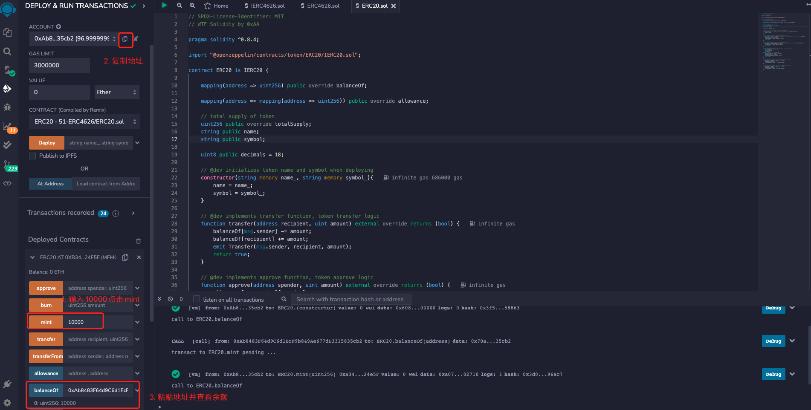
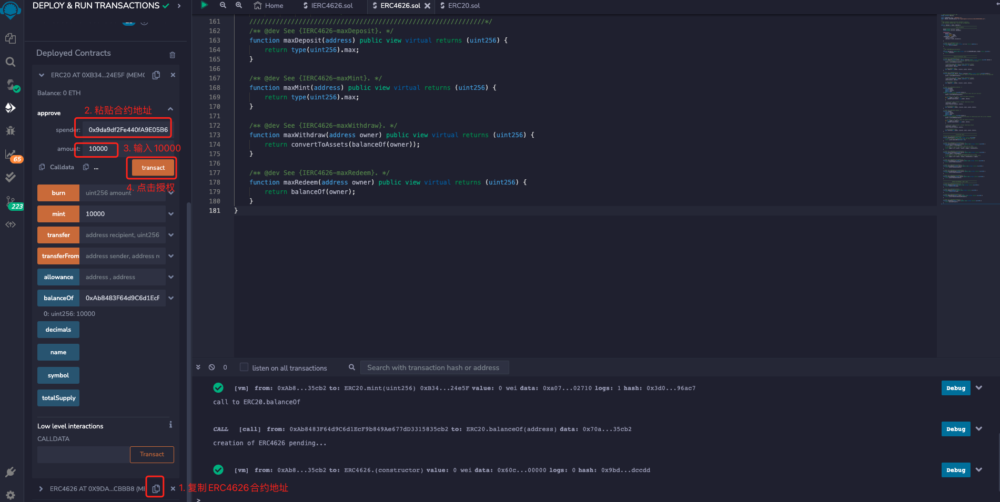
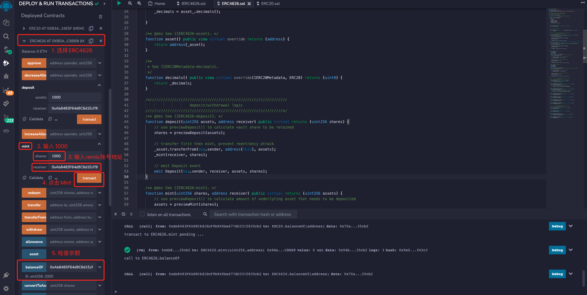

# WTF Introdução Simples ao Solidity: 51. Padrão de Tesouraria Tokenizada ERC4626

Recentemente, tenho estudado Solidity novamente para revisar os detalhes e escrever um "WTF Introdução Simples ao Solidity" para iniciantes (programadores experientes podem procurar outros tutoriais). Serão lançadas de 1 a 3 aulas por semana.

Twitter: [@0xAA_Science](https://twitter.com/0xAA_Science)

Comunidade: [Discord](https://discord.gg/5akcruXrsk)｜[Grupo do WeChat](https://docs.google.com/forms/d/e/1FAIpQLSe4KGT8Sh6sJ7hedQRuIYirOoZK_85miz3dw7vA1-YjodgJ-A/viewform?usp=sf_link)｜[Site oficial wtf.academy](https://wtf.academy)

Todo o código e tutoriais estão disponíveis no GitHub: [github.com/AmazingAng/WTFSolidity](https://github.com/AmazingAng/WTFSolidity)

-----

Frequentemente dizemos que DeFi é como Lego de moedas, onde é possível criar novos protocolos combinando vários protocolos existentes. No entanto, devido à falta de padrões no DeFi, a capacidade de combinação é seriamente afetada. O ERC4626 estende o padrão de token ERC20 e tem como objetivo padronizar as tesourarias tokenizadas. Nesta aula, vamos apresentar o novo padrão ERC4626 para DeFi e escrever um contrato simples de tesouraria. O código de ensino é baseado nos contratos ERC4626 do OpenZeppelin e Solmate, e é apenas para fins educacionais.

## Tesouraria

O contrato de tesouraria é a base do Lego DeFi, permitindo que você faça um depósito de ativos básicos (tokens) no contrato em troca de um rendimento. Alguns casos de uso incluem:

- Fazenda de rendimento: Na Yearn Finance, você pode fazer um depósito de USDT para obter juros.
- Empréstimo: Na AAVE, você pode emprestar ETH para obter juros sobre o depósito e empréstimo.
- Stake: Na Lido, você pode fazer um depósito de ETH para participar do staking do ETH 2.0 e receber stETH, que pode ser usado para obter juros.

## ERC4626


Devido à falta de padronização nos contratos de tesouraria, existem muitas variações, e um agregador de rendimento precisa ter várias interfaces para se conectar a diferentes projetos DeFi. O padrão de tesouraria tokenizada ERC4626 (Tokenized Vault Standard) foi criado para facilitar a expansão do DeFi. Ele possui as seguintes vantagens:

1. Tokenização: O ERC4626 herda o ERC20, então, ao depositar na tesouraria, você recebe tokens de tesouraria que seguem o padrão ERC20. Por exemplo, ao fazer um depósito de ETH, você automaticamente recebe stETH.

2. Maior liquidez: Devido à tokenização, você pode usar os tokens de tesouraria para outras finalidades sem precisar resgatar os ativos básicos. Por exemplo, com o stETH da Lido, você pode fornecer liquidez ou fazer transações na Uniswap sem precisar resgatar o ETH.

3. Maior capacidade de combinação: Com um padrão estabelecido, é possível interagir com todas as tesourarias ERC4626 usando uma única interface, o que facilita o desenvolvimento de aplicativos, plugins e ferramentas baseados em tesourarias.

Em resumo, o ERC4626 é tão importante para o DeFi quanto o ERC721 é para os NFTs.

### Pontos-chave do ERC4626

O padrão ERC4626 implementa principalmente a seguinte lógica:

1. ERC20: O ERC4626 herda o ERC20, e as tesourarias são representadas por tokens ERC20. Quando um usuário deposita um ativo básico específico (como WETH) na tesouraria, o contrato emite uma quantidade correspondente de tokens de tesouraria. Quando um usuário retira um ativo básico da tesouraria, a quantidade correspondente de tokens de tesouraria é destruída. A função `asset()` retorna o endereço do token de ativo básico da tesouraria.
2. Lógica de depósito: Permite que os usuários depositem ativos básicos e emitam tokens de tesouraria correspondentes. As funções relacionadas são `deposit()` e `mint()`. A função `deposit(uint assets, address receiver)` permite que os usuários depositem uma quantidade de ativos e emita uma quantidade correspondente de tokens de tesouraria para o endereço `receiver`. A função `mint(uint shares, address receiver)` é semelhante, mas emite tokens de tesouraria em vez de receber uma quantidade específica.
3. Lógica de retirada: Permite que os usuários destruam tokens de tesouraria e retirem uma quantidade correspondente de ativos básicos da tesouraria. As funções relacionadas são `withdraw()` e `redeem()`, onde a primeira recebe a quantidade de ativos básicos a serem retirados como parâmetro, e a segunda recebe a quantidade de tokens de tesouraria a serem destruídos como parâmetro.
4. Lógica de contabilidade e limites: O padrão ERC4626 também inclui outras funções para calcular os ativos gerenciados pela tesouraria, limites de depósito/retirada e a quantidade de ativos básicos e tokens de tesouraria depositados/retirados.

### Contrato de Interface IERC4626

O contrato de interface IERC4626 contém 2 eventos:
- Evento `Deposit`: Disparado ao fazer um depósito.
- Evento `Withdraw`: Disparado ao fazer uma retirada.

O contrato de interface IERC4626 também contém 16 funções, divididas em 4 categorias: metadados, lógica de depósito/retirada, lógica de contabilidade e lógica de limites de depósito/retirada.

- Metadados

    - `asset()`: Retorna o endereço do token de ativo básico da tesouraria, usado para depósito e retirada.
- Lógica de depósito/retirada
    - `deposit()`: Função de depósito que permite que os usuários depositem uma quantidade de ativos básicos na tesouraria e emita uma quantidade correspondente de tokens de tesouraria para o endereço `receiver`. Deve emitir o evento `Deposit`.
    - `mint()`: Função de emissão que permite que os usuários depositem uma quantidade de ativos básicos na tesouraria e emita uma quantidade correspondente de tokens de tesouraria para o endereço `receiver`. Deve emitir o evento `Deposit`.
    - `withdraw()`: Função de retirada que permite que o endereço `owner` destrua uma quantidade de tokens de tesouraria e retire uma quantidade correspondente de ativos básicos da tesouraria para o endereço `receiver`. Deve emitir o evento `Withdraw`.
    - `redeem()`: Função de resgate que permite que o endereço `owner` destrua uma quantidade de tokens de tesouraria e retire uma quantidade correspondente de ativos básicos da tesouraria para o endereço `receiver`. Deve emitir o evento `Withdraw`.
- Lógica de contabilidade
    - `totalAssets()`: Retorna o valor total dos ativos básicos gerenciados pela tesouraria.
    - `convertToShares()`: Retorna a quantidade de tokens de tesouraria que podem ser obtidos em troca de uma determinada quantidade de ativos básicos.
    - `convertToAssets()`: Retorna a quantidade de ativos básicos que podem ser obtidos em troca de uma determinada quantidade de tokens de tesouraria.
    - `previewDeposit()`: Usado para simular a quantidade de tokens de tesouraria que podem ser obtidos ao depositar uma determinada quantidade de ativos básicos no ambiente atual da cadeia.
    - `previewMint()`: Usado para simular a quantidade de ativos básicos necessários para emitir uma determinada quantidade de tokens de tesouraria no ambiente atual da cadeia.
    - `previewWithdraw()`: Usado para simular a quantidade de tokens de tesouraria que precisam ser destruídos para retirar uma determinada quantidade de ativos básicos no ambiente atual da cadeia.
    - `previewRedeem()`: Usado para simular a quantidade de ativos básicos que podem ser resgatados ao destruir uma determinada quantidade de tokens de tesouraria no ambiente atual da cadeia.
- Lógica de limites de depósito/retirada
    - `maxDeposit()`: Retorna a quantidade máxima de ativos básicos que um determinado endereço pode depositar de uma só vez.
    - `maxMint()`: Retorna a quantidade máxima de tokens de tesouraria que um determinado endereço pode emitir de uma só vez.
    - `maxWithdraw()`: Retorna a quantidade máxima de ativos básicos que um determinado endereço pode retirar de uma só vez.
    - `maxRedeem()`: Retorna a quantidade máxima de tokens de tesouraria que um determinado endereço pode destruir de uma só vez.

```solidity
// SPDX-License-Identifier: MIT
// Author: 0xAA from WTF Academy

pragma solidity ^0.8.0;

import "@openzeppelin/contracts/token/ERC20/IERC20.sol";
import "@openzeppelin/contracts/token/ERC20/extensions/IERC20Metadata.sol";

/**
 * @dev Contrato de interface do ERC4626 "Padrão de Tesouraria Tokenizada"
 * https://eips.ethereum.org/EIPS/eip-4626[ERC-4626].
 */
interface IERC4626 is IERC20, IERC20Metadata {
    /*//////////////////////////////////////////////////////////////
                                 Eventos
    //////////////////////////////////////////////////////////////*/
    // Disparado ao fazer um depósito
    event Deposit(address indexed sender, address indexed owner, uint256 assets, uint256 shares);

    // Disparado ao fazer uma retirada
    event Withdraw(
        address indexed sender,
        address indexed receiver,
        address indexed owner,
        uint256 assets,
        uint256 shares
    );

    /*//////////////////////////////////////////////////////////////
                            Metadados
    //////////////////////////////////////////////////////////////*/
    /**
     * @dev Retorna o endereço do token de ativo básico da tesouraria (usado para depósito e retirada)
     * - Deve ser o endereço do contrato do token ERC20.
     * - Não deve reverter.
     */
    function asset() external view returns (address assetTokenAddress);

    /*//////////////////////////////////////////////////////////////
                        Lógica de Depósito/Retirada
    //////////////////////////////////////////////////////////////*/
    /**
     * @dev Função de depósito: Permite que os usuários depositem uma quantidade de ativos básicos na tesouraria e emita uma quantidade correspondente de tokens de tesouraria para o endereço `receiver`
     *
     * - Deve emitir o evento Deposit.
     * - Se o ativo não puder ser depositado, deve reverter, por exemplo, se a quantidade de depósito for muito alta, etc.
     */
    function deposit(uint256 assets, address receiver) external returns (uint256 shares);

    /**
     * @dev Função de emissão: Permite que os usuários depositem uma quantidade de ativos básicos na tesouraria e emita uma quantidade correspondente de tokens de tesouraria para o endereço `receiver`
     * - Deve emitir o evento Deposit.
     * - Se não for possível emitir todos os tokens de tesouraria, deve reverter, por exemplo, se a quantidade de emissão for muito alta, etc.
     */
    function mint(uint256 shares, address receiver) external returns (uint256 assets);

    /**
     * @dev Função de retirada: Permite que o endereço `owner` destrua uma quantidade de tokens de tesouraria e retire uma quantidade correspondente de ativos básicos da tesouraria para o endereço `receiver`
     * - Deve emitir o evento Withdraw.
     * - Se não for possível retirar todos os ativos básicos, deve reverter.
     */
    function withdraw(uint256 assets, address receiver, address owner) external returns (uint256 shares);

    /**
     * @dev Função de resgate: Permite que o endereço `owner` destrua uma quantidade de tokens de tesouraria e retire uma quantidade correspondente de ativos básicos da tesouraria para o endereço `receiver`
     * - Deve emitir o evento Withdraw.
     * - Se não for possível resgatar todos os ativos básicos, deve reverter.
     */
    function redeem(uint256 shares, address receiver, address owner) external returns (uint256 assets);

    /*//////////////////////////////////////////////////////////////
                            Lógica de Contabilidade
    //////////////////////////////////////////////////////////////*/

    /**
     * @dev Retorna o valor total dos ativos básicos gerenciados pela tesouraria
     * - Deve incluir juros.
     * - Deve incluir taxas.
     * - Não deve reverter.
     */
    function totalAssets() external view returns (uint256 totalManagedAssets);

    /**
     * @dev Retorna a quantidade de tokens de tesouraria que podem ser obtidos em troca de uma determinada quantidade de ativos básicos
     * - Não deve incluir taxas.
     * - Não deve incluir slippage.
     * - Não deve reverter.
     */
    function convertToShares(uint256 assets) external view returns (uint256 shares);

    /**
     * @dev Retorna a quantidade de ativos básicos que podem ser obtidos em troca de uma determinada quantidade de tokens de tesouraria
     * - Não deve incluir taxas.
     * - Não deve incluir slippage.
     * - Não deve reverter.
     */
    function convertToAssets(uint256 shares) external view returns (uint256 assets);

    /**
     * @dev Usado para simular a quantidade de tokens de tesouraria que podem ser obtidos ao depositar uma determinada quantidade de ativos básicos no ambiente atual da cadeia
     * - O valor retornado deve ser próximo e não maior do que o valor obtido ao fazer um depósito na mesma transação.
     * - Não deve considerar limites como maxDeposit, supondo que a transação de depósito do usuário seja bem-sucedida.
     * - Deve considerar taxas.
     * - Não deve reverter.
     * NOTA: A diferença entre o valor retornado por convertToAssets e previewDeposit pode ser usada para calcular o slippage.
     */
    function previewDeposit(uint256 assets) external view returns (uint256 shares);

    /**
     * @dev Usado para simular a quantidade de ativos básicos necessários para emitir uma determinada quantidade de tokens de tesouraria no ambiente atual da cadeia
     * - O valor retornado deve ser próximo e não menor do que o valor necessário para emitir a mesma quantidade de tokens de tesouraria na mesma transação.
     * - Não deve considerar limites como maxMint, supondo que a transação de emissão do usuário seja bem-sucedida.
     * - Deve considerar taxas.
     * - Não deve reverter.
     */
    function previewMint(uint256 shares) external view returns (uint256 assets);

    /**
     * @dev Usado para simular a quantidade de tokens de tesouraria que precisam ser destruídos para retirar uma determinada quantidade de ativos básicos no ambiente atual da cadeia
     * - O valor retornado deve ser próximo e não maior do que a quantidade de tokens de tesouraria que seriam destruídos ao fazer uma retirada na mesma transação.
     * - Não deve considerar limites como maxWithdraw, supondo que a transação de retirada do usuário seja bem-sucedida.
     * - Deve considerar taxas.
     * - Não deve reverter.
     */
    function previewWithdraw(uint256 assets) external view returns (uint256 shares);

    /**
     * @dev Usado para simular a quantidade de ativos básicos que podem ser resgatados ao destruir uma determinada quantidade de tokens de tesouraria no ambiente atual da cadeia
     * - O valor retornado deve ser próximo e não menor do que a quantidade de ativos básicos que seriam resgatados ao destruir a mesma quantidade de tokens de tesouraria na mesma transação.
     * - Não deve considerar limites como maxRedeem, supondo que a transação de resgate do usuário seja bem-sucedida.
     * - Deve considerar taxas.
     * - Não deve reverter.
     */
    function previewRedeem(uint256 shares) external view returns (uint256 assets);

    /*//////////////////////////////////////////////////////////////
                     Lógica de Limites de Depósito/Retirada
    //////////////////////////////////////////////////////////////*/
    /**
     * @dev Retorna a quantidade máxima de ativos básicos que um determinado endereço pode depositar de uma só vez.
     * - Se houver um limite de depósito, o valor retornado deve ser um valor finito.
     * - O valor retornado não deve ser maior que 2 ** 256 - 1.
     * - Não deve reverter.
     */
    function maxDeposit(address receiver) external view returns (uint256 maxAssets);

    /**
     * @dev Retorna a quantidade máxima de tokens de tesouraria que um determinado endereço pode emitir de uma só vez.
     * - Se houver um limite de emissão, o valor retornado deve ser um valor finito.
     * - O valor retornado não deve ser maior que 2 ** 256 - 1.
     * - Não deve reverter.
     */
    function maxMint(address receiver) external view returns (uint256 maxShares);

    /**
.
     * - O valor retornado deve ser um valor finito.
     * - Não deve reverter.
     */
    function maxWithdraw(address owner) external view returns (uint256 maxAssets);

    /**
     * @dev Retorna a quantidade máxima de tokens de tesouraria que um determinado endereço pode destruir de uma só vez.
     * - O valor retornado deve ser um valor finito.
     * - Se não houver outras restrições, o valor retornado deve ser o balanceOf(owner).
     * - Não deve reverter.
     */
    function maxRedeem(address owner) external view returns (uint256 maxShares);
}
```

### Contrato ERC4626

A seguir, vamos implementar um contrato de tesouraria tokenizada simplificado:
- O construtor inicializa o endereço do contrato de ativo básico, o nome e o símbolo dos tokens de tesouraria. É importante que o nome e o símbolo dos tokens de tesouraria estejam relacionados ao ativo básico, por exemplo, se o ativo básico for chamado de `WTF`, é melhor chamar os tokens de tesouraria de `vWTF`.
- Ao fazer um depósito, quando um usuário deposita `x` unidades do ativo básico, serão emitidas `x` unidades (na mesma quantidade) dos tokens de tesouraria.
- Ao fazer uma retirada, quando um usuário destrói `x` unidades dos tokens de tesouraria, serão retiradas `x` unidades (na mesma quantidade) do ativo básico.

**Observação**: Ao usar este contrato na prática, é importante ter cuidado com o cálculo dos valores relacionados à lógica de contabilidade, como arredondamento para cima ou para baixo. Você pode consultar as implementações do OpenZeppelin e Solmate para obter mais informações sobre isso. Nesta aula, não consideraremos esse aspecto.

```solidity
// SPDX-License-Identifier: MIT
pragma solidity >=0.8.0;

import {IERC4626} from "./IERC4626.sol";
import {ERC20, IERC20Metadata} from "@openzeppelin/contracts/token/ERC20/ERC20.sol";

/**
 * @dev Contrato ERC4626 "Padrão de Tesouraria Tokenizada", apenas para fins educacionais, não utilizar em produção
 */
contract ERC4626 is ERC20, IERC4626 {
    /*//////////////////////////////////////////////////////////////
                    Variáveis de Estado
    //////////////////////////////////////////////////////////////*/
    ERC20 private immutable _asset; // 
    uint8 private immutable _decimals;

    constructor(
        ERC20 asset_,
        string memory name_,
        string memory symbol_
    ) ERC20(name_, symbol_) {
        _asset = asset_;
        _decimals = asset_.decimals();

    }

    /** @dev Veja {IERC4626-asset}. */
    function asset() public view virtual override returns (address) {
        return address(_asset);
    }

    /**
     * Veja {IERC20Metadata-decimals}.
     */
    function decimals() public view virtual override(IERC20Metadata, ERC20) returns (uint8) {
        return _decimals;
    }

    /*//////////////////////////////////////////////////////////////
                        Lógica de Depósito/Retirada
    //////////////////////////////////////////////////////////////*/
    /** @dev Veja {IERC4626-deposit}. */
    function deposit(uint256 assets, address receiver) public virtual override returns (uint256 shares) {
        // Calcula a quantidade de tokens de tesouraria a serem obtidos usando a função previewDeposit()
        shares = previewDeposit(assets);

        // Transfere primeiro e depois emite, para evitar reentrância
        _asset.transferFrom(msg.sender, address(this), assets);
        _mint(receiver, shares);

        // Emite o evento Deposit
        emit Deposit(msg.sender, receiver, assets, shares);
    }

    /** @dev Veja {IERC4626-mint}. */
    function mint(uint256 shares, address receiver) public virtual override returns (uint256 assets) {
        // Calcula a quantidade de ativos básicos a serem depositados usando a função previewMint()
        assets = previewMint(shares);

        // Transfere primeiro e depois emite, para evitar reentrância
        _asset.transferFrom(msg.sender, address(this), assets);
        _mint(receiver, shares);

        // Emite o evento Deposit
        emit Deposit(msg.sender, receiver, assets, shares);

    }

    /** @dev Veja {IERC4626-withdraw}. */
    function withdraw(
        uint256 assets,
        address receiver,
        address owner
    ) public virtual override returns (uint256 shares) {
        // Calcula a quantidade de tokens de tesouraria a serem destruídos usando a função previewWithdraw()
        shares = previewWithdraw(assets);

        // Se o chamador não for o proprietário, verifica e atualiza a autorização
        if (msg.sender != owner) {
            _spendAllowance(owner, msg.sender, shares);
        }

        // Destrói primeiro e depois transfere, para evitar reentrância
        _burn(owner, shares);
        _asset.transfer(receiver, assets);

        // Emite o evento Withdraw
        emit Withdraw(msg.sender, receiver, owner, assets, shares);
    }

    /** @dev Veja {IERC4626-redeem}. */
    function redeem(
        uint256 shares,
        address receiver,
        address owner
    ) public virtual override returns (uint256 assets) {
        // Calcula a quantidade de ativos básicos a serem resgatados usando a função previewRedeem()
        assets = previewRedeem(shares);

        // Se o chamador não for o proprietário, verifica e atualiza a autorização
        if (msg.sender != owner) {
            _spendAllowance(owner, msg.sender, shares);
        }

        // Destrói primeiro e depois transfere, para evitar reentrância
        _burn(owner, shares);
        _asset.transfer(receiver, assets);

        // Emite o evento Withdraw       
        emit Withdraw(msg.sender, receiver, owner, assets, shares);
    }

    /*//////////////////////////////////////////////////////////////
                            Lógica de Contabilidade
    //////////////////////////////////////////////////////////////*/
    /** @dev Veja {IERC4626-totalAssets}. */
    function totalAssets() public view virtual override returns (uint256){
        // Retorna o saldo do ativo básico na tesouraria
        return _asset.balanceOf(address(this));
    }

    /** @dev Veja {IERC4626-convertToShares}. */
    function convertToShares(uint256 assets) public view virtual override returns (uint256) {
        uint256 supply = totalSupply();
        // Se o supply for 0, emite tokens de tesouraria na proporção de 1:1
        // Se o supply for diferente de 0, emite tokens de tesouraria proporcionalmente
        return supply == 0 ? assets : assets * supply / totalAssets();
    }

    /** @dev Veja {IERC4626-convertToAssets}. */
    function convertToAssets(uint256 shares) public view virtual override returns (uint256) {
        uint256 supply = totalSupply();
        // Se o supply for 0, resgata ativos básicos na proporção de 1:1
        // Se o supply for diferente de 0, resgata ativos básicos proporcionalmente
        return supply == 0 ? shares : shares * totalAssets() / supply;
    }

    /** @dev Veja {IERC4626-previewDeposit}. */
    function previewDeposit(uint256 assets) public view virtual override returns (uint256) {
        return convertToShares(assets);
    }

    /** @dev Veja {IERC4626-previewMint}. */
    function previewMint(uint256 shares) public view virtual override returns (uint256) {
        return convertToAssets(shares);
    }

    /** @dev Veja {IERC4626-previewWithdraw}. */
    function previewWithdraw(uint256 assets) public view virtual override returns (uint256) {
        return convertToShares(assets);
    }

    /** @dev Veja {IERC4626-previewRedeem}. */
    function previewRedeem(uint256 shares) public view virtual override returns (uint256) {
        return convertToAssets(shares);
    }

    /*//////////////////////////////////////////////////////////////
                     Lógica de Limites de Depósito/Retirada
    //////////////////////////////////////////////////////////////*/
    /** @dev Veja {IERC4626-maxDeposit}. */
    function maxDeposit(address) public view virtual override returns (uint256) {
        return type(uint256).max;
    }

    /** @dev Veja {IERC4626-maxMint}. */
    function maxMint(address) public view virtual override returns (uint256) {
        return type(uint256).max;
    }
    
    /** @dev Veja {IERC4626-maxWithdraw}. */
    function maxWithdraw(address owner) public view virtual override returns (uint256) {
        return convertToAssets(balanceOf(owner));
    }
    
    /** @dev Veja {IERC4626-maxRedeem}. */
    function maxRedeem(address owner) public view virtual override returns (uint256) {
        return balanceOf(owner);
    }
}
```

## Demonstração no Remix

**Observação:** Os exemplos a seguir são executados usando a segunda conta no Remix, ou seja, `0xAb8483F64d9C6d1EcF9b849Ae677dD3315835cb2`, para implantar e chamar os métodos do contrato.

1. Implante o contrato do token ERC20, defina o nome e o símbolo do token como `WTF` e emita `10000` tokens para si mesmo.



2. Implante o contrato ERC4626, defina o endereço do contrato de ativo básico como o endereço do token `WTF`, defina o nome e o símbolo dos tokens de tesouraria como `vWTF`.


3. Chame a função `approve()` do contrato ERC20 para autorizar o contrato ERC4626 a gastar os tokens.


4. Chame a função `deposit()` do contrato ERC4626 para depositar `1000` tokens. Em seguida, chame a função `balanceOf()` para verificar que o saldo dos tokens de tesouraria agora é `1000`.


5. Chame a função `mint()` do contrato ERC4626 para depositar mais `1000` tokens. Em seguida, chame a função `balanceOf()` para verificar que o saldo dos tokens de tesouraria agora é `2000`.


6. Chame a função `withdraw()` do contrato ERC4626 para retirar `1000` tokens. Em seguida, chame a função `balanceOf()` para verificar que o saldo dos tokens de tesouraria agora é `1000`.


7. Chame a função `redeem()` do contrato ERC4626 para resgatar `1000` tokens. Em seguida, chame a função `balanceOf()` para verificar que o saldo dos tokens de tesouraria agora é `0`.


## Conclusão

Nesta aula, apresentamos o padrão ERC4626 para tesourarias tokenizadas e escrevemos um contrato de tesouraria simples que permite a conversão de ativos básicos em tokens de tesouraria na proporção de 1:1. O ERC4626 é importante para melhorar a liquidez e a capacidade de combinação no DeFi, e esperamos que ele se torne mais comum no futuro. Como você usaria o ERC4626 em seus aplicativos?

