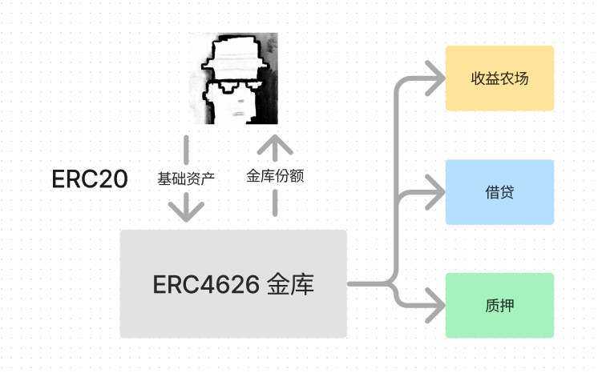

# 51. Padrão de Vault Tokenizado ERC4626

Recentemente, tenho revisado meus conhecimentos em Solidity para reforçar os detalhes e escrever um "WTF Solidity Crash Course" para iniciantes (os especialistas em programação podem buscar outros tutoriais). Atualizo de 1 a 3 lições por semana.

Twitter: [@0xAA_Science](https://twitter.com/0xAA_Science)

Comunidade: [Discord](https://discord.gg/5akcruXrsk) | [Grupo do WhatsApp](https://docs.google.com/forms/d/e/1FAIpQLSe4KGT8Sh6sJ7hedQRuIYirOoZK_85miz3dw7vA1-YjodgJ-A/viewform?usp=sf_link) | [Site wtf.academy](https://wtf.academy)

Todo o código e tutoriais estão disponíveis no GitHub: [github.com/AmazingAng/WTFSolidity](https://github.com/AmazingAng/WTFSolidity)

---

Frequentemente dizemos que DeFi é como um brinquedo Lego, onde podemos criar novos protocolos combinando vários existentes. No entanto, devido à falta de padrões em DeFi, a interoperabilidade tem sido prejudicada. Com a introdução do padrão ERC4626, que expande o padrão ERC20, é esperado promover a padronização de Vaults de receita. Nesta lição, vamos apresentar o novo padrão ERC4626 de DeFi e escrever um contrato simples de Vault. Este tutorial faz referência aos contratos ERC4626 em OpenZeppelin e Solmate, apenas para fins educacionais.

## Vaults

Os contratos de Vault são a base do Lego DeFi, permitindo que você faça o depósito de ativos básicos (tokens) em um contrato e receba receitas. Alguns casos de uso incluem:

- Fazenda de receita: na Yearn Finance, você pode depositar USDT para obter juros.
- Empréstimo: na AAVE, você pode emprestar ETH para receber juros sobre depósitos e empréstimos.
- Stake: na Lido, você pode stakear ETH para participar do staking do ETH 2.0 e receber staking rewards em stETH.

## ERC4626



Como os contratos de Vault não possuem um padrão, existem várias formas de escrevê-los. Um aggregator de receita necessita lidar com várias interfaces para interagir com diferentes projetos DeFi. O padrão ERC4626 Tokenized Vaults veio para facilitar a escalabilidade do DeFi. Ele possui as seguintes vantagens:

1. Tokenização: o ERC4626 herda o ERC20, o que significa que ao depositar em um Vault, você receberá tokens de Vault que seguem o padrão ERC20 - por exemplo, ao fazer um depósito de ETH, automaticamente você recebe stETH.
2. Melhor liquidez: devido à tokenização, você pode usar os tokens de Vault sem precisar retirar os ativos básicos, permitindo fazer outras operações. Por exemplo, com o stETH da Lido, você pode fornecer liquidez ou realizar transações no Uniswap sem retirar o ETH.
3. Melhor interoperabilidade: com um padrão definido, é possível interagir com todos os Vaults ERC4626 usando a mesma interface, facilitando o desenvolvimento de aplicativos, plugins e ferramentas baseados em Vaults.

Em resumo, o ERC4626 é tão importante para o DeFi quanto o ERC721 é para os NFTs.

### Pontos-chave do ERC4626

O padrão ERC4626 implementa principalmente a lógica a seguir:

1. ERC20: o ERC4626 herda o ERC20, e os tokens de Vault representam os ativos básicos - quando um usuário deposita ativos em um Vault, ele recebe tokens de Vault representando esses ativos. A função `asset()` retorna o endereço do token do ativo básico do Vault.
2. Lógica de depósito: permite aos usuários depositarem ativos básicos e receberem tokens de Vault em troca. As funções relacionadas são `deposit()` e `mint()`. A função `deposit(uint assets, address receiver)` permite que o usuário deposite `assets` unidades do ativo e receba a quantidade correspondente de tokens de Vault em `receiver`. A função `mint(uint shares, address receiver)` é semelhante, mas solicita que tokens de Vault sejam mintados com base na quantidade fornecida.
3. Lógica de saque: permite aos usuários destruírem tokens de Vault e retirarem a quantidade correspondente de ativos básicos do Vault. As funções relacionadas são `withdraw()` e `redeem()`, onde a primeira recebe o número de ativos a serem retirados e a segunda recebe o número de tokens de Vault a serem destruídos.
4. Lógica de contabilidade e limites: outras funções do padrão ERC4626 ajudam a monitorar os ativos no Vault, limites de depósito/saque e a quantidade de ativos básicos e tokens de Vault.

### Contrato de interface IERC4626

O contrato de interface IERC4626 consiste em `2` eventos:
- Evento `Deposit`: acionado durante um depósito.
- Evento `Withdraw`: acionado durante um saque.

O contrato de interface IERC4626 também possui `16` funções, divididas em 4 categorias: metadados, lógica de depósito/saque, lógica contábil e lógica de limites de depósito/saque.

- Metadados

    - `asset()`: retorna o endereço do token do ativo básico do Vault, usado para depósito e saque.
- Lógica de depósito/saque
    - `deposit()`: função de depósito que permite ao usuário depositar `assets` unidades do ativo básico, com a emissão correspondente de `shares` unidades de tokens de Vault para o endereço `receiver`. Aciona o evento `Deposit`.
    - `mint()`: função de criação que permite ao usuário depositar `assets` unidades do ativo básico, com a emissão correspondente de `shares` unidades de tokens de Vault para o endereço `receiver`. Aciona o evento `Deposit`.
    - `withdraw()`: função de saque onde o endereço `owner` destrói `share` unidades de tokens de Vault, com a transferência correspondente de ativos básicos para o endereço `receiver`.
    - `redeem()`: função de resgate onde o endereço `owner` destrói `shares` unidades de tokens de Vault, com a transferência correspondente de ativos básicos para o endereço `receiver`.
- Lógica contábil
    - `totalAssets()`: retorna o total de ativos básicos gerenciados no Vault.
    - `convertToShares()`: retorna a quantidade de tokens de Vault que podem ser obtidos ao depositar uma certa quantidade de ativos básicos.
    - `convertToAssets()`: retorna a quantidade de ativos básicos que podem ser obtidos ao resgatar uma certa quantidade de tokens de Vault.
    - `previewDeposit()`: simula o depósito de uma certa quantidade de ativos básicos e a obtenção de tokens de Vault no ambiente atual da cadeia.
    - `previewMint()`: simula a quantidade de ativos básicos necessários para criar uma certa quantidade de tokens de Vault no ambiente atual da cadeia.
    - `previewWithdraw()`: simula a quantidade de tokens de Vault a serem destruídos para resgatar uma certa quantidade de ativos básicos.
    - `previewRedeem()`: simula a quantidade de ativos básicos a serem obtidos ao destruir uma certa quantidade de tokens de Vault.
- Lógica de limites de depósito/saque
    - `maxDeposit()`: retorna o máximo de ativos básicos que um endereço de usuário pode depositar de uma vez.
    - `maxMint()`: retorna o máximo de tokens de Vault que um endereço de usuário pode criar de uma vez.
    - `maxWithdraw()`: retorna o máximo de ativos básicos que um endereço de usuário pode sacar de uma vez.
    - `maxRedeem()`: retorna o máximo de tokens de Vault que um endereço de usuário pode destruir de uma vez.
```Solidity
// SPDX-License-Identifier: MIT
// Autor: 0xAA da WTF Academy

pragma solidity ^0.8.0;

import "@openzeppelin/contracts/token/ERC20/IERC20.sol";
import "@openzeppelin/contracts/token/ERC20/extensions/IERC20Metadata.sol";

/**
 * @dev Contrato de interface do padrão ERC4626 de "Vault Tokenizado"
 * https://eips.ethereum.org/EIPS/eip-4626[ERC-4626].
 */
interface IERC4626 is IERC20, IERC20Metadata {
    /*//////////////////////////////////////////////////////////////
                                 Eventos
    //////////////////////////////////////////////////////////////*/
    // Acionado durante um depósito
    event Deposit(address indexed sender, address indexed owner, uint256 assets, uint256 shares);

    // Acionado durante um saque
    event Withdraw(
        address indexed sender,
        address indexed receiver,
        address indexed owner,
        uint256 assets,
        uint256 shares
    );

    /*//////////////////////////////////////////////////////////////
                            Metadados
    //////////////////////////////////////////////////////////////*/
    /**
     * @dev Retorna o endereço do token do ativo básico do Vault (usado para depósito, saque)
     * - Deve ser um endereço de contrato ERC20
     * - Não deve reverter
     */
    function asset() external view returns (address assetTokenAddress);

    /*//////////////////////////////////////////////////////////////
                        Lógica de depósito/saque
    //////////////////////////////////////////////////////////////*/
    /**
     * @dev Função de depósito: permite que o usuário deposite ativos no Vault e receba tokens de Vault em troca
     *
     * - Deve acionar o evento Deposit
     * - Se a operação de depósito não for possível, deve reverter, por exemplo, se o valor de depósito exceder um limite, etc.
     */
    function deposit(uint256 assets, address receiver) external returns (uint256 shares);

    /**
     * @dev Função de criação: permite ao usuário depositar ativos no Vault e receber tokens de Vault em troca
     * - Deve acionar o evento Deposit
     * - Se não for possível criar todos os tokens de Vault, deve reverter, por exemplo, se a criação de tokens exceder um limite, etc.
     */
    function mint(uint256 shares, address receiver) external returns (uint256 assets);

    /**
     * @dev Função de saque: o endereço do proprietário destrói tokens de Vault e recebe ativos básicos em troca
     * - Deve acionar o evento Withdraw
     * - Se não for possível sacar todos os ativos básicos, deve reverter
     */
    function withdraw(uint256 assets, address receiver, address owner) external returns (uint256 shares);

    /**
     * @dev Função de resgate: o endereço do proprietário destrói tokens de Vault e recebe ativos básicos em troca
     * - Deve acionar o evento Withdraw
     * - Se não for possível resgatar todos os ativos básicos, deve reverter
     */
    function redeem(uint256 shares, address receiver, address owner) external returns (uint256 assets);

    /*//////////////////////////////////////////////////////////////
                            Lógica contábil
    //////////////////////////////////////////////////////////////*/

    /**
     * @dev Retorna o total de ativos básicos gerenciados no Vault
     * - Deve incluir juros
     * - Deve incluir taxas
     * - Não deve reverter
     */
    function totalAssets() external view returns (uint256 totalManagedAssets);

    /**
     * @dev Retorna a quantidade de tokens de Vault que podem ser obtidos ao depositar uma determinada quantidade de ativos básicos
     * - Não deve considerar taxas
     * - Não deve considerar deslizamento
     * - Não deve reverter
     */
    function convertToShares(uint256 assets) external view returns (uint256 shares);

    /**
     * @dev Retorna a quantidade de ativos básicos que podem ser obtidos ao resgatar uma determinada quantidade de tokens de Vault
     * - Não deve considerar taxas
     * - Não deve considerar deslizamento
     * - Não deve reverter
     */
    function convertToAssets(uint256 shares) external view returns (uint256 assets);

    /**
     * @dev Simula o depósito de uma determinada quantidade de ativos básicos e a obtenção de tokens de Vault no ambiente atual da cadeia
     * - Deve ser um valor próximo e não maior do que o valor real obtido em uma transação de depósito
     * - Não deve considerar limites como maxDeposit, etc., supondo que a transação de depósito do usuário seja bem-sucedida
     * - Deve considerar taxas
     * - Não deve reverter
     */
    function previewDeposit(uint256 assets) external view returns (uint256 shares);

    /**
     * @dev Simula a quantidade de ativos básicos necessária para criar uma determinada quantidade de tokens de Vault no ambiente atual da cadeia
     * - Deve ser um valor próximo e não menor do que o valor real necessário para a transação de criação de tokens
     * - Não deve considerar limites como maxMint, etc., supondo que a transação de criação seja bem-sucedida
     * - Deve considerar taxas
     * - Não deve reverter
     */
    function previewMint(uint256 shares) external view returns (uint256 assets);

    /**
     * @dev Simula a quantidade de tokens de Vault a serem destruídos para resgatar uma determinada quantidade de ativos básicos
     * - Deve ser um valor próximo e não maior do que o valor real necessário para a transação de saque de ativos
     * - Não deve considerar limites como maxWithdraw, etc., supondo que a transação de saque do usuário seja bem-sucedida
     * - Deve considerar taxas
     * - Não deve reverter
     */
    function previewWithdraw(uint256 assets) external view returns (uint256 shares);

    /**
     * @dev Simula a quantidade de ativos básicos a ser obtida ao destruir uma determinada quantidade de tokens de Vault
     * - Deve ser um valor próximo e não menor do que o valor real a ser obtido na transação de resgate
     * - Não deve considerar limites como maxRedeem, etc., supondo que a transação de resgate do usuário seja bem-sucedida
     * - Deve considerar taxas
     * - Não deve reverter
     */
    function previewRedeem(uint256 shares) external view returns (uint256 assets);

    /*//////////////////////////////////////////////////////////////
                     Lógica de limites de depósito/saque
    //////////////////////////////////////////////////////////////*/
    /**
     * @dev Retorna a quantidade máxima de ativos básicos que um endereço de usuário pode depositar de uma vez
     * - Se houver um limite de depósito, o valor retornado deve ser finito
     * - O valor retornado não deve exceder 2 ** 256 - 1 
     * - Não deve reverter
     */
    function maxDeposit(address receiver) external view returns (uint256 maxAssets);

    /**
     * @dev Retorna a quantidade máxima de tokens de Vault que um endereço de usuário pode criar de uma vez
     * - Se houver um limite de criação, o valor retornado deve ser finito
     * - O valor retornado não deve exceder 2 ** 256 - 1 
     * - Não deve reverter
     */
    function maxMint(address receiver) external view returns (uint256 maxShares);

    /**
     * @dev Retorna a quantidade máxima de ativos básicos que um endereço de usuário pode sacar de uma vez
     * - O valor retornado deve ser finito
     * - Não deve reverter
     */
    function maxWithdraw(address owner) external view returns (uint256 maxAssets);

    /**
     * @dev Retorna a quantidade máxima de tokens de Vault que um endereço de usuário pode destruir de uma vez
     * - O valor retornado deve ser finito
     * - Se não houver outras restrições, o valor retornado deve ser balanceOf(owner)
     * - Não deve reverter
     */
    function maxRedeem(address owner) external view returns (uint256 maxShares);
}
```

### Contrato ERC4626

Agora, vamos implementar um contrato de Vault tokenizado simplificado:
- O construtor inicializa o endereço do contrato do ativo básico, o nome e o símbolo dos tokens de Vault. É importante que o nome e o símbolo dos tokens de Vault estejam relacionados ao ativo básico, por exemplo, se o ativo básico for chamado de `WTF`, o token de Vault deve ser chamado de `vWTF`.
- Ao depositar, quando um usuário deposita `x` unidades do ativo básico, serão mintadas `x` unidades correspondentes de tokens de Vault.
- Ao sacar, quando um usuário destrói `x` unidades de tokens de Vault, serão retiradas `x` unidades correspondentes do ativo básico.

**Observação:** Na prática, é importante considerar se as funções relacionadas à lógica contábil realizam arredondamento para cima ou para baixo. Você pode consultar as implementações da [OpenZeppelin](https://github.com/OpenZeppelin/openzeppelin-contracts/blob/master/contracts/token/ERC20/extensions/ERC4626.sol) e [Solmate](https://github.com/transmissions11/solmate/blob/main/src/mixins/ERC4626.sol). O exemplo educacional a seguir não considera essas nuances.

```solidity
// SPDX-License-Identifier: MIT
pragma solidity >=0.8.0;

import {IERC4626} from "./IERC4626.sol";
import {ERC20, IERC20Metadata} from "@openzeppelin/contracts/token/ERC20/ERC20.sol";

/**
 * @dev Contrato ERC4626 padrão de "Vault Tokenizado", apenas para fins educacionais, não usar em produção
 */

<!-- This file was translated using AI by repo_ai_translate. For more information, visit https://github.com/marcelojsilva/repo_ai_translate -->