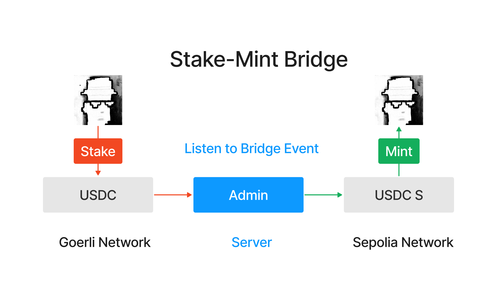
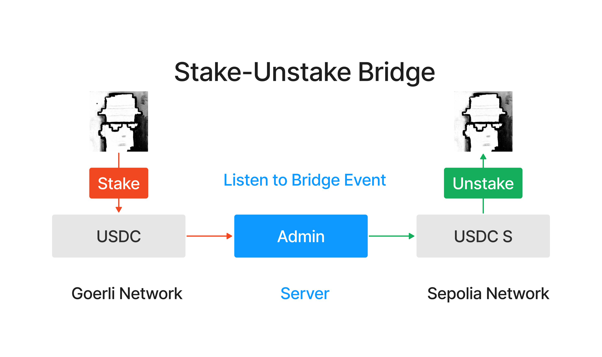

# WTF Solidity Introdução Simples: 54. Ponte de Cadeia Cruzada

Recentemente, tenho estudado solidity novamente para revisar os detalhes e escrever um "WTF Solidity Introdução Simples" para iniciantes (programadores experientes podem procurar outros tutoriais). Serão lançadas de 1 a 3 aulas por semana.

Twitter: [@0xAA_Science](https://twitter.com/0xAA_Science)

Comunidade: [Discord](https://discord.gg/5akcruXrsk)｜[Grupo WeChat](https://docs.google.com/forms/d/e/1FAIpQLSe4KGT8Sh6sJ7hedQRuIYirOoZK_85miz3dw7vA1-YjodgJ-A/viewform?usp=sf_link)｜[Site wtf.academy](https://wtf.academy)

Todo o código e tutoriais estão disponíveis no GitHub: [github.com/AmazingAng/WTFSolidity](https://github.com/AmazingAng/WTFSolidity)

-----

Nesta aula, vamos falar sobre pontes de cadeia cruzada, que são infraestruturas que permitem a transferência de ativos de uma blockchain para outra, e implementar uma ponte de cadeia cruzada simples.


## 1. O que é uma Ponte de Cadeia Cruzada

Uma ponte de cadeia cruzada é um protocolo de blockchain que permite a movimentação de ativos digitais e informações entre duas ou mais blockchains. Por exemplo, um token ERC20 que está sendo executado na mainnet do Ethereum pode ser transferido para uma sidechain ou uma blockchain independente compatível com Ethereum usando uma ponte de cadeia cruzada.

No entanto, as pontes de cadeia cruzada não são nativamente suportadas pelas blockchains e exigem a intervenção de terceiros confiáveis para executar as operações de cadeia cruzada, o que também traz riscos. Nos últimos dois anos, ataques a pontes de cadeia cruzada resultaram em perdas de ativos de usuários no valor de mais de **2 bilhões de dólares**.

## 2. Tipos de Pontes de Cadeia Cruzada

Existem principalmente três tipos de pontes de cadeia cruzada:

- **Burn/Mint** (Queimar/Cunhar): Nesse método, os tokens são queimados (burn) na cadeia de origem e, em seguida, uma quantidade equivalente de tokens é cunhada (mint) na cadeia de destino. A vantagem desse método é que o suprimento total de tokens permanece o mesmo, mas a ponte de cadeia cruzada precisa ter permissão para cunhar os tokens, o que é adequado para projetos que desejam construir sua própria ponte de cadeia cruzada.

    

- **Stake/Mint** (Bloquear/Cunhar): Nesse método, os tokens são bloqueados (stake) na cadeia de origem e, em seguida, uma quantidade equivalente de tokens (certificados) é cunhada (mint) na cadeia de destino. Os tokens na cadeia de origem são desbloqueados quando os tokens são movidos de volta para a cadeia de origem. Esse é o método mais comum usado pelas pontes de cadeia cruzada, pois não requer nenhuma permissão, mas também apresenta riscos. Se os ativos na cadeia de origem forem atacados por hackers, os certificados na cadeia de destino se tornarão inúteis.

    

- **Stake/Unstake** (Bloquear/Desbloquear): Nesse método, os tokens são bloqueados (stake) na cadeia de origem e, em seguida, uma quantidade equivalente de tokens é desbloqueada (unstake) na cadeia de destino. Os tokens na cadeia de destino podem ser trocados de volta para os tokens na cadeia de origem a qualquer momento. Esse método requer que a ponte de cadeia cruzada tenha tokens bloqueados em ambas as cadeias, o que é mais complexo e geralmente requer incentivos para os usuários bloquearem seus tokens na ponte de cadeia cruzada.

    

## 3. Construindo uma Ponte de Cadeia Cruzada Simples

Para entender melhor como uma ponte de cadeia cruzada funciona, vamos construir uma ponte de cadeia cruzada simples e implementar a transferência de tokens ERC20 entre a rede de teste Goerli e a rede de teste Sepolia. Usaremos o método burn/mint, em que os tokens na cadeia de origem são queimados e cunhados na cadeia de destino. Essa ponte de cadeia cruzada consiste em um contrato inteligente (implantado em ambas as cadeias) e um script Ethers.js.

> **Observe** que esta é uma implementação muito simples de uma ponte de cadeia cruzada e é apenas para fins educacionais. Ela não lida com problemas como falhas de transação, reorganização de cadeias, etc. Em um ambiente de produção, é recomendável usar soluções de ponte de cadeia cruzada profissionais ou frameworks que tenham sido amplamente testados e auditados.

### 3.1 Contrato de Token de Cadeia Cruzada

Primeiro, precisamos implantar um contrato ERC20 chamado `CrossChainToken` nas redes de teste Goerli e Sepolia. Esse contrato define o nome, símbolo e fornecimento total do token, além de uma função `bridge()` para a transferência de cadeia cruzada.

```solidity
// SPDX-License-Identifier: MIT
pragma solidity ^0.8.10;

import "@openzeppelin/contracts/token/ERC20/ERC20.sol";
import "@openzeppelin/contracts/access/Ownable.sol";

contract CrossChainToken is ERC20, Ownable {
    
    // Evento Bridge
    event Bridge(address indexed user, uint256 amount);
    // Evento Mint
    event Mint(address indexed to, uint256 amount);

    /**
     * @param name Nome do Token
     * @param symbol Símbolo do Token
     * @param totalSupply Fornecimento Total do Token
     */
    constructor(
        string memory name,
        string memory symbol,
        uint256 totalSupply
    ) payable ERC20(name, symbol) {
        _mint(msg.sender, totalSupply);
    }

    /**
     * Função Bridge
     * @param amount: quantidade de tokens a serem queimados na cadeia atual e cunhados na outra cadeia
     */
    function bridge(uint256 amount) public {
        _burn(msg.sender, amount);
        emit Bridge(msg.sender, amount);
    }

    /**
     * Função Mint
     */
    function mint(address to, uint amount) external onlyOwner {
        _mint(to, amount);
        emit  Mint(to, amount);
    }
}
```

Este contrato possui três funções principais:

- `constructor()`: O construtor é chamado uma vez ao implantar o contrato e é usado para inicializar o nome, símbolo e fornecimento total do token.

- `bridge()`: Os usuários chamam essa função para realizar a transferência de cadeia cruzada. Ela queima a quantidade especificada de tokens do usuário e emite o evento `Bridge`.

- `mint()`: Somente o proprietário do contrato pode chamar essa função, que lida com o evento de cadeia cruzada e emite o evento `Mint`. Quando um usuário chama a função `bridge()` na outra cadeia para queimar tokens, o script ouve o evento `Bridge` e cunha os tokens para o usuário na cadeia de destino.

### 3.2 Script de Cadeia Cruzada

Agora que temos o contrato de token, precisamos de um servidor para lidar com os eventos de cadeia cruzada. Podemos escrever um script Ethers.js (versão 6) para ouvir o evento `Bridge` e, quando esse evento for acionado, cunhar a mesma quantidade de tokens na cadeia de destino. Se você não está familiarizado com o Ethers.js, pode ler o [WTF Ethers Tutorial](https://github.com/WTFAcademy/WTF-Ethers).

```javascript
import { ethers } from "ethers";

// Inicializando os provedores das duas cadeias
const providerGoerli = new ethers.JsonRpcProvider("Goerli_Provider_URL");
const providerSepolia = new ethers.JsonRpcProvider("Sepolia_Provider_URL://eth-sepolia.g.alchemy.com/v2/RgxsjQdKTawszh80TpJ-14Y8tY7cx5W2");

// Inicializando os signatários das duas cadeias
// Preencha privateKey com a chave privada da carteira do administrador
const privateKey = "Your_Key";
const walletGoerli = new ethers.Wallet(privateKey, providerGoerli);
const walletSepolia = new ethers.Wallet(privateKey, providerSepolia);

// Endereços e ABI do contrato
const contractAddressGoerli = "0xa2950F56e2Ca63bCdbA422c8d8EF9fC19bcF20DD";
const contractAddressSepolia = "0xad20993E1709ed13790b321bbeb0752E50b8Ce69";

const abi = [
    "event Bridge(address indexed user, uint256 amount)",
    "function bridge(uint256 amount) public",
    "function mint(address to, uint amount) external",
];

// Inicializando as instâncias do contrato
const contractGoerli = new ethers.Contract(contractAddressGoerli, abi, walletGoerli);
const contractSepolia = new ethers.Contract(contractAddressSepolia, abi, walletSepolia);

const main = async () => {
    try{
        console.log(`Iniciando a escuta de eventos de cadeia cruzada`)

        // Ouvindo o evento Bridge na cadeia Sepolia e cunhando tokens na cadeia Goerli
        contractSepolia.on("Bridge", async (user, amount) => {
            console.log(`Evento Bridge na cadeia Sepolia: Usuário ${user} queimou ${amount} tokens`);

            // Executando a queima
            let tx = await contractGoerli.mint(user, amount);
            await tx.wait();

            console.log(`Cunhados ${amount} tokens para ${user} na cadeia Goerli`);
        });

        // Ouvindo o evento Bridge na cadeia Goerli e cunhando tokens na cadeia Sepolia
        contractGoerli.on("Bridge", async (user, amount) => {
            console.log(`Evento Bridge na cadeia Goerli: Usuário ${user} queimou ${amount} tokens`);

            // Executando a queima
            let tx = await contractSepolia.mint(user, amount);
            await tx.wait();

            console.log(`Cunhados ${amount} tokens para ${user} na cadeia Sepolia`);
        });

    }catch(e){
        console.log(e);
    
    } 
}

main();
```

## Reproduzindo no Remix

1. Implante o contrato `CrossChainToken` nas redes de teste Goerli e Sepolia. O contrato irá automaticamente cunhar 10000 tokens para nós.

    

2. Preencha as URLs dos nós RPC e a chave privada do administrador no script de cadeia cruzada `crosschain.js`. Insira os endereços dos contratos de token implantados no Goerli e Sepolia nos locais apropriados e execute o script.

3. Chame a função `bridge()` do contrato de token na cadeia Goerli para transferir 100 tokens de cadeia cruzada.

    

4. O script ouvirá o evento de cadeia cruzada e cunhará 100 tokens na cadeia Sepolia.

    

5. Consulte o saldo na cadeia Sepolia usando a função `balance()` e você verá que o saldo de tokens aumentou para 10100. A transferência de cadeia cruzada foi concluída com sucesso!

    

## Conclusão

Nesta aula, falamos sobre pontes de cadeia cruzada, que permitem a transferência de ativos digitais e informações entre duas ou mais blockchains, facilitando a operação de ativos em várias cadeias. No entanto, também apresentam riscos significativos, com ataques a pontes de cadeia cruzada resultando em perdas de ativos de usuários no valor de mais de **2 bilhões de dólares** nos últimos dois anos. Neste tutorial, construímos uma ponte de cadeia cruzada simples e implementamos a transferência de tokens ERC20 entre a rede de teste Goerli e a rede de teste Sepolia. Espero que este tutorial tenha ajudado você a entender melhor as pontes de cadeia cruzada.

<!-- This file was translated using AI by repo_ai_translate. For more information, visit https://github.com/marcelojsilva/repo_ai_translate -->