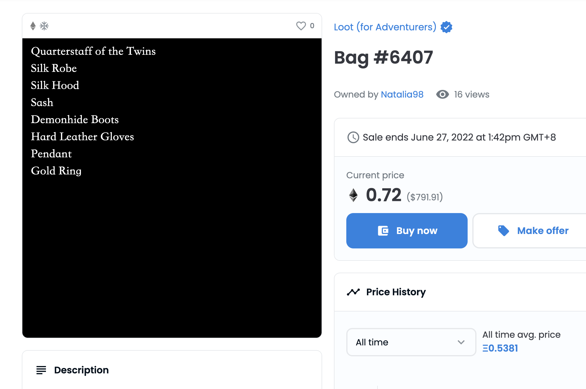

# WTF Solidity Introdução Simples ao Solidity Tópico 5: Loot

Recentemente, estou estudando Solidity novamente para consolidar os detalhes e escrever um "WTF Solidity Introdução Simples" para iniciantes (programadores experientes podem procurar outros tutoriais). Serão lançadas de 1 a 3 aulas por semana.

Twitter: [@0xAA_Science](https://twitter.com/0xAA_Science)

Comunidade: [Discord](https://discord.gg/5akcruXrsk) | [Grupo WeChat](https://docs.google.com/forms/d/e/1FAIpQLSe4KGT8Sh6sJ7hedQRuIYirOoZK_85miz3dw7vA1-YjodgJ-A/viewform?usp=sf_link) | [Site oficial wtf.academy](https://wtf.academy)

Todo o código e tutoriais estão disponíveis no GitHub: [github.com/AmazingAng/WTFSolidity](https://github.com/AmazingAng/WTFSolidity)

-----

## Loot



"Loot" é um projeto experimental de NFT na blockchain Ethereum, lançado em agosto de 2021, com um total de 8000 unidades. As primeiras 7777 unidades foram distribuídas gratuitamente através de "minting", e as 233 unidades restantes foram reservadas para os desenvolvedores do projeto. O preço máximo chegou a ultrapassar 20 ETH, mas atualmente está estável em cerca de 1 ETH. Ao contrário dos NFTs de imagens que inundam o mercado, o "Loot" é um NFT de texto, onde todos os metadados são armazenados na blockchain, garantindo a descentralização e a impossibilidade de alteração por terceiros.

O conteúdo do "Loot" é bastante simples, consistindo em uma descrição textual de um conjunto de equipamentos para jogadores, incluindo armas, capacetes, anéis e outros 8 tipos de itens. Nomes como "Anel de Ouro", "Espada Gêmea" e "Luvas de Couro Resistente" me fazem lembrar do jogo "Diablo" que eu costumava jogar quando era criança.

O "Loot" é um ecossistema aberto, e os desenvolvedores esperam que mais equipes se juntem à construção do metaverso do "Loot". Nesta aula, vou explicar como o "Loot" gera o texto dos equipamentos usando contratos inteligentes e como ele os armazena na blockchain.

## Código do Loot
O código do "Loot" está disponível no Etherscan, no seguinte endereço: [link](https://etherscan.io/address/0xff9c1b15b16263c61d017ee9f65c50e4ae0113d7#code)

O contrato principal do "Loot" começa na linha 1291 e herda os contratos "ERC721Enumerable", "ReentrancyGuard" e "Ownable", que são bibliotecas padrão do OpenZeppelin.

```solidity
contract Loot is ERC721Enumerable, ReentrancyGuard, Ownable {
```

### 1. Frases básicas para a descrição dos equipamentos
O "Loot" define 11 arrays de strings como variáveis de estado para gerar as frases básicas da descrição dos equipamentos:

- Oito deles são listas de equipamentos para descrever diferentes partes do corpo, incluindo "weapon" (arma), "chestArmor" (armadura de peito), "headArmor" (armadura de cabeça), "waistArmor" (armadura de cintura), "footArmor" (armadura de pés), "handArmor" (armadura de mãos), "necklaces" (colares) e "rings" (anéis). Por exemplo, a lista de armas contém strings como "Warhammer" e "Quarterstaff":

```solidity
        string[] private weapons = [
        "Warhammer",
        "Quarterstaff",
        "Maul",
        "Mace",
        "Club",
        "Katana",
        "Falchion",
        "Scimitar",
        "Long Sword",
        "Short Sword",
        "Ghost Wand",
        "Grave Wand",
        "Bone Wand",
        "Wand",
        "Grimoire",
        "Chronicle",
        "Tome",
        "Book"
    ];
```

- Os outros três arrays são prefixos e sufixos para modificar os equipamentos, incluindo "suffixes" (sufixos), "namePrefixes" (prefixos de nome) e "nameSuffixes" (sufixos de nome). Os prefixos e sufixos podem tornar os equipamentos mais impressionantes, como "Coroa Perfeita do Dragão" e "Couraça do Gigante Elegante". Por exemplo, o array "suffixes" inclui:

```solidity
    string[] private suffixes = [
        "of Power",
        "of Giants",
        "of Titans",
        "of Skill",
        "of Perfection",
        "of Brilliance",
        "of Enlightenment",
        "of Protection",
        "of Anger",
        "of Rage",
        "of Fury",
        "of Vitriol",
        "of the Fox",
        "of Detection",
        "of Reflection",
        "of the Twins"
    ];
```

Ao combinar aleatoriamente as listas de equipamentos e palavras modificadoras, é possível gerar o texto do NFT do "Loot".

### 2. Geração aleatória do texto da descrição

Para diferenciar a raridade dos equipamentos, o "Loot" utiliza a função de geração de números pseudoaleatórios na blockchain chamada "random()" para fornecer aleatoriedade ao texto da descrição dos equipamentos:

```solidity
    function random(string memory input) internal pure returns (uint256) {
        return uint256(keccak256(abi.encodePacked(input)));
    }
```

A função "random()" recebe uma string "input" como parâmetro, calcula o hash dessa string e o converte para um número uint256. Isso mapeia diferentes inputs para diferentes números de forma uniforme. Em seguida, esse número é mapeado para a raridade do equipamento. O "Loot" define a função "pluck()" para fazer isso.

```solidity
    function pluck(uint256 tokenId, string memory keyPrefix, string[] memory sourceArray) internal view returns (string memory) {
        uint256 rand = random(string(abi.encodePacked(keyPrefix, toString(tokenId))));
        string memory output = sourceArray[rand % sourceArray.length];
        uint256 greatness = rand % 21;
        if (greatness > 14) {
            output = string(abi.encodePacked(output, " ", suffixes[rand % suffixes.length]));
        }
        if (greatness >= 19) {
            string[2] memory name;
            name[0] = namePrefixes[rand % namePrefixes.length];
            name[1] = nameSuffixes[rand % nameSuffixes.length];
            if (greatness == 19) {
                output = string(abi.encodePacked('"', name[0], ' ', name[1], '" ', output));
            } else {
                output = string(abi.encodePacked('"', name[0], ' ', name[1], '" ', output, " +1"));
            }
        }
        return output;
    }
```

A função "pluck()" é responsável por gerar a descrição de um equipamento específico com base no "tokenId", no "keyPrefix" (parte do corpo do equipamento) e no "sourceArray" (lista de equipamentos). Um equipamento tem 33,3% de chance de ter um sufixo, sendo que 9,5% de chance de ter um "nome especial". Portanto, cada equipamento no "Loot" tem 66,7% de chance de ser comum, 23,8% de chance de ser raro e 9,5% de chance de ser épico.

O "Loot" possui oito funções "get()" para obter os equipamentos de cada parte do corpo. Por exemplo, a função "getWeapon()" retorna a descrição da arma. Ela chama a função "pluck()" com o "keyPrefix" "WEAPON" e a lista de equipamentos "weapons" como parâmetros.

```solidity
    function getWeapon(uint256 tokenId) public view returns (string memory) {
        return pluck(tokenId, "WEAPON", weapons);
    }
```

### 3. Armazenamento dos metadados na blockchain
Como tanto o "keyPrefix" quanto o "sourceArray" são reutilizados, a descrição e a raridade dos equipamentos do "Loot" são totalmente determinadas pelo "tokenId": dado um "tokenId", sempre será gerado o mesmo conjunto de equipamentos. Portanto, o "Loot" não "armazena" todas as descrições dos equipamentos. Sempre que um usuário consulta os metadados, o contrato gera uma nova descrição dos equipamentos. Esse método é inovador e inteligente, reduzindo significativamente o uso de armazenamento e tornando possível o armazenamento dos metadados na blockchain.

Vamos dar uma olhada na função "tokenURI()":

```solidity
    function tokenURI(uint256 tokenId) override public view returns (string memory) {
        string[17] memory parts;
        parts[0] = '<svg xmlns="http://www.w3.org/2000/svg" preserveAspectRatio="xMinYMin meet" viewBox="0 0 350 350"><style>.base { fill: white; font-family: serif; font-size: 14px; }</style><rect width="100%" height="100%" fill="black" /><text x="10" y="20" class="base">';

        parts[1] = getWeapon(tokenId);

        parts[2] = '</text><text x="10" y="40" class="base">';

        parts[3] = getChest(tokenId);

        parts[4] = '</text><text x="10" y="60" class="base">';

        parts[5] = getHead(tokenId);

        parts[6] = '</text><text x="10" y="80" class="base">';

        parts[7] = getWaist(tokenId);

        parts[8] = '</text><text x="10" y="100" class="base">';

        parts[9] = getFoot(tokenId);

        parts[10] = '</text><text x="10" y="120" class="base">';

        parts[11] = getHand(tokenId);

        parts[12] = '</text><text x="10" y="140" class="base">';

        parts[13] = getNeck(tokenId);

        parts[14] = '</text><text x="10" y="160" class="base">';

        parts[15] = getRing(tokenId);

        parts[16] = '</text></svg>';

        string memory output = string(abi.encodePacked(parts[0], parts[1], parts[2], parts[3], parts[4], parts[5], parts[6], parts[7], parts[8]));
        output = string(abi.encodePacked(output, parts[9], parts[10], parts[11], parts[12], parts[13], parts[14], parts[15], parts[16]));
        
        string memory json = Base64.encode(bytes(string(abi.encodePacked('{"name": "Bag #', toString(tokenId), '", "description": "Loot is randomized adventurer gear generated and stored on chain. Stats, images, and other functionality are intentionally omitted for others to interpret. Feel free to use Loot in any way you want.", "image": "data:image/svg+xml;base64,', Base64.encode(bytes(output)), '"}'))));
        output = string(abi.encodePacked('data:application/json;base64,', json));

        return output;
    }
```

Normalmente, a função "tokenURI()" de um NFT de perfil (pfp) retorna uma URL com os metadados em formato JSON. No caso do "Loot", ela retorna diretamente um JSON. A função define a variável "parts" e, em seguida, concatena as descrições dos equipamentos usando as oito funções "get()" para formar um arquivo SVG com a descrição dos equipamentos, que será usado como a imagem dos metadados. Por fim, ele empacota o "name", "description" e "image" em um JSON codificado em Base64 e retorna como resultado da consulta "tokenURI()".

Aqui está um exemplo do resultado da função "tokenURI()":

```solidity
data:application/json;base64,eyJuYW1lIjogIkJhZyAjNSIsICJkZXNjcmlwdGlvbiI6ICJMb290IGlzIHJhbmRvbWl6ZWQgYWR2ZW50dXJlciBnZWFyIGdlbmVyYXRlZCBhbmQgc3RvcmVkIG9uIGNoYWluLiBTdGF0cywgaW1hZ2VzLCBhbmQgb3RoZXIgZnVuY3Rpb25hbGl0eSBhcmUgaW50ZW50aW9uYWxseSBvbWl0dGVkIGZvciBvdGhlcnMgdG8gaW50ZXJwcmV0LiBGZWVsIGZyZWUgdG8gdXNlIExvb3QgaW4gYW55IHdheSB5b3Ugd2FudC4iLCAiaW1hZ2UiOiAiZGF0YTppbWFnZS9zdmcreG1sO2Jhc2U2NCxQSE4yWnlCNGJXeHVjejBpYUhSMGNEb3ZMM2QzZHk1M015NXZjbWN2TWpBd01DOXpkbWNpSUhCeVpYTmxjblpsUVhOd1pXTjBVbUYwYVc4OUluaE5hVzVaVFdsdUlHMWxaWFFpSUhacFpYZENiM2c5SWpBZ01DQXpOVEFnTXpVd0lqNDhjM1I1YkdVK0xtSmhjMlVnZXlCbWFXeHNPaUIzYUdsMFpUc2dabTl1ZEMxbVlXMXBiSGs2SUhObGNtbG1PeUJtYjI1MExYTnBlbVU2SURFMGNIZzdJSDA4TDNOMGVXeGxQanh5WldOMElIZHBaSFJvUFNJeE1EQWxJaUJvWldsbmFIUTlJakV3TUNVaUlHWnBiR3c5SW1Kc1lXTnJJaUF2UGp4MFpYaDBJSGc5SWpFd0lpQjVQU0l5TUNJZ1kyeGhjM005SW1KaGMyVWlQazFoZFd3Z2IyWWdVbVZtYkdWamRHbHZiand2ZEdWNGRENDhkR1Y0ZENCNFBTSXhNQ0lnZVQwaU5EQWlJR05zWVhOelBTSmlZWE5sSWo1UWJHRjBaU0JOWVdsc1BDOTBaWGgwUGp4MFpYaDBJSGc5SWpFd0lpQjVQU0l5TUNJZ1kyeGhjM005SW1KaGMyVWlQa1J5WVdkdmJpZHpJRU55YjNkdUlHOW1JRkJsY21abFkzUnBiMjQ4TDNSbGVIUStQSFJsZUhRZ2VEMGlNVEFpSUhrOUlqZ3dJaUJqYkdGemN6MGlZbUZ6WlNJK1UyRnphRHd2ZEdWNGRENDhkR1Y0ZENCNFBTSXhNQ0lnZVQwaU1UQXdJaUJqYkdGemN6MGlZbUZ6WlNJK1NHOXNlU0JIY21WaGRtVnpQQzkwWlhoMFBqeDBaWGgwUGp4MFpYaDBJSGc5SWpFd0lpQjVQU0l4TkRBaUlHTnNZWE56UFNKaVlYTmxJajVRWlc1a1lXNTBQQzkwWlhoMFBqeDBaWGgwSUhnOUlqRXdJaUI1UFNJeE1qQWlJR05zWVhOelBTSmlZWE5sSWo1SVlYSmtJRXhsWVhSb1pYSWdSMnh2ZG1WelBDOTBaWGgwUGp4MFpYaDBJSGc5SWpFd0lpQjVQU0kyTUNJZ1kyeGhjM005SW1KaGMyVWlQa1J5WVdkdmJpZHpJRU55YjNkdUlHOW1JRkJsY21abFkzUnBiMjQ4TDNSbGVIUStQSFJsZUhRZ2VEMGlNVEFpSUhrOUlqZ3dJaUJqYkdGemN6MGlZbUZ6WlNJK1NHOXNlU0JIY21WaGRtVnpQQzkwWlhoMFBqd3ZjM1puUGc9PSJ9
```

Copie e cole o resultado em um navegador para obter diretamente os metadados do "Loot". É bastante impressionante:


Aqui está um exemplo da imagem gerada pelo "Loot" com a descrição em texto em formato SVG:
```
data:image/svg+xml;base64,PHN2ZyB4bWxucz0iaHR0cDovL3d3dy53My5vcmcvMjAwMC9zdmciIHdpZHRoPSIzNTAiIGhlaWdodD0iMzUwIj4KPHJlY3Qgd2lkdGg9IjEwMCIgaGVpZ2h0PSIxMDAiIGZpbGw9ImJsYWNrIiAvPjx0ZXh0IHg9IjEwIiB5PSIyMCIgY2xhc3M9ImJhc2UiPjxzdHlsZT4uYmFzZSB7IGZpbGw6IHdoaXRlOyBmb250LWZhbWlseTogc2VyaWY7IGZvbnQtc2l6ZTogMTRweDsgfTwvc3R5bGU+PHJlY3Qgd2lkdGg9IjEwMCIgaGVpZ2h0PSIyMCIgY2xhc3M9ImJhc2UiPk1hdWwgb2YgUmVmbGVjdGlvbjwvcmVjdD48dGV4dCB4PSIxMCIgeT0iNDAiIGNsYXNzPSJiYXNlIj5QbGF0ZSBNYWlsPC90ZXh0Pjx0ZXh0IHg9IjEwIiB5PSI2MCIgY2xhc3M9ImJhc2UiPkRyYWdvbidzIENyb3duIG9mIFBlcmZlY3Rpb248L3RleHQ+PHRleHQgeD0iMTAiIHk9IjgwIiBjbGFzcz0iYmFzZSI+SG9seSBHcmVhdmVzPC90ZXh0Pjx0ZXh0IHg9IjEwIiB5PSIxMjAiIGNsYXNzPSJiYXNlIj5IYXJkIExlYXRoZXIgR2xvdmVzPC90ZXh0Pjx0ZXh0IHg9IjEwIiB5PSIxNDAiIGNsYXNzPSJiYXNlIj5QZW5kYW50PC90ZXh0Pjx0ZXh0IHg9IjEwIiB5PSIxNjAiIGNsYXNzPSJiYXNlIj5UaXRhbml1bSBSaW5nPC90ZXh0Pjwvc3ZnPgo=
```
