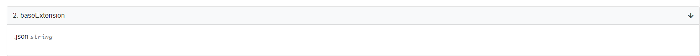
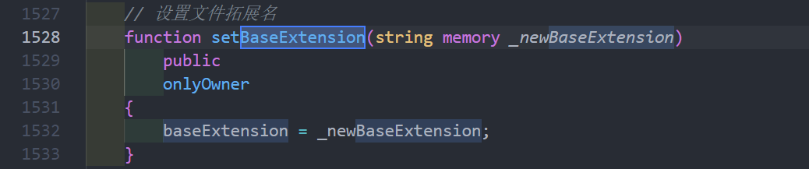
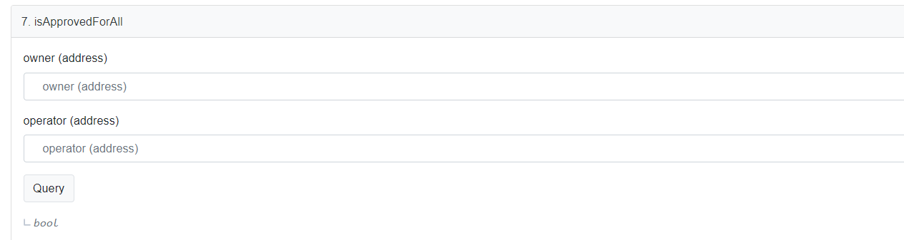
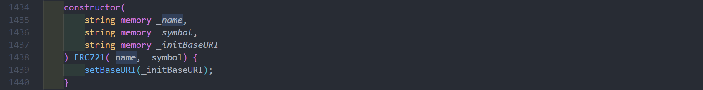
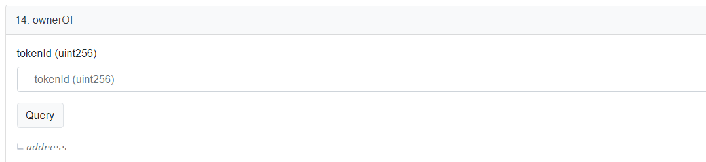
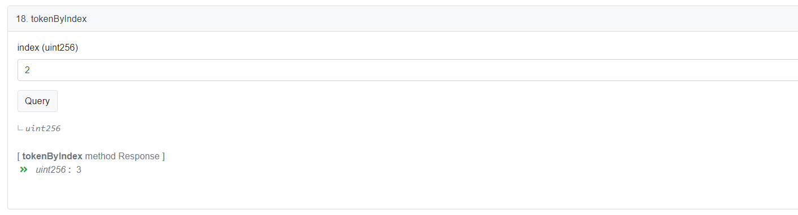
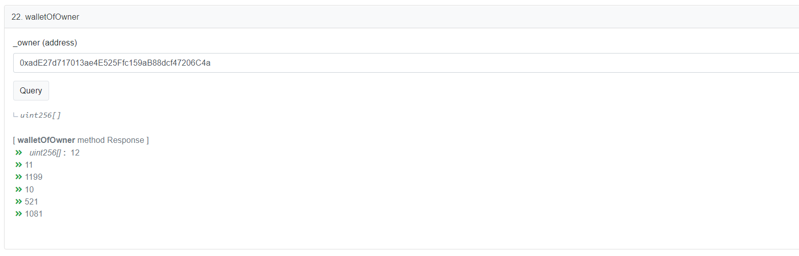
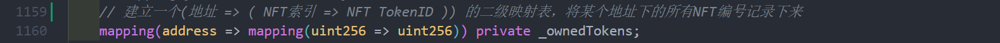
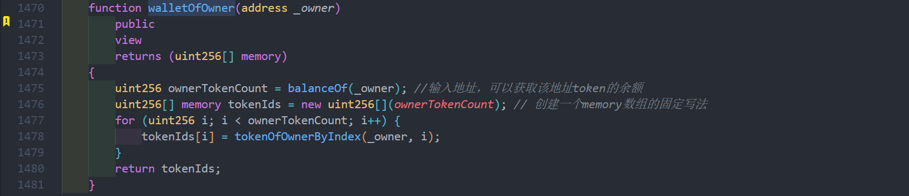
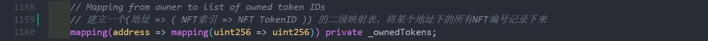

# Contrato BanaCat NFT (1/3)

# Sobre o BanaCatNFT

O projeto BanaCat é uma coleção de arte digital de avatar implantada na blockchain Polygon.


Link do projeto: [https://opensea.io/collection/banacat-v2](https://opensea.io/collection/banacat-v2)

Endereço do código do contrato: [https://polygonscan.com/address/0xd2bc5c3990c06ccd26f10a3e9d93b19450136c8d#code](https://polygonscan.com/address/0xd2bc5c3990c06ccd26f10a3e9d93b19450136c8d#code)

Além disso, foram criados pacotes de emojis relacionados a essa arte digital, e um deles já está disponível na loja de emojis do WeChat. Link para os emojis: [香蕉猫看戏篇](https://sticker.weixin.qq.com/cgi-bin/mmemoticon-bin/emoticonview?oper=single&t=shop/detail&productid=aL2PCfwK/89qO7sF6/+I+UDhfwEjhec2ZNvdnLLJRd/N7QVyYnUnFpeB0t9OOOGqFiGlj08OJVil+/ruMQmJp3eFNlkqDVcbCJC9A4/2eWbE=)


---

# Todas as funções de "leitura" do contrato. (Funções que apenas leem o estado do contrato, mas não o modificam)

`balanceOf()`: Retorna a quantidade de NFTs que um determinado endereço possui neste contrato.


Cria um mapeamento de endereços para a quantidade de tokens e a função `balanceOf()` verifica a validade do endereço e retorna a quantidade de NFTs que o endereço possui de acordo com o mapeamento.


---

`baseExtension()`: Retorna o formato do arquivo `Metadata`, que neste caso é `.json`.




O `baseExtension` também pode ser modificado posteriormente por meio de uma função.



---

`cost`: Preço para criar um novo NFT, o preço unitário é de 0,5 ether. Como está implantado na rede Polygon, o preço para criar um NFT é de 0,5 MATIC. (O BanaCat NFT é o meu primeiro projeto de NFT e tem como objetivo ser um projeto de perfil público, para fins de comunicação e aprendizado, por isso o preço é baixo);

Nem todos os projetos de NFT têm preços fixos, muitos projetos definem o preço como uma variável e a ajustam dinamicamente com base nas vendas públicas do projeto.


A unidade de medida da criptomoeda Ethereum é o WEI, 1 ETH = 10^18 WEI.

---

`getApproved()`: Uma das funções principais do padrão ERC721, verifica qual endereço está autorizado a possuir um determinado NFT. Em conjunto com as funções `approve()` e `setApprovalForAll()`, é possível realizar operações de autorização de NFTs, como será demonstrado em um exemplo na próxima postagem.


Por meio de um mapeamento de NFT `tokenID` para endereço, a função `getApproved()` verifica a validade do `tokenID` e retorna o endereço do proprietário correspondente ao `tokenID` do mapeamento.


Um exemplo de aplicação:

[_safeTransferFrom() para transferir NFT usando um proxy](file:./_safeTransferFrom()使用代理转移NFT.md)

---

`isApprovedForAll()`: Verifica se o `owner` de um NFT autorizou um determinado `operator` a gerenciar todos os seus NFTs.



Por meio de um mapeamento de dois níveis, é estabelecido um relacionamento de mapeamento entre `(endereço do proprietário ⇒ (endereço do operador ⇒ bool))`. Quando `bool` é `true`, significa que o `owner` autorizou o `operator` a gerenciar todos os seus NFTs. Quando `bool` é `false`, significa que o `owner` não autorizou ou cancelou a autorização.


---

`isPaused()`: Controla a atividade de criação de NFTs ou pausa a atividade.


A variável `isPaused` é usada como um interruptor para controlar o início da atividade de criação de NFTs na função `mint()`.


---

`maxMintAmount()`: Quantidade máxima de NFTs que podem ser criados de uma só vez, o valor padrão é 5.


É uma variável que pode ser modificada posteriormente pela função `setmaxMintAmountOneTime()`.


---

`maxSupply()`: Quantidade atual de NFTs que ainda podem ser criados no projeto. O total de NFTs da primeira fase do BanaCat NFT está registrado no contrato, dê uma olhada! (A quantidade tem relação comigo também).


---

`name()`: Variável declarada em `Metadata.sol` que representa o nome do projeto, o mesmo princípio se aplica ao `symbol`.


`name` e `symbol` são inicializados no construtor do contrato.




---

`owner()`: Proprietário atual do contrato, por padrão é o endereço que publicou o contrato inicialmente, mas posteriormente o contrato pode ser transferido para outra pessoa. Alguns projetos de NFT transferem a propriedade para a comunidade, que cuida coletivamente do projeto, sendo um exemplo de aplicação de DAO.


Implementação do contrato `Ownable.sol` da biblioteca OpenZeppelin.

[openzeppelin-contracts/Ownable.sol at master · OpenZeppelin/openzeppelin-contracts](https://github.com/OpenZeppelin/openzeppelin-contracts/blob/master/contracts/access/Ownable.sol)

Função de transferência de propriedade;

Outra aplicação da transferência de propriedade é quando o proprietário do projeto cria NFTs gratuitamente e deseja enviar uma grande quantidade de NFTs para outro endereço próprio. Uma maneira mais econômica de fazer isso é transferir a propriedade do contrato para o endereço de destino e, em seguida, transferir a propriedade de volta após a criação em massa de NFTs.


---

`ownerOf()`: Verifica o endereço proprietário de um determinado NFT.



O `_owners` estabelece um mapeamento entre o `tokenID` e o endereço, e a função `ownerOf()` retorna o endereço correspondente após verificar a validade do endereço retornado.


---

`supportsInterface()`: Funcionalidade principal do padrão ERC165, usada para verificar se o contrato implementa uma interface específica. Usando o `InterfaceID` ERC721 como exemplo: "0x80ac58cd".

Se você não está familiarizado com o ERC165, pode ler este artigo:

[GitHub - LIPUU/1wallet](https://github.com/LIPUU/1wallet#4-erc165%E4%B8%8Eerc721)


---

`tokenByIndex()`: Retorna o `tokenID` correspondente ao índice fornecido no array `_allTokens`, para facilitar a pesquisa posterior.

A função `ownerOf()` do ERC721 pode retornar o endereço proprietário de um determinado `tokenID`, e `balanceOf()` pode informar quantos NFTs um determinado endereço possui, mas como podemos saber quais `tokenID`s um determinado endereço possui? A biblioteca de extensão `ERC721Enumerable` foi criada para resolver esse problema.

[openzeppelin-contracts/ERC721Enumerable.sol at master · OpenZeppelin/openzeppelin-contracts](https://github.com/OpenZeppelin/openzeppelin-contracts/blob/master/contracts/token/ERC721/extensions/ERC721Enumerable.sol)




---

`tokenOfOwnerByIndex()`: Retorna o `tokenID` do endereço fornecido e do índice fornecido.

Como entender essa função? Um NFT padrão do ERC721 só pode ser possuído por um endereço, mas um endereço pode possuir vários NFTs. O contrato padrão do ERC721 fornece apenas uma interface para verificar quantos NFTs um endereço possui (`balanceOf()`), mas não fornece uma interface para verificar quais tokens um endereço possui. A função `tokenOfOwnerByIndex()` fornece essa funcionalidade, que será explicada em detalhes na função `walletOfOwner()` a seguir.

Por exemplo: `walletOfOwner()` retorna a lista de `tokenID`s [12, 11, 1199, 10, 521, 1081] do endereço `_owner`, e como os índices de array começam em 0, o `tokenID` retornado quando o índice é 0 é 12.






---

`totalSupply()`: Mostra a quantidade atual de NFTs que foram criados e podem ser rastreados.


---

`walletOfOwner()`: Retorna todos os `tokenID`s do endereço atual.

Princípio:

① Cria um mapeamento de dois níveis `(endereço => (índice do NFT => tokenID do NFT))`, registrando todos os números de NFTs de um determinado endereço; (Na minha opinião, também é possível criar um mapeamento `(endereço => address[])` para alcançar a mesma funcionalidade, mas isso aumentaria o consumo de gás devido às operações frequentes de array com as transações de NFT)

② A função `walletOfOwner()` primeiro verifica quantos NFTs o endereço atual possui e cria um array temporário `tokenIds` com esse tamanho. Em seguida, chama `tokenOfOwnerByIndex(_owner, i)`.

③ `tokenOfOwnerByIndex(_owner, i)` retorna o `tokenID` correspondente à posição `i` do endereço e o registra no array temporário `tokenIds`.

④ Por fim, a função `walletOfOwner()` retorna os dados do array `tokenIds`.







---

`tokenURI()`: Retorna o `tokenURI` correspondente ao `tokenID` fornecido.


Como entender essa função? Vamos começar explicando como os metadados do NFT são armazenados.

Nas condições tecnológicas atuais, armazenar diretamente a imagem do NFT e os dados de atributos em uma blockchain é inviável (o mecanismo de consenso da blockchain faz backup dos dados de todos os blocos em cada nó completo da rede, armazenar um arquivo de 1 MB em 100 nós resultaria em 100 MB de dados redundantes, o que não apenas desperdiça espaço de armazenamento, mas também aumenta significativamente o custo de emissão de NFTs). Para atender à tendência de descentralização, a maioria dos projetos de metadados de NFT armazena os arquivos de origem do NFT na rede IPFS.

Você pode verificar os metadados nos seguintes links:

[Metadata Standards](https://docs.opensea.io/docs/metadata-standards)

Usando o exemplo do NFT #1623 do BanaCat:


```json
{
  "name": "BanaCat #1623",  // Nome do NFT
    // Descrição do projeto
  "description": "Pixel kitty with different styles, if you're tired of those 'bored' Apes, come and take a look at these cute cats~ Maybe they are the most suitable NFT for avatar and your honey may love them too. Let's explore what the next kitty will wear on his/her head!",
  "image": "ipfs://QmYr9NUaom7uijzTdsjvQ57hRNV4gttnhXF7Sgvt36cUUh/1623.png",  // Localização da imagem no IPFS, semelhante a um URL no protocolo HTTP
  "dna": "b39631c09c646593738fa44a1d8665cdb74faf08",  // Resumo dos dados do NFT (atributos) calculado a partir do hash dos atributos do NFT, garantindo que não haja arquivos de imagem duplicados com base nesses atributos
  "edition": 1623,  // Pode ser entendido como um ID
  "date": 1643206138987,  // Data de criação
  "attributes": [  // Atributos da imagem
    {
      "trait_type": "background",  // Fundo laranja
      "value": "Orange"
    },
    {
      "trait_type": "head",  // Cabeça cinza
      "value": "Gray"
    },
    {
      "trait_type": "blush",  // Bochechas rosadas
      "value": "Pink"
    },
    {
      "trait_type": "nose",  // Nariz marrom
      "value": "Brown"
    },
    {
      "trait_type": "mouse",  // Boca sorridente
      "value": "Smile"
    },
    {
      "trait_type": "eyes",  // Olhos brilhantes
      "value": "Blingbling"
    },
    {
      "trait_type": "hat",  // Chapéu de radar (em homenagem à engenharia de comunicação de radar da Xidian University)
      "value": "Radar"
    }
  ],
  "Author": "shuxun"
}

Cada NFT tem um arquivo JSON correspondente. Todos os arquivos são colocados em uma pasta e enviados para a rede IPFS, gerando um endereço CID para a pasta, que é o "baseURI" no contrato. O endereço do arquivo correspondente a cada NFT é concatenado a partir deste endereço base.
```

`tokenURI()`: concatena o `baseURI` + `tokenID` + sufixo do arquivo para obter o endereço de armazenamento do NFT correspondente ao `tokenID`.


Este artigo apresentou principalmente as funções de "leitura" do contrato do BanaCat. No próximo artigo, apresentaremos as funções de "escrita" do contrato.

<!-- This file was translated using AI by repo_ai_translate. For more information, visit https://github.com/marcelojsilva/repo_ai_translate -->