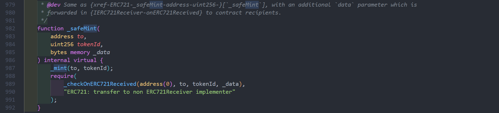
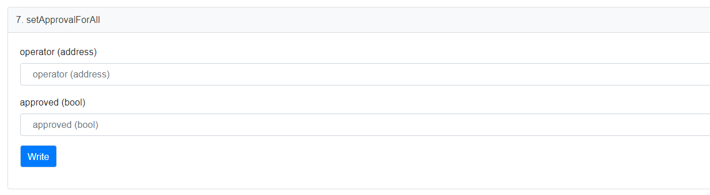
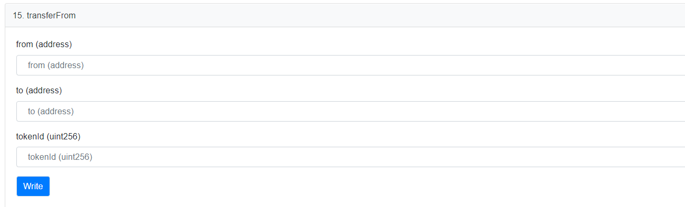
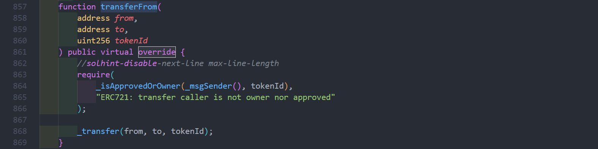

# Contrato BanaCat NFT (2/3)

# Sobre o BanaCatNFT

O projeto BanaCat é uma coleção de arte digital de avatar implantada na blockchain Polygon.

Link do projeto: [BanaCato_O - Collection | OpenSea](https://opensea.io/collection/banacat-v2)

Endereço do código do contrato: https://polygonscan.com/address/0xd2bc5c3990c06ccd26f10a3e9d93b19450136c8d#code

Além disso, com base nesta arte digital, também foram criados pacotes de emojis relacionados. Atualmente, um desses pacotes já está disponível na loja de emojis do WeChat. Link do pacote de emojis: [香蕉猫看戏篇](https://sticker.weixin.qq.com/cgi-bin/mmemoticon-bin/emoticonview?oper=single&t=shop/detail&productid=aL2PCfwK/89qO7sF6/+I+UDhfwEjhec2ZNvdnLLJRd/N7QVyYnUnFpeB0t9OOOGqFiGlj08OJVil+/ruMQmJp3eFNlkqDVcbCJC9A4/2eWbE=)

---

# A função "write" altera o estado do contrato e cada transação consome uma certa quantidade de gás.

Como é necessário assinar cada transação com a chave privada, é necessário conectar sua carteira antes de interagir com o contrato.

---

`approve()`: autoriza um único NFT para um determinado operador, permitindo que ele transfira o NFT em nome do proprietário. Será fornecido um exemplo posteriormente.

`_tokenApprovals` é um mapeamento de `tokenID` para o endereço do `operador`. A função `approve()` usa esse mapeamento para autorizar um endereço específico a transferir o NFT.

---

`mint()`: função de criação de NFT. Durante a fase de promoção do projeto, seja por meio de criação de lista branca ou venda pública, a função `mint()` é chamada diretamente ou indiretamente. A criação de NFT na camada do contrato refere-se a pular o processo de criação do site oficial do projeto e interagir diretamente com o contrato por meio de um explorador de blockchain ou chamada RPC local. Essa função é muito importante, pois é o ponto de partida para a emissão de NFT.

O primeiro parâmetro `mint` é a quantidade total de tokens a serem pagos;

`_mintAmount()`: quantidade de NFTs a serem criados de uma vez;

O preço unitário da criação varia dependendo se há uma lista branca ou não, mas o `preço total = preço unitário * quantidade`. O contrato deduzirá o valor total dos tokens da conta do criador (o gás é calculado separadamente);

---

A função `mint()` verifica se o valor de `_mintAmount` é válido, ou seja, `_mintAmount` deve ser maior que 0 e não pode exceder a quantidade máxima de criação em uma única vez, `maxMintAmount`;

Além disso, a função verifica se a quantidade de criação atual `_mintAmount` somada à quantidade total de criações `_totalsupply` não excede o fornecimento máximo de NFTs do contrato `maxSupply`;

Em seguida, a função verifica se o valor total dos tokens enviados pelo criador da transação é maior ou igual ao preço total da criação dos NFTs;

Por fim, a função usa um loop para chamar a função `_safeMint()` para criar os NFTs para cada usuário. (Esse método de loop é fácil de entender, mas o custo de criação em lote é alto. O protocolo ERC721A proposto por Azuki economiza gás ao criar NFTs em lote, mas falaremos sobre isso mais adiante).

A função `_safeMint()` é chamada de "segura" porque verifica a identidade do criador. Se o criador for um contrato, o contrato deve implementar a interface `IERC721Receiver`. Para mais informações sobre `IERC721Receiver`, consulte o artigo de A:

[WTF Solidity极简入门 ERC721专题：1. ERC721相关库](https://mirror.xyz/wtfacademy.eth/PAsIFLAmEoMufZsXlX0NWsVF8DHpHz3OrYlooosy9Ho)

Há um pequeno detalhe: o primeiro parâmetro de `_checkOn721Received()` é `from`, que é definido como `address(0)` ou `0x0000000000000000000000000000000000000000` quando chamado por `_safeMint()`. Isso significa que o NFT está sendo transferido do endereço 0. Em seguida, a função `_mint()` dispara o evento `Transfer` para registrar a transferência do NFT do endereço `from` para o endereço `to`. Aqui, `from` também é `address(0)`. Embora todos os NFTs sejam criados pelo contrato, o endereço de origem do NFT não é o endereço do contrato. Minha interpretação disso é que queimar um NFT é basicamente enviá-lo para o endereço 0, o que significa que o NFT foi destruído e perdeu sua liquidez. Talvez isso também inclua o ditado "de onde vem, para onde vai".

A função `_mint()` dispara o evento `Transfer()` para gerar um arquivo de log no blockchain.

---

`pause()`: define se a atividade de criação de NFT está pausada. `true` significa pausado e `false` significa que a criação está permitida.

---

`renounceOwnership()`: o projeto renuncia ao controle do contrato, definindo o endereço do `owner` como `address(0)`, o que significa que ninguém mais pode controlar o contrato, assim como poeira no universo.

Se o saldo do contrato não puder ser retirado. Função de alto risco (nível de risco: máximo⚠️⚠️⚠️⚠️⚠️)

---

`safeTransferFrom()`: função de transferência de NFT, transfere um NFT com o ID fornecido `tokenID` do endereço `from` para o endereço `to`.

---

`safeTransferFrom()`: função de transferência de NFT, transfere um NFT com o ID fornecido `tokenID` do endereço `from` para o endereço `to`, com alguns dados adicionais que podem ser usados para atividades explicativas (como escrever um texto de arquivo permanente no blockchain).

Por que o nome é `safeTransferFrom` em vez de `safeTransfer`? Embora pareça que apenas uma palavra foi removida do nome, isso está relacionado ao problema da delegação de direitos.

Existem duas categorias de atores em um contrato ERC721 que podem transferir um NFT: o proprietário do NFT e o operador autorizado atual do NFT. O "from" no nome da função representa de qual conta o NFT está sendo transferido, e muitas vezes o endereço para o qual o NFT está sendo transferido não é o proprietário real do NFT. Vamos dar um exemplo para ilustrar esse fenômeno.

[_safeTransferFrom()使用代理转移NFT (1)](BanaCat%20NFT%20Contract%EF%BC%882%203%EF%BC%89%202fed2b20e00b4af9acf6104983616ced/_safeTransferFrom()%E4%BD%BF%E7%94%A8%E4%BB%A3%E7%90%86%E8%BD%AC%E7%A7%BBNFT%20(1)%209ed361c7830b4b1a8375000b5bedcd07.md)

Mas qual é o propósito dessa operação?

Na minha opinião, os NFTs têm propriedades financeiras desde o momento em que são criados, e a autorização para o NFT fornece um método viável para garantia. O autorizador pode obter empréstimos com base na garantia, e as instituições de empréstimo podem emitir ativos financeiros derivados dos NFTs obtidos como garantia... O espaço de aplicação dos NFTs vai muito além da minha imaginação!

---

`setApprovalForAll()`: autoriza todos os NFTs do endereço do `owner` para o `operator`.

Função de alto risco (nível de risco: ⚠️⚠️⚠️)

`_operatorApprovals` é um mapeamento de dois níveis (endereço do proprietário ⇒ (endereço do operador ⇒ bool)). A função `setApprovalForAll()` usa esse mapeamento para definir se todos os NFTs do proprietário estão autorizados para o `operator`.

[Exemplo de setApprovalForAll()](https://github.com/ShuxunoO/WTFSolidity/blob/main/Topics/ERC721%E6%8E%A5%E5%8F%A3%E8%A7%A3%E6%9E%90/Notes_02_%E5%AE%9E%E4%BE%8B%E5%88%86%E6%9E%90_ShuxunOo/setApprovalForAll%EF%BC%88%EF%BC%89%E7%9A%84%E5%AE%9E%E4%BE%8B.md)

---

`setBaseExtension()`: define a extensão do arquivo `Metadata`. Geralmente, essa função não é usada, pois a extensão padrão é "json".

---

`setBaseURI()`: define o `BaseURI` do NFT. Função de alto risco (nível de risco: ⚠️⚠️⚠️). Geralmente, é usada apenas para o lançamento do projeto e não é mais usada após o lançamento.

---

`setCost()`: define o preço de criação dos NFTs durante a venda pública.

---

`transferFrom()`: função de transferência de NFT, transfere um NFT com o ID fornecido `tokenID` do endereço `from` para o endereço `to`. Não verifica o endereço `to`, portanto, não é "segura".

---

`transferOwnership()`: transfere a propriedade do contrato para um novo endereço.

Função de alto risco (nível de risco: ⚠️⚠️⚠️⚠️)

`Ownable.sol` é um arquivo de extensão que contém funções adicionais. Para mais detalhes, consulte o seguinte link:

[openzeppelin-contracts/Ownable.sol at master · OpenZeppelin/openzeppelin-contracts](https://github.com/OpenZeppelin/openzeppelin-contracts/blob/master/contracts/access/Ownable.sol)

---

`withdraw()`: transfere o saldo do contrato para o endereço do `owner` do contrato. Acredito que a maioria dos projetos esteja esperando por esse último passo.

O próximo artigo apresentará um mecanismo de lista branca de senhas projetado no contrato BanaCatNFT.

