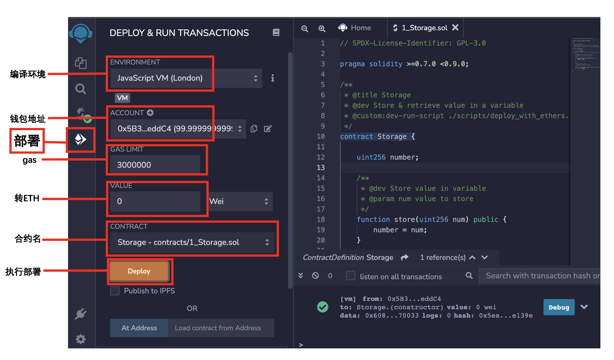

# WTF Solidity Simplified Introduction - Tool 1: Remix

Recentemente, estou estudando solidity novamente para revisar os detalhes e escrever um "WTF Solidity Simplified Introduction" para iniciantes (programadores experientes podem procurar outros tutoriais). Serão publicadas de 1 a 3 aulas por semana.

Siga-me no Twitter: [@0xAA_Science](https://twitter.com/0xAA_Science)

Comunidade técnica do WTF no Discord, com informações sobre como entrar no grupo do WeChat: [link](https://discord.gg/5akcruXrsk)

Todo o código e tutoriais estão disponíveis no GitHub: [github.com/AmazingAng/WTFSolidity](https://github.com/AmazingAng/WTFSolidity)

-----

`Remix` é uma IDE oficialmente recomendada para o desenvolvimento de contratos inteligentes no Ethereum e é muito fácil de usar. O Remix permite que você implante e teste contratos inteligentes diretamente no navegador, sem a necessidade de instalar ou configurar qualquer programa. Nesta aula, vamos aprender como implantar um contrato usando o Remix e chamar suas funções.

**Site oficial do Remix**: [remix.ethereum.org](https://remix.ethereum.org)

## 1. Abrindo o Remix

Abra o site oficial do Remix e você verá que ele é composto por quatro painéis:
1. Painel de ícones: contém ícones que representam diferentes funcionalidades. Ao clicar em um ícone, a funcionalidade correspondente será exibida no painel lateral.
2. Painel lateral: contém a interface gráfica de várias funcionalidades.
3. Painel principal: editor de código.
4. Terminal: exibe os resultados da interação com a interface gráfica e também pode ser usado para executar scripts.

## 2. Painel de ícones

O painel de ícones possui quatro ícones padrão, sendo que "File" (Arquivo), "Compile" (Compilar) e "Deploy" (Implantar) são os mais utilizados. Quando você adiciona mais plugins do Remix, eles também serão exibidos no painel de ícones.

## 3. Implantação de um contrato simples
### i. Selecionando o arquivo do contrato
Primeiro, clique no ícone "File" para abrir o painel lateral de navegação de arquivos.

No painel de navegação de arquivos, você pode gerenciar seu workspace, pastas e arquivos.

Dentro da pasta "contract", existem três exemplos de contratos fornecidos pelo Remix: "1_Storage.sol", "2_Owner.sol" e "3_Ballot.sol".

Clique em "1_Storage.sol" e o código será exibido no editor de código do painel principal. Este contrato é muito simples: ele possui uma variável de estado chamada "number" que armazena um número do tipo "uint256" na blockchain; ele também possui duas funções, "store()" que atribui um número à variável "number" e "retrieve()" que exibe o valor da variável "number".

### ii. Compilando
Em seguida, clique no ícone "Compile" para abrir o "Solidity Compiler". Aqui, selecione a versão "Solidity 0.8.7" e clique no botão "Compile 1_Storage.sol" para compilar o contrato. Quando o contrato for compilado com sucesso, o ícone "Compile" ficará marcado com um sinal de verificação verde.

Você também pode experimentar habilitar a otimização ("Enable Optimization") e definir o número de vezes como "200", o que às vezes pode reduzir o consumo de "gas".

### iii. Implantação
Agora, vamos implantar o contrato compilado em uma máquina virtual local ou na blockchain. Primeiro, clique no ícone "Deploy" para abrir a página de implantação.

Na seção "ENVIRONMENT", você pode selecionar o ambiente de implantação. O padrão é "JavaScript VM", onde todas as transações são executadas em uma blockchain local no navegador, usando o endereço da carteira virtual fornecido pelo Remix. Você também pode selecionar "Injected Web3" para conectar sua carteira Metamask e executar as transações na blockchain real.

Aqui, vamos selecionar "JavaScript VM" e você poderá ver o endereço de teste atribuído pela máquina virtual na seção "ACCOUNT". Não é necessário ajustar o "Gas" nem enviar "ETH" para o contrato. Na seção "CONTRACT", selecione o contrato "Storage" que você deseja implantar. Como o arquivo "1_Storage.sol" contém apenas um contrato, ele será selecionado automaticamente. No entanto, se o arquivo contiver vários contratos, você precisará selecionar manualmente o contrato que deseja implantar.

Clique no botão "DEPLOY" para concluir a implantação!

**Observação**: Se você escolher "Injected Web3" para implantar o contrato, cada transação será registrada na blockchain e exigirá a confirmação e o pagamento de "gas" pela carteira.

### iv. Chamando as funções
Após a implantação bem-sucedida do contrato, você pode encontrar o contrato implantado "Storage" em "Deployed Contracts". Expanda-o e você verá todas as funções externas: "store" e "retrieve".

Digite "100" na caixa de texto da função "store" e clique no nome da função para chamá-la. Após a chamada bem-sucedida, você poderá ver as informações de "log" no terminal e clicar no botão "Debug" para ver os detalhes da transação.

Em seguida, chame a função "retrieve" para exibir o valor atualizado da variável "number", que agora deve ser "100".

## Conclusão

Nesta aula, aprendemos como compilar, implantar e chamar contratos inteligentes usando o Remix.

