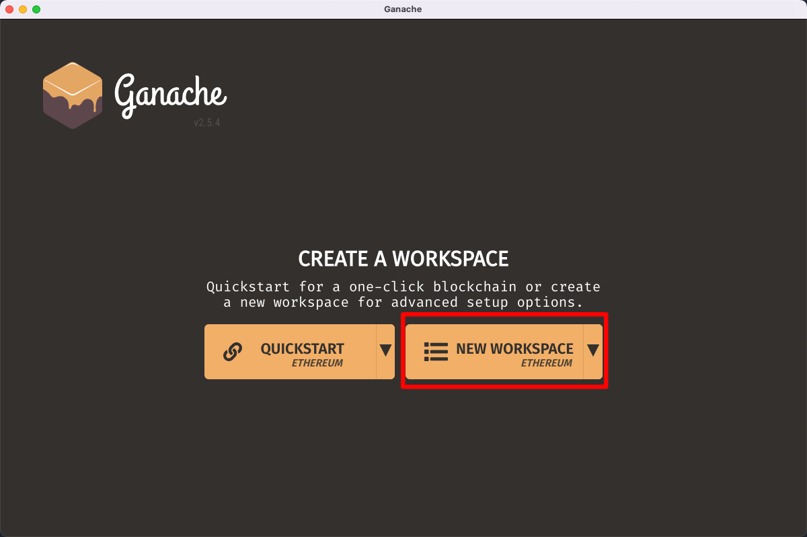
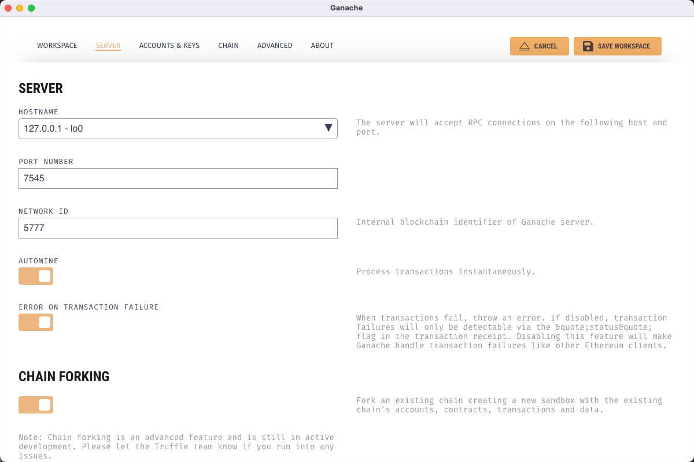
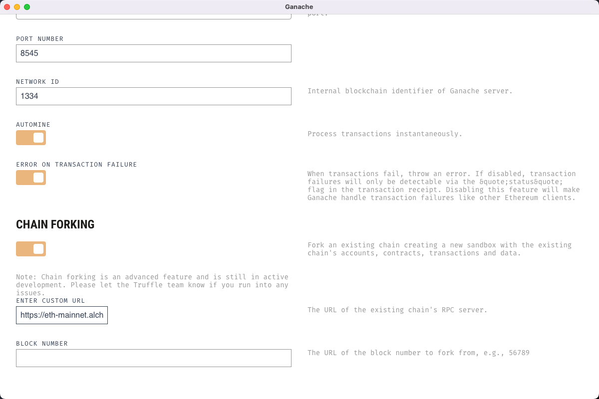
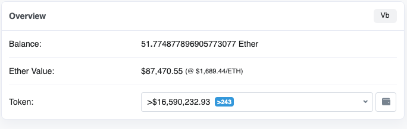
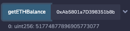

# WTF Solidity Simplified Introduction - Tools Part 3: Ganache, Setting Up a Local Test Network

I've been relearning Solidity recently to reinforce the details and write a "WTF Solidity Simplified Introduction" for beginners to use. I will update it with 1-3 lessons every week.

Feel free to follow me on Twitter: [@0xAA_Science](https://twitter.com/0xAA_Science)

Join the WTF Tech Community Discord for information on joining the WeChat group: [Link](https://discord.gg/5akcruXrsk)

All code and tutorials are open source on GitHub: [github.com/AmazingAng/WTFSolidity](https://github.com/AmazingAng/WTFSolidity)

-----

`Ganache` is an Ethereum blockchain network for "development scenarios" (or during the development process). It makes developing Ethereum applications faster, easier, and more secure. It includes all popular RPC features and capabilities (such as events) and can run deterministically to make development a breeze.

> You can think of Ganache as an Ethereum blockchain "simulator" that "simulates" the production environment during the development process, making it easy to access the context of contract calls.

> ⚠️ Note: **Do not use Ganache as a blockchain network in a production environment**. If needed, use node applications like Geth or OpenEthereum.

Ganache also has a GUI version that is suitable for quickly configuring and using it for beginners.

## Ganache Project Facilities

- Official website: [https://trufflesuite.com/ganache/](https://trufflesuite.com/ganache/)
- Documentation: [https://trufflesuite.com/docs/ganache/](https://trufflesuite.com/docs/ganache/)
- GitHub:
  - UI: [https://github.com/trufflesuite/ganache-ui](https://github.com/trufflesuite/ganache-ui)
  - CLI: [https://github.com/trufflesuite/ganache](https://github.com/trufflesuite/ganache)
  - Deprecated version: [https://github.com/trufflesuite/ganache-cli](https://github.com/trufflesuite/ganache-cli)
- Documentation for command line/npm: [https://trufflesuite.com/blog/introducing-ganache-7/](https://trufflesuite.com/blog/introducing-ganache-7/)

> ⚠️ Note: The GitHub repo on Ganache's official website is for the UI version. The CLI version can be found on npm as `ganache` & `ganache-cli`, with `ganache-cli` being deprecated.

## Why Use Ganache?

Ganache has the following main features:
- Out-of-the-box, quickly start an EVM blockchain network (can set miner and block time).
- Conveniently fork an existing blockchain network (no need to wait for block synchronization).
- Use `console.log` for easy debugging during Solidity development.
- [Fast-forward time](https://trufflesuite.com/blog/introducing-ganache-7/#6-fast-forward-time) to simulate the state of smart contracts in the future.
- Simulate any account (you can simulate the environment of any user's token without needing their private key).

Sometimes, when you want to test a contract or do some contract development, you need to get ETH from a testnet. Sometimes, the faucet doesn't have any ETH to give. In this case, you can fork a network locally and generate as much ETH as you want. The principle is to fork a mainnet network to run locally (or a locally running chain).

Forking the mainnet also has the benefit of being able to directly mock all the environments on the mainnet, such as token balances on DEX exchanges. If you know the contract address, you can directly test and use them.

## Command Line Installation (Recommended)

[Complete package description for ganache - npm](https://www.npmjs.com/package/ganache)
```shell
npm install ganache --global
```
You can also install it separately in your project directory (without using `--global`) and configure the script in `package.json` to start it.  
After Ganache 7, you can import and use it directly in node.js JavaScript scripts. It will provide an [EIP-1193 (Ethereum Provider JavaScript API)](https://eips.ethereum.org/EIPS/eip-1193) provider, a JSON-RPC server, Web3.js & ethers providers. You can also use it in [browsers](https://github.com/trufflesuite/ganache#browser-use).

### Starting Ganache

```shell
ganache
```

### Help / Instructions
```
ganache --help
```
With the help command, you can learn about the main features and related configuration methods and parameters of Ganache. This includes:
- **Chain**: Set the network version, ID, time, contract size limit, and hard fork version rules.
- **Database**: Set the database to save the chain.
- **Logging**: Set EVM opcodes, log RPC requests and responses.
- **Miner**: Set the miner, including block time, default gas price, Txn gas limit, difficulty, instamine, price increase.
- **Wallet**: Set the default balance and unlock the wallet.
- **Fork**: Set the forked network, including fork target network RPC URL, block height, userAgent, cache strategy, and support for providing username/password (if the target RPC has Basic Authentication).
- **Server**: Set the listening address and port for the local chain.

### Forking the Mainnet

The following command will automatically generate 10 ETH accounts, each with a balance of 100 ETH.

```shell
ganache -f https://eth-mainnet.alchemyapi.io/v2/YOUR_API_KEY
```

You can also fork other Ethereum blockchain networks, such as BSC, Polygon, Astar, etc. You need to find and use their RPC nodes.

### Forking the Mainnet with Fixed Accounts

The `wallet.accounts` main parameters are the private key and the amount of ETH to generate.

Note that the unit is `wei`. In the example, it is converted to `1000 ETH`.

```shell
ganache -f https://eth-mainnet.alchemyapi.io/v2/YOUR_API_KEY --wallet.accounts=ACCOUNT_PRIVATE_KEY,AMOUNT_WEI --wallet.accounts=ACCOUNT_PRIVATE_KEY,1000000000000000000000
```

### Fast Forwarding Time

Reasons or scenarios for manipulating time: some contracts lock users' tokens and have a release period/time to gradually release these locked tokens, or allow users to perform certain operations at a specific future time.

Ganache allows us to advance the time on the blockchain using RPC calls (methods `evm_increaseTime` and `evm_setTime`). 

In most cases, we cannot wait for this time, so we can use `evm_increaseTime` to **increase the current timestamp of the blockchain by a specified amount of time** (in seconds, passed in hexadecimal format). This will return the total time adjusted in seconds.

```
curl -H 'Content-Type: application/json' --data' {"jsonrpc": "2.0", "id": 1, "method": "evm_increaseTime", "params": ["0x15180"] }' http://localhost:8545
```

Additionally, you can use `evm_setTime` to set it to a specific timestamp. It accepts a JavaScript timestamp with millisecond precision and returns the number of seconds between the given timestamp and the current time.

Here is an example of how it is implemented in a project (very practical): [liquity project contract testing - implementation of the ForwardTime feature](https://github.com/liquity/dev/blob/0c61ed8b7181450da214d4f10a1327c2082bd4f4/packages/contracts/utils/testHelpers.js#L1104-L1119)

### Using Ganache with GUI

Not highly recommended, but if you are new to it, you can use it to quickly familiarize yourself with Ganache.

[Click here to download Ganache - Truffle Suite](https://trufflesuite.com/ganache/)

#### Client Interface


#### Initializing a New Workspace


Click on "Quickstart" to quickly start, but note that the default network port for quickstart is 7545. If you are using Remix, you need to modify it. After the startup is complete, it will look like the following:


You can see the current network RPC server on the first line, with the default address and port being `127.0.0.1:7545`. If you are using the default in Remix, you need to change the port to 7545.

#### Linking Remix to Ganache


Select the environment as "ganache provider" and specify the port according to your settings. It should match the port of Ganache.


Change the port to the default of Ganache, which is `7545`.

#### Testing Deploying a Contract

Here you can see the transaction information in the blocks, showing that I deployed a contract address.


#### Custom Configuration

Sometimes you may need to customize the configuration, such as the network port or forking the mainnet. You can configure it when initializing the workspace.

Select "New Workspace"



#### Setting the Port and Network ID

Port: You can change the default port 7545 to 8545, depending on your preference.



#### Forking the Mainnet

Enter your eth mainnet address in the "ENTER CUSTOM URL" under "Chain Forking".



#### Setting Fixed Accounts and Balances


Finally, click "Save Workspace" to start.

## Connecting Ganache with web3.js/ethers.js

The local RPC address generated by Ganache is `127.0.0.1:8545`. The default address in the UI is different from the command line, so I made changes above. For example, Remix defaults to using port 8454.

```js

// web3.js

const web3 = new Web3(Web3.givenProvider || "http://127.0.0.1:8545");

// ethers.js
const provider = new ethers.providers.JsonRpcProvider("http://127.0.0.1:8545");

```

## Linking Remix to Local Ganache

Change the environment to Ganache to deploy it on your locally running ETH network.


### Testing Deploying a Contract

Here, we deployed the contract on our locally running Ganache.


The command line outputs the corresponding deployment details.


After successful deployment, you can easily call various methods.


### Deploying a Contract and Checking Vitalik Buterin's Balance

This contract has a method to check the ETH balance, and since we forked the mainnet, we can check the balance of Vitalik Buterin on our local test network, which should be the same as the balance on the mainnet.

```solidity
// contracts/GLDToken.sol†
// SPDX-License-Identifier: MIT
pragma solidity ^0.8.0;

contract XBXToken {

    function getETHBalance(address _address) view external returns(uint256) {
        return address(_address).balance;
    }

}

```

[Vitalik Buterin's mainnet wallet address](https://etherscan.io/address/0xab5801a7d398351b8be11c439e05c5b3259aec9b)



Using Remix to call and check the balance of this address deployed on the local forked network.



The balance of Vitalik Buterin on the locally forked network matches the balance on the mainnet, indicating a successful test of forking the mainnet.

## Summary

In this way, we have successfully forked a mainnet and set up the necessary local environment for contract development.

<!-- This file was translated using AI by repo_ai_translate. For more information, visit https://github.com/marcelojsilva/repo_ai_translate -->