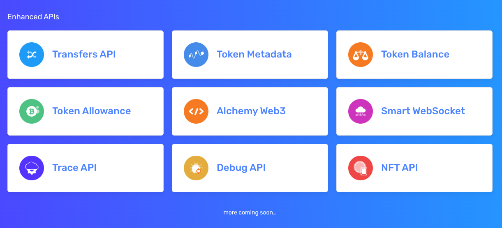
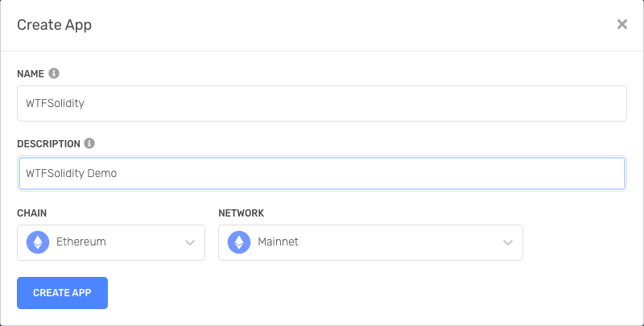
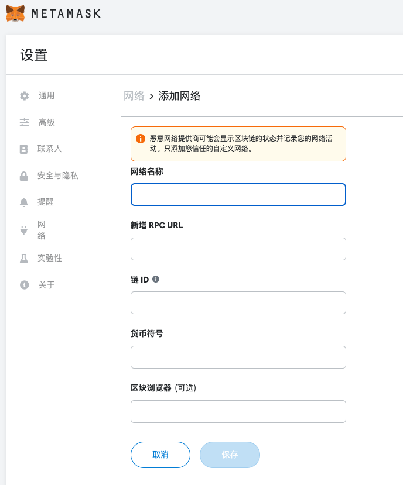

# WTF Solidity Simplified Introduction - Tools Part 4: Alchemy, Blockchain API and Node Infrastructure

I've been relearning Solidity recently, consolidating the details, and writing a "WTF Solidity Simplified Introduction" for beginners to use. I update it with 1-3 lessons every week.

Feel free to follow me on Twitter: [@0xAA_Science](https://twitter.com/0xAA_Science)

Join the WTF Tech Community Discord, where you can find instructions on how to join the WeChat group: [link](https://discord.gg/5akcruXrsk)

All code and tutorials are open source on GitHub: [github.com/AmazingAng/WTFSolidity](https://github.com/AmazingAng/WTFSolidity)

-----
## What is Alchemy

`Alchemy` is a super node that provides the most widely used blockchain API for Ethereum, Polygon, Solana, Arbitrum, Optimism, Flow, and Crypto.org. It offers all the features of a node, including JSON-RPC support, but with the reliability, data accuracy, and scalability required to run world-class applications on the blockchain.

## Connecting Applications and the Blockchain

Dapp applications developed on Ethereum (off-chain) need to interact with the blockchain (on-chain). In the early days, there was limited infrastructure on Ethereum, and developers had to deploy a local Ethereum node to complete off-chain and on-chain interactions, which was very cumbersome and time-consuming.

Alchemy and Infura have built a bridge between off-chain and on-chain interactions, making it easier for developers. They provide users with instant and scalable API access to the Ethereum and IPFS networks. After registering on the Alchemy and Infura websites, developers can apply for a free Ethereum API key, which allows them to interact with the blockchain using their nodes. In addition, the MetaMask wallet has built-in Infura services, making it easy for users to access the Ethereum network.

For an introduction to Infura, you can refer to [WTF Solidity Simplified Introduction - Tools Part 2: Infura, Connecting Off-Chain and On-Chain](../Topics/Tools/TOOL02_Infura/readme.md)

## Differences Between Alchemy and Infura


The left side is Alchemy, and the right side is Infura. Let's compare their free plans.

### Difference in Usage Limits

Alchemy has no daily usage limit, while Infura has a daily limit of 100,000 requests.

Alchemy has a monthly usage limit of 300,000,000 requests, while Infura has a monthly limit of 3,000,000 requests.

### Difference in Supported Public Chains (Free Version)


Alchemy supports: ETH, Polygon, Solana, Arbitrum, Optimism.

Infura supports: ETH, ETH2, IPFS, Filecoin.

### Alchemy Supports Enhanced APIs



Alchemy has its own set of enhanced web3 APIs. You can refer to the documentation for more details.

[Alchemy - Enhanced APIs](https://dashboard.alchemyapi.io/enhanced-apis)

## Creating an Alchemy API Key

### 1. Open the Alchemy website and register

Website: [alchemy.com](https://www.alchemy.com/)


### 2. Create an API Key
After registering, go to the Dashboard and click the **+ CREATE APP** button in the top right corner.


### 3. Fill in the API Key information

`CHAIN`: Select the network you need. For Ethereum, it would be `Ethereum`.

`NETWORK`: Choose whether it's the mainnet or a testnet.



After filling in the information, click **CREATE APP** to create the API Key.

### 4. API Key created

Go back to the Dashboard, and you will see that the API Key named `WTFSolidity` has been created. In the Dashboard, click the **view key** button to view the details of the API Key.


### 5. View API Key details

You can see that we have created the corresponding API Key, and both HTTPS and WebSockets are supported.


## Using the Alchemy API Key

### JavaScript (`ethers.js`)
In `ethers.js`, we can use the Alchemy API Key to create a `JsonRpcProvider` for interacting with the blockchain.

```javascript
const { ethers } = require("ethers");
// Replace with your Alchemy API Key
const ALCHEMY_ID = '' 
const provider = new ethers.providers.JsonRpcProvider(`https://eth-mainnet.g.alchemy.com/v2/${ALCHEMY_ID}`)
```

### MetaMask Wallet

Go to the Settings page in the MetaMask wallet and click on **Networks**. Click on **Add Network** to add the Alchemy ETH chain to MetaMask using the following parameters:

```
Network Name: Alchemy-eth
RPC URL: Fill in the Alchemy RPC URL you obtained
Chain ID: 1
Currency Symbol: ETH
Block Explorer URL: https://etherscan.io
```



## Summary

In this lesson, we introduced how to create and use an Alchemy API Key to conveniently access the Ethereum blockchain.

<!-- This file was translated using AI by repo_ai_translate. For more information, visit https://github.com/marcelojsilva/repo_ai_translate -->