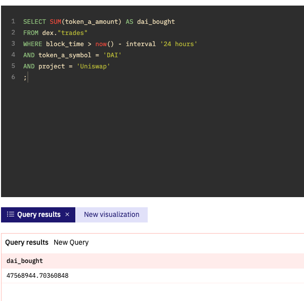
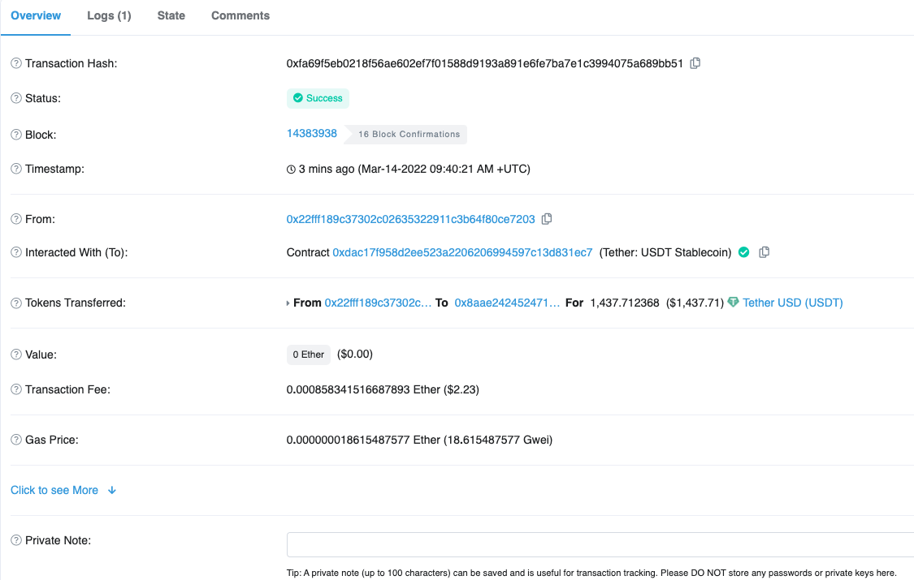
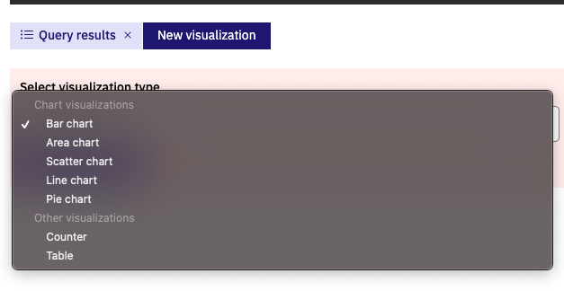

# WTF Solidity Simplified Introduction - Tool 5: Using Dune for Visualizing Blockchain Data

Recently, I've been relearning Solidity to reinforce the details and write a "WTF Solidity Simplified Introduction" for beginners. I will update it with 1-3 lessons per week.

Feel free to follow me on Twitter: [@0xAA_Science](https://twitter.com/0xAA_Science)

Join the WTF Tech Community Discord, where you can find instructions to join the WeChat group: [Link](https://discord.gg/5akcruXrsk)

All the code and tutorials are open source on GitHub: [github.com/AmazingAng/WTFSolidity](https://github.com/AmazingAng/WTFSolidity)

-----
## What is Dune?

`Dune` is a blockchain query and analysis tool that allows you to query all the information on the blockchain using a SQL-like language, such as whale data, on-chain transaction data, and more. Additionally, `Dune` can easily convert data into visual charts.

> Ethereum is a database, smart contracts are tables, and transactions from wallets are rows in each table.

This statement captures the essence of blockchain: it is essentially a publicly accessible distributed ledger for storing data, and now we can use Dune to query this distributed ledger.

[Dune Official Website](https://dune.xyz/)


## First Query

Goal: Query the **amount of DAI stablecoin purchased on Uniswap in the past 24 hours**

1. Register and log in to Dune.
2. Click on **new query** in the top right corner to create a new query and enter the following code:

    ```sql
    SELECT
    SUM(token_a_amount) AS dai_bought
    FROM
    dex."trades"
    WHERE
    block_time > now() - interval '24 hours'
    AND token_a_symbol = 'DAI'
    AND project = 'Uniswap';
    ```
3. Click on **Run** in the bottom right corner to execute the query and get the amount of DAI purchased through Uniswap in the last 24 hours.




## Building a Query from Scratch

**Goal: Learn how to use SELECT, WHERE, and LIMIT**

Let's query one of the tables, using Aave as an example: [Aave Contract](https://etherscan.io/address/0x398ec7346dcd622edc5ae82352f02be94c62d119#writeProxyContract)

By querying the Aave contract, we can see that it has a deposit method (for storing) and an associated event (which is broadcasted when executed).


Go back to Dune and search for the corresponding table by searching for Aave-related tables on Ethereum and matching the event, `LendingPool_evt_Deposit`.


### Learning: SELECT, LIMIT, and WHERE to Query Data

Now we can query the corresponding stored data using Dune.

```sql
SELECT * FROM aave."LendingPool_evt_Deposit"
limit 100
```


This will give us the corresponding data for the storage method in the Aave contract. With this data, we can apply some filters.

#### Meaning of Each Field

_user: The wallet address that initiated the deposit.

_reserve: The token address used as collateral.

_amount: The amount of tokens deposited.

_timestamp: The timestamp when the transaction was mined on the blockchain.


#### Filtering Data Using WHERE

Querying for a specific address `0xeeeeeeeeeeeeeeeeeeeeeeeeeeeeeeeeeeeeeeee`

```sql
SELECT *, (_amount / 1e18) as _amount FROM aave."LendingPool_evt_Deposit"
WHERE _reserve = '\xeeeeeeeeeeeeeeeeeeeeeeeeeeeeeeeeeeeeeeee'
limit 100
```

By adding a query condition, we can quickly filter the data we need.

To view deposits with USDC as collateral, use the USDC contract address: `xa0b86991c6218b36c1d19d4a2e9eb0ce3606eb48`

```sql
SELECT * FROM aave."LendingPool_evt_Deposit"
WHERE _reserve = '\xa0b86991c6218b36c1d19d4a2e9eb0ce3606eb48'
limit 100
```

The above examples are referenced from [Your guide to basic SQL while learning Ethereum at the same time](https://towardsdatascience.com/your-guide-to-basic-sql-while-learning-ethereum-at-the-same-time-9eac17a05929)

### Practicing On-Chain Transfers

Practice querying transfers in the `Ethereum.Transactions` table.

```sql
select * from ethereum.transactions
LIMIT 10
```


### Field and Transfer Correspondence Explanation

Take this [hash](https://etherscan.io/tx/0xfa69f5eb0218f56ae602ef7f01588d9193a891e6fe7ba7e1c3994075a689bb51) transfer as an example.



The transfer is from [0x22fff189c37302c02635322911c3b64f80ce7203](https://etherscan.io/token/0xdac17f958d2ee523a2206206994597c13d831ec7?a=0x22fff189c37302c02635322911c3b64f80ce7203) to [0x8aae242452471d2dfea145214ceedf87ca043198](https://etherscan.io/token/0xdac17f958d2ee523a2206206994597c13d831ec7?a=0x8aae242452471d2dfea145214ceedf87ca043198)

Hash: `0xfa69f5eb0218f56ae602ef7f01588d9193a891e6fe7ba7e1c3994075a689bb51`

We can directly query this information using Dune.

```sql
select * from ethereum.transactions
WHERE hash='\xfa69f5eb0218f56ae602ef7f01588d9193a891e6fe7ba7e1c3994075a689bb51'
```


The fields in Dune correspond to those in Etherscan.

### Data Visualization



Click on New visualization to choose the desired view. For example, I clicked on bar chart.


This will visualize the data I just filtered. The longest bars represent the accounts with the highest borrowing amounts.

## Summary

In this lesson, we introduced the basics of using Dune. With Dune, we can convert on-chain data into visualized data, allowing us to better understand the hotspots on the blockchain.

