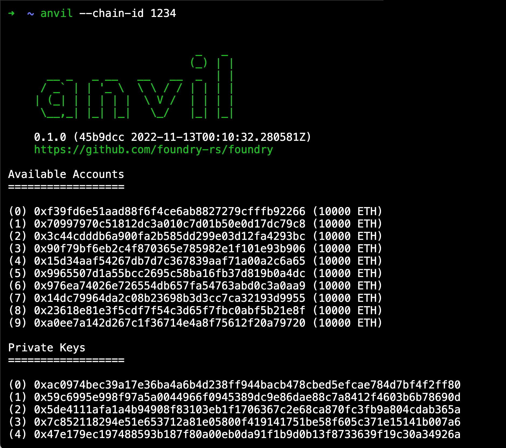
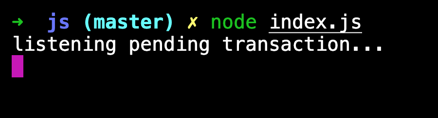
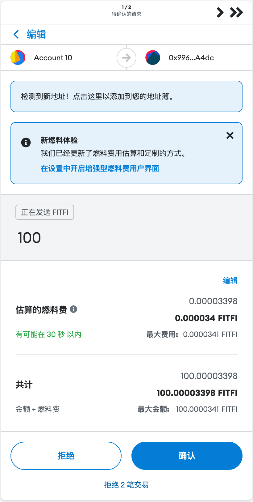
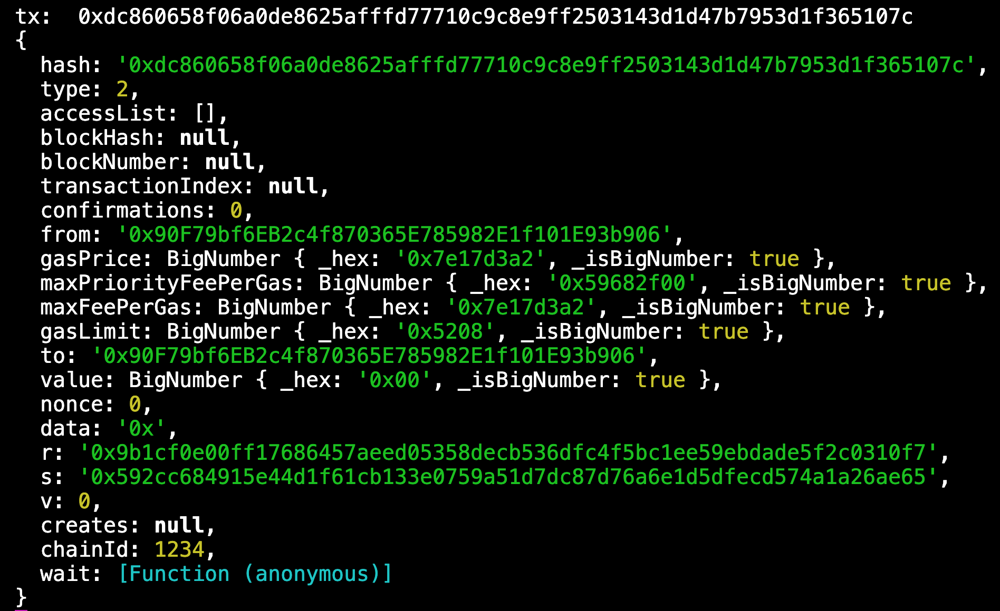

# WTF Solidity 合约安全: S10. 先行交易（追踪交易）

我最近在重新学 solidity，巩固一下细节，也写一个“WTF Solidity 极简入门”，供小白们使用（编程大佬可以另找教程），每周更新 1-3 讲。

推特：[@0xAA_Science](https://twitter.com/0xAA_Science)｜[@WTFAcademy\_](https://twitter.com/WTFAcademy_)

社区：[Discord](https://discord.wtf.academy)｜[微信群](https://docs.google.com/forms/d/e/1FAIpQLSe4KGT8Sh6sJ7hedQRuIYirOoZK_85miz3dw7vA1-YjodgJ-A/viewform?usp=sf_link)｜[官网 wtf.academy](https://wtf.academy)

所有代码和教程开源在 github: [github.com/AmazingAng/WTFSolidity](https://github.com/AmazingAng/WTFSolidity)

---

这一讲，我们将介绍智能合约的先行交易（Frontrunning）漏洞。NFT Marketplace 前员工曾被指控参与有史以来第一个数字资产内幕交易，通过使用将在 OpenSea 主页上展示哪些 NFT 的机密信息来谋取个人经济利益，于 2022.6.22 被捕。

## 先行交易（Frontrunning）

由于所有的交易都会在执行前 pending 在内存池中，因此一些链上的观察者可以在交易出块前采取一些措施。利用这一点的一个例子是去中心化交易所，他可以随时观测到进行的交易，而且可以在当前的交易上链之前，广播并执行第二笔交易，通过更高的 gas price 拦截。

Front-running 最初诞生于传统金融市场，是一场单纯未了利益的竞赛。在金融市场中，信息差催生了金融中介机构，他们可以通过最先了解某些行业信息并最先做出反应从而实现获利。这些攻击主要发生在股票市场交易和早期的域名注册。

例如，2021 年 9 月，Nate Chastain，NFT 市场 OpenSea 的产品负责人，被发现在 OpenSea 网站上发布显示之前购买了 NFT，然后他卖掉它们获利。
他利用内幕信息，比如 OpenSea 将要推送哪些 NFT，获得不公平的信息差。然而，一个有人通过将 NFT 交易时间戳与 OpenSea 上有问题的 NFT 的首页促销进行匹配，发现了这一非法行为。

## 监听 pending 交易复现流程

> 请提前安装好 [foundry](https://book.getfoundry.sh/getting-started/installation)

**1.** 使用 `anvil` 部署本地测试链，并声明 chain-id。

**2.** 调用 [`etherjs` 脚本](./js/index.js)监听 pending 状态的交易。

**3.** Metamask 连接本地链

**4.** 使用 `anvil` 部署后提供的私钥导入账户。

**5.** 使用 Metamask 给 anvil 提供的另一个账户地址转账。

**6.** 监听脚本捕获到了交易的消息，这时可以发起立刻发起一笔交易，并提高 gas price 来抢先。

## 预防方法

抢先交易是以太坊等公共区块链上普遍存在的问题。

最好的措施是在交易中尽可能的减少被抢先交易的收益，主要是消除交易顺序或时间的重要性。
例如，在市场中，最好实施批量拍卖（这也可以防止高频交易问题）。另一种方法是使用预提交方案。第三种选择是通过指定交易的最大或最小可接受价格范围来降低抢先交易的成本，从而限制价格下滑。

有两个方面可以预防

- 分批交易：使用多次少量的交易，让攻击者每次先行攻击的成本变大。

- 机密性：另一种方法是限制交易的可见性，这可以使用“commit-reveal”方案来完成（先承诺再验证），或者使用隐藏的交易内存池（TaiChi）。

## 总结

这一讲，我们介绍了智能合约的先行交易漏洞，这种存在于传统金融行业的攻击模式在区块链的环境下更容易实施，所有的交易信息都是公开的，当需要有类似的交易时，最好支持隐藏的内存池，或者实施批量拍卖等措施限制。
