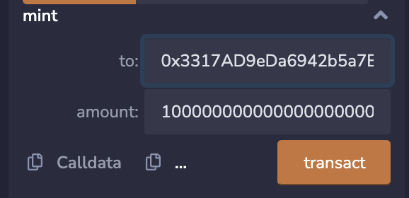

# WTF Solidity 合约安全: S10. 貔貅

我最近在重新学 solidity，巩固一下细节，也写一个“WTF Solidity 极简入门”，供小白们使用（编程大佬可以另找教程），每周更新 1-3 讲。

推特：[@0xAA_Science](https://twitter.com/0xAA_Science)｜[@WTFAcademy_](https://twitter.com/WTFAcademy_)

社区：[Discord](https://discord.wtf.academy)｜[微信群](https://docs.google.com/forms/d/e/1FAIpQLSe4KGT8Sh6sJ7hedQRuIYirOoZK_85miz3dw7vA1-YjodgJ-A/viewform?usp=sf_link)｜[官网 wtf.academy](https://wtf.academy)

所有代码和教程开源在 github: [github.com/AmazingAng/WTF-Solidity](https://github.com/AmazingAng/WTF-Solidity)

---

这一讲，我们将介绍貔貅合约和预防方法（英文习惯叫蜜罐代币 honeypot token）。

## 貔貅学入门

[貔貅](https://en.wikipedia.org/wiki/Pixiu)是中国的一个神兽，因为在天庭犯了戒，被玉帝揍的肛门封闭了，只能吃不能拉，可以帮人们聚财。但在Web3中，貔貅变为了不详之兽，韭菜的天敌。貔貅盘的特点：投资人只能买不能卖，仅有项目方地址能卖出。

通常一个貔貅盘有如下的生命周期：

1. 恶意项目方部署貔貅代币合约。
2. 宣传貔貅代币让散户上车，由于只能买不能卖，代币价格会一路走高。
3. 项目方`rug pull`卷走资金。


学会貔貅合约的原理，才能更好的识别并避免被割，才能做一个顽强的韭菜！

## 貔貅合约

这里我们介绍一个极简的ERC20代币貔貅合约`Pixiu`。在该合约中，只有合约拥有者可以在`uniswap`出售代币，其他地址不能。

`Pixiu` 有一个状态变量`pair`，用于记录`uniswap`中 `Pixiu-ETH LP`的币对地址。它主要有三个函数：

1. 构造函数：初始化代币的名称和代号，并根据 `uniswap` 和 `create2` 的原理计算`LP`合约地址，具体内容可以参考 [WTF Solidity 第25讲: Create2](https://github.com/AmazingAng/WTFSolidity/blob/main/25_Create2/readme.md)。这个地址会在 `_beforeTokenTransfer()` 函数中用到。
2. `mint()`：铸造函数，仅 `owner` 地址可以调用，用于铸造 `Pixiu` 代币。
3. `_beforeTokenTransfer()`：`ERC20`代币在被转账前会调用的函数。在其中，我们限制了当转账的目标地址 `to` 为 `LP` 的时候，也就是韭菜卖出的时候，交易会 `revert`；只有调用者为`owner`的时候能够成功。这也是貔貅合约的核心。

```solidity
// 极简貔貅ERC20代币，只能买，不能卖
contract HoneyPot is ERC20, Ownable {
    address public pair;

    // 构造函数：初始化代币名称和代号
    constructor() ERC20("HoneyPot", "Pi Xiu") {
        address factory = 0x5C69bEe701ef814a2B6a3EDD4B1652CB9cc5aA6f; // goerli uniswap v2 factory
        address tokenA = address(this); // 貔貅代币地址
        address tokenB = 0xB4FBF271143F4FBf7B91A5ded31805e42b2208d6; //  goerli WETH
        (address token0, address token1) = tokenA < tokenB ? (tokenA, tokenB) : (tokenB, tokenA); //将tokenA和tokenB按大小排序
        bytes32 salt = keccak256(abi.encodePacked(token0, token1));
        // calculate pair address
        pair = address(uint160(uint(keccak256(abi.encodePacked(
        hex'ff',
        factory,
        salt,
        hex'96e8ac4277198ff8b6f785478aa9a39f403cb768dd02cbee326c3e7da348845f'
        )))));
    }
    
    /**
     * 铸造函数，只有合约所有者可以调用
     */
    function mint(address to, uint amount) public onlyOwner {
        _mint(to, amount);
    }

    /**
     * @dev See {ERC20-_beforeTokenTransfer}.
     * 貔貅函数：只有合约拥有者可以卖出
     */
    function _beforeTokenTransfer(
        address from,
        address to,
        uint256 amount
    ) internal virtual override {
        super._beforeTokenTransfer(from, to, amount);
        // 当转账的目标地址为 LP 时，会revert
        if(to == pair){
            require(from == owner(), "Can not Transfer");
        }
    }
}
```

## `Remix` 复现

我们会在 `Goerli` 测试网上部署 `Pixiu` 合约，并在 `uniswap` 交易所中演示。

1. 部署 `Pixiu` 合约。


2. 调用 `mint()` 函数，给自己铸造 `100000` 枚貔貅币。


3. 进入 [uniswap](https://app.uniswap.org/#/add/v2/ETH) 交易所，为貔貅币创造流动性（v2），提供 `10000`貔貅币。和 `0.1` ETH。


4. 出售 `100` 貔貅币，能够操作成功。


5. 切换到另一个账户，使用 `0.01` ETH 购买貔貅币，能够操作成功。


6. 出售貔貅币，无法弹出交易。


## 预防方法

貔貅币是韭菜在链上梭哈最容易遇到的骗局，并且形式多变，预防非常有难度。我们有以下几点建议，可以降低被貔貅盘割韭菜的风险：

1. 在区块链浏览器上（比如[etherscan](https://etherscan.io/)）查看合约是否开源，如果开源，则分析它的代码，看是否有貔貅漏洞。

2. 如果没有编程能力，可以使用貔貅识别工具，比如 [Token Sniffer](https://tokensniffer.com/) 和 [Ave Check](https://ave.ai/check)，分低的话大概率是貔貅。

3. 看项目是否有审计报告。

4. 仔细检查项目的官网和社交媒体。

5. 只投资你了解的项目，做好研究（DYOR）。

## 总结

这一讲，我们介绍了貔貅合约和预防貔貅盘的方法。貔貅盘是每个韭菜必经之路，大家也对它恨之入骨。另外，最近也出现貔貅 `NFT`，恶意项目方通过修改 `ERC721` 的转账或授权函数，使得普通投资者不能出售它们。了解貔貅合约的原理和预防方法，可以显著减少你买到貔貅盘的概率，让你的资金更安全，大家要不断学习。