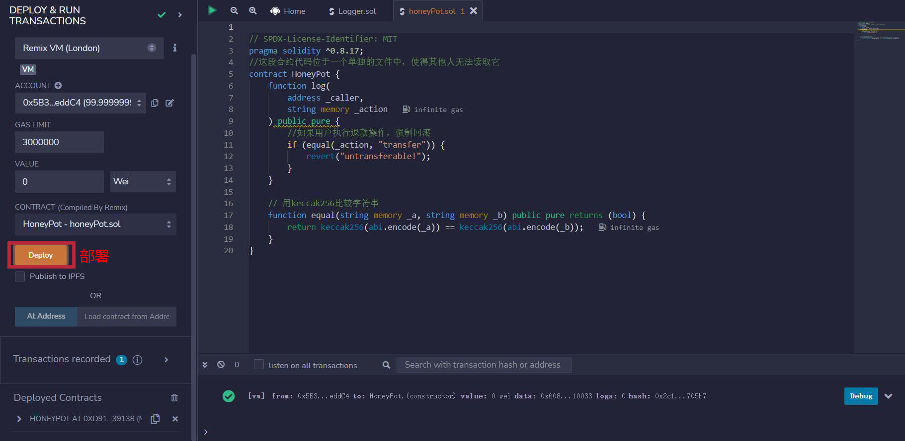
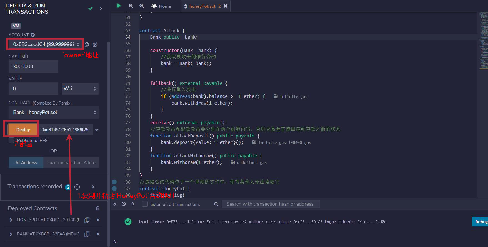
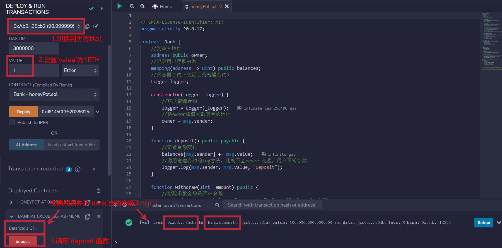
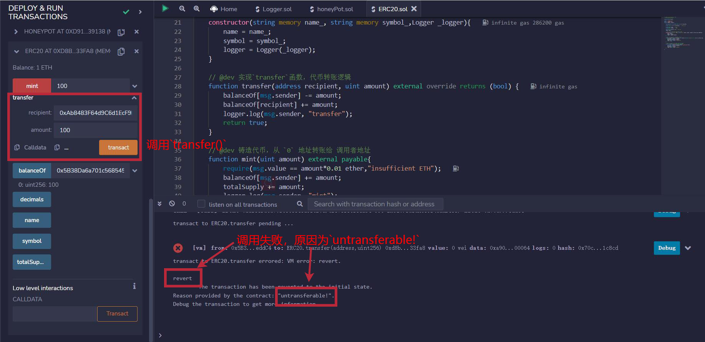

# WTF Solidity 合约安全: S16. 貔貅合约

我最近在重新学solidity，巩固一下细节，也写一个“WTF Solidity极简入门”，供小白们使用（编程大佬可以另找教程），每周更新1-3讲。

推特：[@0xAA_Science](https://twitter.com/0xAA_Science)｜[@WTFAcademy_](https://twitter.com/WTFAcademy_)

社区：[Discord](https://discord.wtf.academy)｜[微信群](https://docs.google.com/forms/d/e/1FAIpQLSe4KGT8Sh6sJ7hedQRuIYirOoZK_85miz3dw7vA1-YjodgJ-A/viewform?usp=sf_link)｜[官网 wtf.academy](https://wtf.academy)

所有代码和教程开源在github: [github.com/AmazingAng/WTFSolidity](https://github.com/AmazingAng/WTFSolidity)

-----

这一讲，我们将介绍貔貅（国外更习惯称它为`Honey Pot`，意为`蜜罐`）合约和预防方法。

## 什么是貔貅合约

V神于2015年提出了以太坊第20号代币标准`ERC20`，从此人人都可以在以太坊上发行自己的代币。但这也导致出现了很多貔貅合约，这些貔貅合约通过修改`ERC20`部分函数功能，使得投资者只能买入而不能卖出代币，最终合约部署者卷走了所有投资者的钱。

## 貔貅合约例子

### 貔貅合约

我们先看貔貅合约，控制投资者无法卖出代币的函数就包含在它里面。它非常简单，只包含了`2`个函数：

- `log()`: 当用户调用`transfer()`函数时强制回滚交易，取名为`log`同时有两个参数是为了迷惑用户。
- `equal()`: 该函数的作用是用`keccak256`来比较字符串，会在`log()`函数中使用。注意字符串要先转化为`bytes`类型，否则无法被`keccak256`哈希化。

同时合约部署者会将这段合约代码放在一个单独的文件中，使得其他人无法读取它。

```solidity
//这段合约代码位于一个单独的文件中，使得其他人无法读取它
contract HoneyPot {
    function log(
        address _caller,
        string memory _action
    ) public pure {
        //如果用户调用`transfer()`函数，强制回滚
        if (equal(_action, "transfer")) {
            revert("untransferable!");
        }
    }

    // 用keccak256比较字符串
    function equal(string memory _a, string memory _b) public pure returns (bool) {
        return keccak256(abi.encode(_a)) == keccak256(abi.encode(_b));
    }
}
```

### ERC20合约

然后是`ERC20合约`，为了简化代码，这里就用`transfer()`函数来模拟卖出代币操作，在`mint()`函数中使用`require(msg.value == amount*0.01 ether, "insufficient ETH")`来模拟买入代币操作，同时此处省略了与本讲不相关的函数。如果你对`ERC20合约`不是很了解，可以先回去阅读[WTF Solidity极简入门: 31. ERC20](https://github.com/AmazingAng/WTF-Solidity/blob/main/31_ERC20/readme.md)。

由于这是貔貅盘，所以我们将`ERC20`中`mint()`和`transfer()`触发事件的语句更改为调用貔貅合约的`log()`函数。这样就起到了迷惑投资者的效果，让他们在分析源代码时误以为这只是用来触发事件的，实际上`log()`在`mint()`中一切正常，但在`transfer()`中会强制回滚交易，导致投资者无法卖出代币。

**注意**：在部署`ERC20`合约时，需要先部署貔貅合约，再将貔貅合约的地址作为参数传入构造函数，而不是`Logger`合约。`Logger.sol`导入的目的是为了便于声明一个合约变量。

```solidity
import "./IERC20.sol";
import "./Logger.sol";
contract ERC20 is IERC20 {

    mapping(address => uint256) public override balanceOf;

    uint256 public override totalSupply;   // 代币总供给

    string public name;   // 名称
    string public symbol;  // 符号
    
    uint8 public decimals = 18; // 小数位数
    Logger logger;

    // @dev 在合约部署的时候实现合约名称和符号
    constructor(string memory name_, string memory symbol_,Logger _logger){
        name = name_;
        symbol = symbol_;
        logger = Logger(_logger);
    }

    // @dev 实现`transfer`函数，代币转账逻辑
    function transfer(address recipient, uint amount) external override returns (bool) {
        balanceOf[msg.sender] -= amount;
        balanceOf[recipient] += amount;
        logger.log(msg.sender, "transfer");
        return true;
    }

    // @dev 铸造代币，从 `0` 地址转账给 调用者地址
    function mint(uint amount) external payable{
        require(msg.value == amount*0.01 ether,"insufficient ETH");
        balanceOf[msg.sender] += amount;
        totalSupply += amount;
        logger.log(msg.sender, "mint");
    }

}
```

### `Logger`合约

`Logger`合约只是写给用户看的，它甚至都不需要部署。

它包含了`1`个事件和`1`个函数:

- 事件`log`: 用来记录调用者和执行的操作类型。
- 函数`log`: 获取事件需要的参数并触发事件。

```solidity
//日志器合约，不会被部署
contract Logger {
    event Log(address caller, string action);
    function log(
        address _caller,
        string memory _action
    ) public {
        emit Log(_caller, _action);
    }
}
```

## `Remix` 复现

**1.** 部署蜜罐（Honey Pot）合约。



**2.** 复制并粘贴蜜罐合约地址，部署`ERC20`合约。



**3.** 将`value`设置为`1ETH`，将`ERC20`合约的`mint()`函数的参数设置为`100`并调用，成功`mint`100个代币，并且合约余额为`1ETH`。



**4.** 调用`Bank`合约的`transfer()`函数（`recipient`地址任意，`amount`输入`100`），调用失败，原因为`untransferable`。



## 预防办法

貔貅合约很明显的一个特点就是修改了原生`ERC20`的代码，因此如果以后在分析合约源代码时遇到这种情况，要留一分警惕，可能是项目方有特殊的需求，也有可能增加了只能买不能卖的功能。

同时不要完全相信合约名和函数名，在本讲的案例中出现了`contract Logger`和`log()`，看名字以为只是用来触发事件的，实际功能却大相径庭。

## 总结

这一讲，我们介绍了貔貅合约。这些貔貅合约通过修改`ERC20`部分函数功能，使得投资者只能买入而不能卖出代币。针对这种类型的貔貅合约我们在分析源代码时要注意它是否修改了原生`ERC20`的代码，同时不能完全相信合约名和函数名，一定要弄清每个函数的真实功能。
