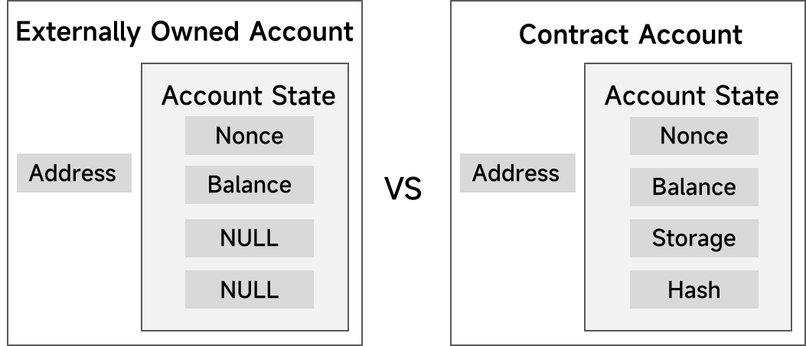

# ERC721

[**ERC-721**](https://eips.ethereum.org/EIPS/eip-721) 提供了代表单一资产的唯一标示符到地址的映射，由 Dapper labs Dieter Shirley 创造出来并由 CryptoKitties 带向市场。

ERC721合约的主要构成

- 3个库合约：`Address.sol`, `Context.sol`和`Strings.sol`
- 3个接口合约：`IERC721.sol`, `IERC721Receiver.sol`, `IERC721Metadata.sol`
- 1个`EIP165`合约：`ERC165.sol`

本文内容参照了A大关于Solidity的学习笔记文章，教程内容由社区成员创作完善而成，每个知识点后面都结合具体的例子，Github1.9K⭐︎。目前还在不断完善中，欢迎大家一起完善。文章仓库链接：

https://github.com/AmazingAng/WTFSolidity

同时也参照了@崔棉大师关于Solidity的教学资源，B站链接：

[崔棉大师的个人空间_哔哩哔哩_Bilibili](https://space.bilibili.com/286084162/?spm_id_from=333.999.0.0)

[ERC-721的依赖项](ERC-721%E7%9A%84%E4%BE%9D%E8%B5%96%E9%A1%B9%207a6ddea8ee2e45f7812a96f6586605b3.csv)

## 合约构成图


**知识补充**：关于Doxygen Tags 的介绍：

> Doxygen能将程序中的特定批注转换成为说明文件。它可以依据程序本身的结构，将程序中按规范注释的批注经过处理生成一个纯粹的参考手册，通过提取代码结构或借助自动生成的包含依赖图（include dependency graphs）、继承图（inheritance diagram）以及协作图（collaboration diagram）来可视化文档之间的关系， Doxygen生成的帮助文档的格式可以是CHM、RTF、PostScript、PDF、HTML等。
> 详细介绍：[Doxygen快速入门 - 知乎 (zhihu.com)](https://zhuanlan.zhihu.com/p/100223113)

**Solidity语法习惯中的Doxygen Tags**

| Tag     | 描述      | 使用Tag时候的上下文 |
| ------- | ------- | ----------- |
| @title  | 合约的标题   | 合约、接口       |
| @author | 作者姓名    | 合约、接口、函数    |
| @notice | 功能性介绍   | 合约、接口、函数    |
| @dev    | 一些额外的细节 | 合约、接口、函数    |
| @param  | 参数列表    | 函数          |
| @return | 函数返回值   | 函数          |

## ERC721标准库合约

```solidity
pragma solidity ^0.8.10;

/// @title ERC-721 Non-Fungible Token Standard
/// @dev See https://eips.ethereum.org/EIPS/eip-721
///  Note: the ERC-165 identifier for this interface is 0x80ac58cd.
interface ERC721 /* is ERC165 */ {

    /// @dev 当NFT的所属权发生变化的时候会触发本事件(一般是指用户X调用transfer函数把他的NFT转给了别人。
    ///   也包括铸造(mint `from` == 0)和销毁（destroyed`to` == 0).记录代币的发出地址from，接收地址to和tokenid。
    ///   Exception: 在合约创建期间，任意数量的 NFT 可以在不发出 Transfer 的情况下创建和分配。
    event Transfer(address indexed _from, address indexed _to, uint256 indexed _tokenId);

    /// @dev 当NFT的授权地址发生更改或再次确认的时候除法本函数。 零地址（0x0000000000000000000000000000000000000000）表示没有批准的地址。
    ///   当一个 Transfer事件发出时，这也表明批准了该 NFT（如果有）的地址被重置为无。
    ///   记录approve的发出地址owner，被授权地址approved和tokenid。
    event Approval(address indexed _owner, address indexed _approved, uint256 indexed _tokenId);

    /// @dev 当一个第三方管理者（operator）被在批量授权或者被在批量取消授权的时候触发本事件
    ///   录approve的发出地址owner，被授权地址operator和是否被授权approved
    event ApprovalForAll(address indexed _owner, address indexed _operator, bool _approved);

    /// @notice 查询输入地址下的所有NFT数量
    /// @dev 分配给零地址的NFT被认为是无效的，查询0地址时会抛出异常。
    /// @param _owner 要查询NFT数量的地址
    /// @return 返回值是当前地址所持有本系列NFT的数量
    function balanceOf(address _owner) external view returns (uint256);

    /// @notice 找到当前TokenIDNFT的持有者
    /// @dev 分配给零地址的 NFT 被认为是无效的，查询的时候抛出异常。
    /// @param _tokenId NFT的编号
    /// @return 返回当前NFT的持有地址
    function ownerOf(uint256 _tokenId) external view returns (address);

    /// @notice 将当前NFT的所属权从地址`_from`发送到目标地址`_to`
    /// @dev 当`msg.sender`不是当前NFT的拥有者 或者是没被授权的第三方管理账户时将会抛出异常; 如果目标地址`_to`是零号地址则抛出异常；当NFT的`_tokenId`非法时抛出异常;
    ///   发送的时候会检查,目标地址`_to`是不是一个合约地址，如果是则会调用 ERC721的接收接口'onERC721Received'
    ///   如果返回值不是`bytes4(keccak256("onERC721Received(address,address,uint256,bytes)"))`则会抛出异常
    ///   这个我们后续会结合源码再具体分析
    /// @param _from 当前NFT的拥有者
    /// @param _to 将要把当前NFT发送出去的目标接收者
    /// @param _tokenId 要发送的NFT编号
    /// @param data 一些额外的说明
    function safeTransferFrom(address _from, address _to, uint256 _tokenId, bytes data) external payable;

    /// @notice 将当前NFT的所属权从地址`_from`发送到目标地址`_to`
    /// @dev 和上一个 safeTransferFrom()函数的功能相同，只不过不再有data作为额外的说明
    /// @param _from 当前NFT的拥有者
    /// @param _to 将要把当前NFT发送出去的目标接收者
    /// @param _tokenId 要发送的NFT编号
    function safeTransferFrom(address _from, address _to, uint256 _tokenId) external payable;

    /// @notice 将当前NFT的所属权从地址`_from`发送到目标地址`_to`，因为方法内部不检查对方是否实现ERC721的接收接口
    ///   方法的调用者需要自己确认目标地址`_to`有能力接收NFT，否则会造成永久损失
    /// @dev 当`msg.sender`不是当前NFT的拥有者 或者是没被授权的第三方管理账户时将会抛出异常; 如果目标地址`_to`是零号地址则抛出异常；当NFT的`_tokenId`非法时抛出异常
    /// @param _from 当前NFT的拥有者
    /// @param _to 将要把当前NFT发送出去的目标接收者
    /// @param _tokenId 要发送的NFT编号
    function transferFrom(address _from, address _to, uint256 _tokenId) external payable;

    /// @notice 更改或重申 NFT 的授权地址
    /// @dev 零地址表示没有批准的地址。当`msg.sender`不是当前NFT的拥有者, 或被授权的第三方管理者时会抛出异常
    /// @param _approved 新批准的NFT控制者
    /// @param _tokenId 将要被授权的NFTID
    function approve(address _approved, uint256 _tokenId) external payable;

    /// @notice 授权或者取消授权第三方管理者管理`msg.sender`账户下的所有资产（NFT）
    /// @dev 触发 ApprovalForAll 事件. 合约必须允许一个NFT的owner有多个被授权的第三方管理者
    /// @param _operator 被添加到第三方管理者集合的地址
    /// @param _approved 如果第三方管理者被批准，则为 true，取消批准则为 false
    function setApprovalForAll(address _operator, bool _approved) external;

    /// @notice 查询某个NFT被授权给了哪个地址
    /// @dev 当NFT编号非法时抛出异常
    /// @param _tokenId 查询授权状况的那个NFT编号
    /// @return 返回当前NFT的授权地址，如果没有则返回零地址
    function getApproved(uint256 _tokenId) external view returns (address);

    /// @notice 查询某个地址 '_owner'是否将他的NFT批量授权给了某个地址'_operator'
    /// @param _owner NFT拥有者的地址
    /// @param _operator 想要查询是否被授权的第三方管理者地址
    /// @return True 如果 `_operator` 被 `_owner` 认可，则返回 true，否则返回 false
    function isApprovedForAll(address _owner, address _operator) external view returns (bool);
}
```

# 个人心得：

**需求是最高级别的抽象**：在开发项目之前一定要弄清楚需求分析。

**接口是第二高级别的抽象**：学习智能合约要从接口出发，吃透了弄明白了，就可以拿着对接口的理解去批判对接口的实现。对一开始不太理解的接口最好不要从实现去反推合约的功能，那样就会陷入接口开发人员自己的理解中跳不出来，那时的自己已经缴械了。

**接口的定义之上，是需求的第一性原理**：比如在我理解来，721合约正式解决了 **归属权流转**的问题，利用这个原则，将来就可以不断改进721合约的方向。现实中围绕着归属权展开的一些列问题，都可以用以改进721合约。  买卖，借贷，赎回，抵押，被盗，销毁，拍卖，众筹，以物易物，分红，批量的mint，批量的transform……这一切的现实应用，都是将来改进合约的方向，所以要紧扣“第一性原理”

## ERC165

```solidity
interface ERC165 {
    /// @notice 查询合约是否实现了某个接口
    /// @param interfaceID 在 ERC-165 中指定的用于标识接口的ID, as specified in ERC-165
    /// @dev 接口标识在 ERC-165 中指定。 这个功能使用少于 30,000 个气体
    /// @return 如果合约实现了`interfaceID`不为0xffffffff的接口 则返回返回`true 否则返回 `false` 
    function supportsInterface(bytes4 interfaceID) external view returns (bool);
}
```

## ERC721TokenReceiver

```solidity
// 钱包/经纪/拍卖申请如果要接受安全转移，则必须实现这个接口
/// @dev Note: the ERC-165 identifier for this interface is 0x150b7a02.
interface ERC721TokenReceiver {
    /// @notice 处理 NFT 的接收，代币的接收合约必须实现这个接口才能转账成功
    /// @dev  `transfer` 之后,ERC721智能合约在接收者上调用这个函数,如果没有实现onERC721Received此函数可能会抛出异常并且回滚交易
    /// @param _operator 调用 `safeTransferFrom` 函数的地址
    /// @param _from 之前拥本NFT的地址
    /// @param _tokenId 
    /// @param _data 没有指定格式的附加数据
    /// @return 返回`bytes4(keccak256("onERC721Received(address,address,uint256,bytes)"))` 或者抛出异常
    function onERC721Received(address _operator, address _from, uint256 _tokenId, bytes _data) external returns(bytes4);
}
```

## ERC721Metadata

```solidity
///   元数据扩展是可选的ERC-721智能合约(见下面的说明)。这允许询问你的智能合约的名称和你的NFTs所代表的资产的细节。
/// @title ERC-721 Non-Fungible Token Standard, optional metadata extension
/// @dev See https://eips.ethereum.org/EIPS/eip-721
///  Note: the ERC-165 identifier for this interface is 0x5b5e139f.
interface ERC721Metadata /* is ERC721 */ {
    /// @notice 返回NFT集合一个描述性质的名字
    function name() external view returns (string memory _name);

    /// @notice 本合约中 NFT 的简称
    function symbol() external view returns (string  memory _symbol);

    /// @notice 返回指定 _tokenId不同统一资源标识符 (URI)。
    /// @dev 如果 `_tokenId` 不是有效的 NFT，则异常。 URI 在 RFC 中定义
    /// 3986. URI可能指向一个符合“ERC721”的JSON文件

    function tokenURI(uint256 _tokenId) external view returns (string  memory);
}
```

以#1623号雷达猫的Metadata文件举例说明：


```json
{
  "name": "BanaCat #1623",  // NFT 的名字
    // 项目描述
  "description": "Pixel kitty with different styles, if you're tired of those 'bored' Apes, come and take a look at these cute cats~ Maybe they are the most suitable NFT for avatar and your honey may love them too. Let's explore what the next kitty will wear on his/her head!",
  "image": "ipfs://QmYr9NUaom7uijzTdsjvQ57hRNV4gttnhXF7Sgvt36cUUh/1623.png",  // 图像在IPFS网络的存储位置，类似于HTTP协议中的URL
  "dna": "b39631c09c646593738fa44a1d8665cdb74faf08",  // 以NFT的attributes为输入经过hash算法计算出来的数据摘要，以其为依据保证不会有重复的图片文件
  "edition": 1623,  // 可以理解成ID号
  "date": 1643206138987,  // 生成日期
  "attributes": [  //图片的属性
    {
      "trait_type": "background",  // 背景是橙色
      "value": "Orange"
    },
    {
      "trait_type": "head",  // 灰色的头
      "value": "Gray"
    },
    {
      "trait_type": "blush",  // 粉色的腮红
      "value": "Pink"
    },
    {
      "trait_type": "nose",  // 褐色的鼻子
      "value": "Brown"
    },
    {
      "trait_type": "mouse",  // 微笑的嘴巴
      "value": "Smile"
    },
    {
      "trait_type": "eyes",  //  blingbling的眼睛
      "value": "Blingbling"
    },
    {
      "trait_type": "hat",  // 帽子为雷达（为了致敬西电的雷达通信工程）
      "value": "Radar"
    }
  ],
  "Author": "shuxun"
}

每一个NFT都会有一个与之对应的JSON文件，所有的文件挡在一个文件夹传到IPFS网络中会生成一个文件夹的CID地址，这个地址就是合约中的"baseURI"，项目中每个NFT对应的文件地址都是由这个基地址拼接起来的。
```

## Address.sol（暂时只看`isContract（）`方法就行了）

 **先导知识**  



外部账户（`EOA`）：由掌握私钥的人控制的账户；合约账户（`CA`）：账户由智能合约组成，没有私钥。

只有合约账户才有代码，其中存储的是 **codeHash**，合约的方法**isContract（）**利用这个属性来判断目标地址是不是合约地址。

```jsx
// SPDX-License-Identifier: MIT
// OpenZeppelin Contracts (last updated v4.7.0) (utils/Address.sol)

pragma solidity ^0.8.1;

/**
 * @dev Collection of functions related to the address type
 */
library Address {
    /**
/**
     * @dev 如果参数地址是一个合约地址则返回“true”
     * [IMPORTANT]
     * ====
     * 当该方法返回“false”就假定参数地址是个外部账户地址（EOA）而不是合约地址是不安全的
     * Among others, `isContract` will return false for the following
     * types of addresses:
     * 在包括以下（但不完全局限于以下）情况，“isContract（）”方法会返回“false”
                1. 确实是一个外部账户（由掌握私钥的人控制的账户）；
                2. 在合约的构造函数中，将本合约的地址address（this）作为参数传入调用isContract（）；
                3. 一个地址，合约将要被创建；（2、3 由“0xMax”补充。我理解就是，不一定是在当前交易上下文里调用这个isContract，或者是在一个交易的执行时，先执行isContract，再去调用Create或create2  ）
                4. 地址还在，但是合约已被销毁；
     * ====
     *
     * [IMPORTANT]
     * ====
     * 你不应该依赖 `isContract` 来防止闪贷攻击！
     * Preventing calls from contracts is highly discouraged. It breaks composability, breaks support for smart wallets
     * like Gnosis Safe, and does not provide security since it can be circumvented by calling from a contract
     * constructor.
     * ====
     */
    function isContract(address account) internal view returns (bool) {
        // This method relies on extcodesize/address.code.length, which returns 0
        // for contracts in construction, since the code is only stored at the end
        // of the constructor execution.

        return account.code.length > 0;
    }

    /**
     * @dev Replacement for Solidity's `transfer`: sends `amount` wei to
     * `recipient`, forwarding all available gas and reverting on errors.
            * 替换Solidity语法中的transfer（）函数，转发所有可用gas，并在遇到错误的时候回滚。
     */
    function sendValue(address payable recipient, uint256 amount) internal {
        require(address(this).balance >= amount, "Address: insufficient balance");

        (bool success, ) = recipient.call{value: amount}("");
        require(success, "Address: unable to send value, recipient may have reverted");
    }

    /**
     * @dev Performs a Solidity function call using a low level `call`. A
     * plain `call` is an unsafe replacement for a function call: use this
     * function instead.
     *
     * If `target` reverts with a revert reason, it is bubbled up by this
     * function (like regular Solidity function calls).
     *
     * Returns the raw returned data. To convert to the expected return value,
     * use https://solidity.readthedocs.io/en/latest/units-and-global-variables.html?highlight=abi.decode#abi-encoding-and-decoding-functions[`abi.decode`].
     *
     * Requirements:
     *
     * - `target` must be a contract.
     * - calling `target` with `data` must not revert.
     *
     * _Available since v3.1._
     */
    function functionCall(address target, bytes memory data) internal returns (bytes memory) {
        return functionCall(target, data, "Address: low-level call failed");
    }

    /**
     * @dev Same as {xref-Address-functionCall-address-bytes-}[`functionCall`], but with
     * `errorMessage` as a fallback revert reason when `target` reverts.
     *
     * _Available since v3.1._
     */
    function functionCall(
        address target,
        bytes memory data,
        string memory errorMessage
    ) internal returns (bytes memory) {
        return functionCallWithValue(target, data, 0, errorMessage);
    }

    /**
     * @dev Same as {xref-Address-functionCall-address-bytes-}[`functionCall`],
     * but also transferring `value` wei to `target`.
     *
     * Requirements:
     *
     * - the calling contract must have an ETH balance of at least `value`.
     * - the called Solidity function must be `payable`.
     *
     * _Available since v3.1._
     */
    function functionCallWithValue(
        address target,
        bytes memory data,
        uint256 value
    ) internal returns (bytes memory) {
        return functionCallWithValue(target, data, value, "Address: low-level call with value failed");
    }

    /**
     * @dev Same as {xref-Address-functionCallWithValue-address-bytes-uint256-}[`functionCallWithValue`], but
     * with `errorMessage` as a fallback revert reason when `target` reverts.
     *
     * _Available since v3.1._
     */
    function functionCallWithValue(
        address target,
        bytes memory data,
        uint256 value,
        string memory errorMessage
    ) internal returns (bytes memory) {
        require(address(this).balance >= value, "Address: insufficient balance for call");
        require(isContract(target), "Address: call to non-contract");

        (bool success, bytes memory returndata) = target.call{value: value}(data);
        return verifyCallResult(success, returndata, errorMessage);
    }

    /**
     * @dev Same as {xref-Address-functionCall-address-bytes-}[`functionCall`],
     * but performing a static call.
     *
     * _Available since v3.3._
     */
    function functionStaticCall(address target, bytes memory data) internal view returns (bytes memory) {
        return functionStaticCall(target, data, "Address: low-level static call failed");
    }

    /**
     * @dev Same as {xref-Address-functionCall-address-bytes-string-}[`functionCall`],
     * but performing a static call.
     *
     * _Available since v3.3._
     */
    function functionStaticCall(
        address target,
        bytes memory data,
        string memory errorMessage
    ) internal view returns (bytes memory) {
        require(isContract(target), "Address: static call to non-contract");

        (bool success, bytes memory returndata) = target.staticcall(data);
        return verifyCallResult(success, returndata, errorMessage);
    }

    /**
     * @dev Same as {xref-Address-functionCall-address-bytes-}[`functionCall`],
     * but performing a delegate call.
     *
     * _Available since v3.4._
     */
    function functionDelegateCall(address target, bytes memory data) internal returns (bytes memory) {
        return functionDelegateCall(target, data, "Address: low-level delegate call failed");
    }

    /**
     * @dev Same as {xref-Address-functionCall-address-bytes-string-}[`functionCall`],
     * but performing a delegate call.
     *
     * _Available since v3.4._
     */
    function functionDelegateCall(
        address target,
        bytes memory data,
        string memory errorMessage
    ) internal returns (bytes memory) {
        require(isContract(target), "Address: delegate call to non-contract");

        (bool success, bytes memory returndata) = target.delegatecall(data);
        return verifyCallResult(success, returndata, errorMessage);
    }

    /**
     * @dev Tool to verifies that a low level call was successful, and revert if it wasn't, either by bubbling the
     * revert reason using the provided one.
     *
     * _Available since v4.3._
     */
    function verifyCallResult(
        bool success,
        bytes memory returndata,
        string memory errorMessage
    ) internal pure returns (bytes memory) {
        if (success) {
            return returndata;
        } else {
            // Look for revert reason and bubble it up if present
            if (returndata.length > 0) {
                // The easiest way to bubble the revert reason is using memory via assembly
                /// @solidity memory-safe-assembly
                assembly {
                    let returndata_size := mload(returndata)
                    revert(add(32, returndata), returndata_size)
                }
            } else {
                revert(errorMessage);
            }
        }
    }
}
```

## Context.sol

```jsx
/**
 * @dev Provides information about the current execution context, including the
 * sender of the transaction and its data. While these are generally available
 * via msg.sender and msg.data, they should not be accessed in such a direct
 * manner, since when dealing with meta-transactions the account sending and
 * paying for execution may not be the actual sender (as far as an application
 * is concerned).
 * 提供当前交易执行的上下文信息，包括交易的发起者以及交易数据。尽管这些信息可以通过msg.sender 和 msg.data获取，但也不应该用这样直接方式获得。
    * 因为在处理初始交易的时候，帐户发送和为交易付费的可能不是实际的发送者
 */
abstract contract Context {
    function _msgSender() internal view virtual returns (address) {
        return msg.sender;
    }

    function _msgData() internal view virtual returns (bytes calldata) {
        return msg.data;
    }
}
```

## String.sol

```jsx
// SPDX-License-Identifier: MIT
// OpenZeppelin Contracts (last updated v4.7.0) (utils/Strings.sol)

pragma solidity ^0.8.0;

/**
 * @dev String operations.
 */
library Strings {
    bytes16 private constant _HEX_SYMBOLS = "0123456789abcdef";
    uint8 private constant _ADDRESS_LENGTH = 20;

    /**
     * @dev Converts a `uint256` to its ASCII `string` decimal representation.
     */
    function toString(uint256 value) internal pure returns (string memory) {
        // Inspired by OraclizeAPI's implementation - MIT licence
        // https://github.com/oraclize/ethereum-api/blob/b42146b063c7d6ee1358846c198246239e9360e8/oraclizeAPI_0.4.25.sol

        if (value == 0) {
            return "0";
        }
        uint256 temp = value;
        uint256 digits;
        while (temp != 0) {
            digits++;
            temp /= 10;
        }
        bytes memory buffer = new bytes(digits);
        while (value != 0) {
            digits -= 1;
            buffer[digits] = bytes1(uint8(48 + uint256(value % 10)));
            value /= 10;
        }
        return string(buffer);
    }

    /**
     * @dev Converts a `uint256` to its ASCII `string` hexadecimal representation.
     */
    function toHexString(uint256 value) internal pure returns (string memory) {
        if (value == 0) {
            return "0x00";
        }
        uint256 temp = value;
        uint256 length = 0;
        while (temp != 0) {
            length++;
            temp >>= 8;
        }
        return toHexString(value, length);
    }

    /**
     * @dev Converts a `uint256` to its ASCII `string` hexadecimal representation with fixed length.
     */
    function toHexString(uint256 value, uint256 length) internal pure returns (string memory) {
        bytes memory buffer = new bytes(2 * length + 2);
        buffer[0] = "0";
        buffer[1] = "x";
        for (uint256 i = 2 * length + 1; i > 1; --i) {
            buffer[i] = _HEX_SYMBOLS[value & 0xf];
            value >>= 4;
        }
        require(value == 0, "Strings: hex length insufficient");
        return string(buffer);
    }

    /**
     * @dev Converts an `address` with fixed length of 20 bytes to its not checksummed ASCII `string` hexadecimal representation.
     */
    function toHexString(address addr) internal pure returns (string memory) {
        return toHexString(uint256(uint160(addr)), _ADDRESS_LENGTH);
    }
}
```

# BanaCat NFT项目实例

[BanaCat NFT Contract（1/3）](BanaCat%20NFT%20Contract%EF%BC%881%203%EF%BC%89%209284fb7d529046fb908e70cfed5cbc64.md)

[BanaCat NFT Contract（2/3）](BanaCat%20NFT%20Contract%EF%BC%882%203%EF%BC%89%202fed2b20e00b4af9acf6104983616ced.md)

[BanaCat NFT Contract（3/3）](BanaCat%20NFT%20Contract%EF%BC%883%203%EF%BC%89%20c1e94cb165ab49c09020284e3cdc3189.md)