# BanaCat NFT Contract（1/3）

# 关于BanaCatNFT

BanaCat一期项目是一个部署在polygon区块链上的头像数字艺术品


项目链接：[https://opensea.io/collection/banacat-v2](https://opensea.io/collection/banacat-v2)

合约源码地址：[https://polygonscan.com/address/0xd2bc5c3990c06ccd26f10a3e9d93b19450136c8d#code](https://polygonscan.com/address/0xd2bc5c3990c06ccd26f10a3e9d93b19450136c8d#code)

同时，基于这款数字艺术品，我们也设计了配套的表情包周边，目前已经有一款已经上架到微信表情包商城，表情包链接：[香蕉猫看戏篇](https://sticker.weixin.qq.com/cgi-bin/mmemoticon-bin/emoticonview?oper=single&t=shop/detail&productid=aL2PCfwK/89qO7sF6/+I+UDhfwEjhec2ZNvdnLLJRd/N7QVyYnUnFpeB0t9OOOGqFiGlj08OJVil+/ruMQmJp3eFNlkqDVcbCJC9A4/2eWbE=)


---

# 合约中所有的“读”函数。（函数只能读取合约的状态，但不会改变合约状态）

`balanceOf（）`：返回地址参数在本合约中所持有NFT的数量。

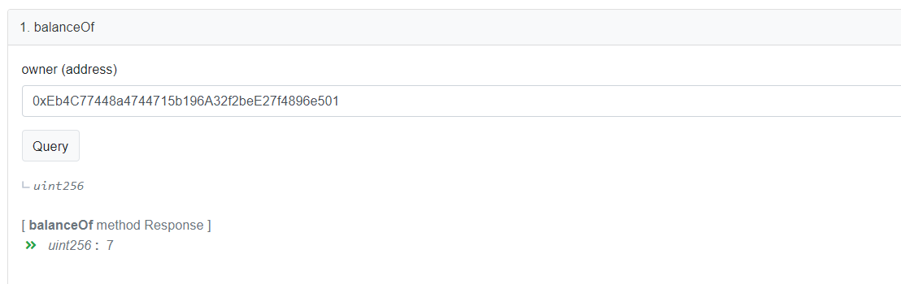

建立一个`address `到token数量的映射表，函数`balanceOf（）`检查地址的合法性的前提下，返回映射表中返回地址持有的NFT数量。

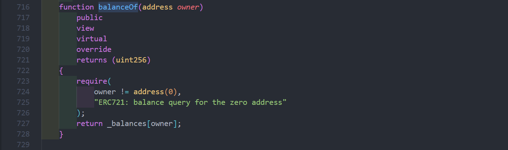


---

`baseExtension（）`：`Metadata`文件的格式说明，这里是`json`格式，所以返回`“.json”`。


baseExtension也可以在后期通过函数进行修改


---

`cost`：`mint`单个NFT的价格，单价是0.5ether，因为是部署到`Polygon`网络中，所以`mint`一个NFT的价格是0.5MATIC。（BanaCatNFT 一期像素猫是我的第一个NFT项目，定位为一个半公益性质的pfp项目，供交流和学习用，所以价格定得很便宜）；

不是所有的NFT项目价格都是固定，很多项目方会把定价设定成一个变量，并辅以修改变量的函数，会根据项目后期的公售情况动态调整价格。

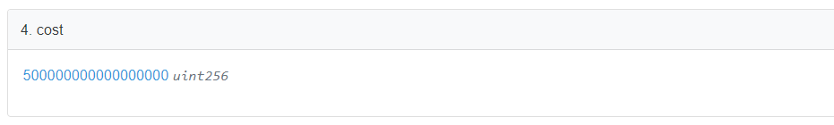


以太坊生态货币的计量单位是WEI，1ETH = 10^18 WEI

---

`getApproved（）`：ERC721标准的核心函数之一，查询某个NFT被授权给了哪个地址。配合`approve（）`，`setApprovalForAll（）`方法实现NFT的授权操作，在下一篇文章中会举一个小例子说明。


通过NFT `tokenID`到`address`的映射表建立NFT编号到地址之间的映射关系，函数`getApproved（）`在检查`tokenID`的合法性之后从映射表中返回`tokenID`对应持有者地址。


一个应用的实例：

[_safeTransferFrom()使用代理转移NFT](https://www.notion.so/_safeTransferFrom-NFT-ba9d0cc177894101afbb955625aad2e4) 

---

`isApprovedForAll（）`：检查NFT的`owner`是不是把自己的当前地址的所有NFT授权给`operator`地址。


通过一个二级映射表，建立`( owner address ⇒ ( operator address ⇒ bool ）`的映射关系，当 `bool` 为`true`的时候表示`owner` 将自己的所有的NFT授权给 `operator` ；

  `bool`为 `false`的时候代表`owner`没有授权或者已经取消了授权。


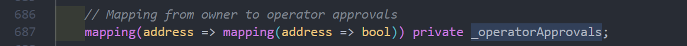

---

`isPauseed（）`：控制`mint`活动的进行或者暂停。


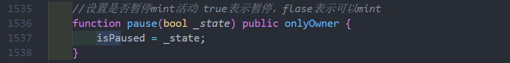

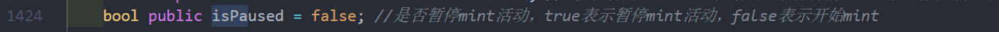

在`mint（）`函数中会将 `isPaused` 变量作为时候开始`mint`活动的开关。


---

`maxMintAmount（）`：单次最大NFT铸造数量，默认是5.

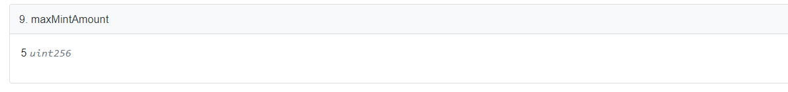


是个变量，可以在后续的`setmaxMintAmountOneTime（）`修改。

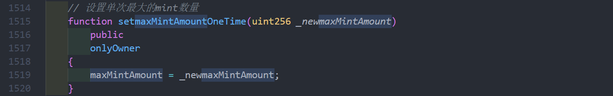

---

`maxSupply（）`：当前项目还可以`mint`的NFT数量，BanaCat NFT一期的NFT总量我也写到合约里了，自己去看看吧~（数量跟我自己还有一些关系）。


---

`name（）`：`Metadata.sol`中声明的关于项目名称的变量，`symbol`原理类似。


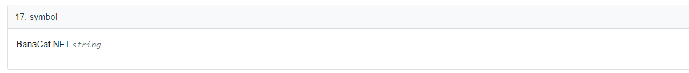


`name`，`symbol` 会在合约的构造函数中被初始化。


---

`owner（）`：当前合约的拥有者，默认是最初发布合约的地址，后期也可以将合约的拥有权移交给被人。有些NFT项目所属权移交给社区，由社区共同打理，也是`DAO`的一处应用场景。


openzeppelin 关于`Ownable.sol` 实现

[openzeppelin-contracts/Ownable.sol at master · OpenZeppelin/openzeppelin-contracts](https://github.com/OpenZeppelin/openzeppelin-contracts/blob/master/contracts/access/Ownable.sol)

归属权的转移函数；

关于归属权转移还有一个应用场景：如果项目的owner mint本项目的NFT是免费的，同时项目方想向自己的另一个地址发送大量NFT，一种比较节约成本的做法是可以先将合约的归属权移交给自己的目标地址，然后批量mint一定数量NFT之后再将归属权转移回来。


---

`ownerOf（）`：查看某个NFT的归属地址。


`_owners` 建立NFT tokenID与address之间的映射，函数`ownerOf()` 在判断返回地址的合法化之后将对应的地址返回。

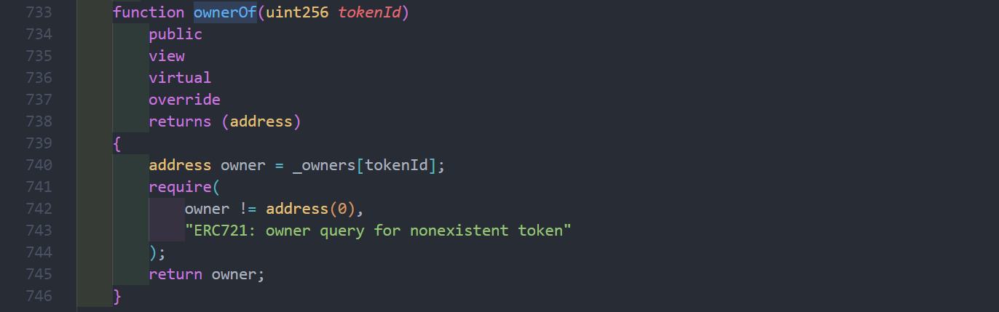

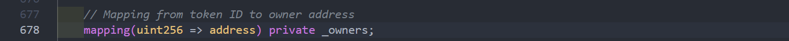

---

`supportsInterface（）`：ERC165标准的核心功能，用于检测合约是否实现了特定的接口。以ERC721的 `InterfaceID “0x80ac58cd”`为例。

对ERC165不太了解的同学可以看这篇文章：

[GitHub - LIPUU/1wallet](https://github.com/LIPUU/1wallet#4-erc165%E4%B8%8Eerc721)


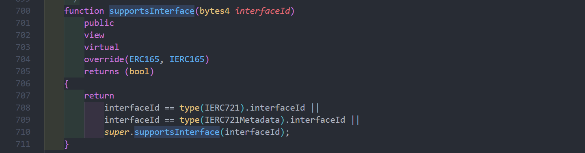

---

`tokenByIndex（）`：返回索引值在`_allTokens` 数组中对应的`tokenID`，以便于后续的查找。

`ERC721` 的`ownerOf（）`函数可以返回某个`tokenID`所属的`address`，`balanceOf()`可以知道某个`address`下有几个NFT，但是怎么查某个`address`下面都有哪些`tokenID`呢？`ERC721Enumerable` 扩展库的提出就是用来解决这个问题的。

[openzeppelin-contracts/ERC721Enumerable.sol at master · OpenZeppelin/openzeppelin-contracts](https://github.com/OpenZeppelin/openzeppelin-contracts/blob/master/contracts/token/ERC721/extensions/ERC721Enumerable.sol)


---

`tokenOfOwnerByIndex（）`：返回输入的地址参数`owner`在在索引`index`处的`tokenID`。

怎么理解这个功能呢？一个`ERC721`标准的NFT只能被一个地址所持有，但是一个地址却可以同时持有多个NFT。标准的`ERC721`合约只提供了查询地址下有多少个NFT的接口`balanceOf（）`但是没有提供相关的接口规范来查询当前地址下有哪些tokens，`tokenOfOwnerByIndex（）`为这个需求提供了自己的功能，具体过程会在下面的`walletOfOwner()`中展开讲解。

举个例子：`walletOfOwner()`返回`_owner` 地址下的NFT `tokenID`列表[12, 11, 1199, 10, 521, 1081]，因为数组索引（index）是从0开始的，所以查询0号位置查出来的就是`tokenID`为`12`的NFT。


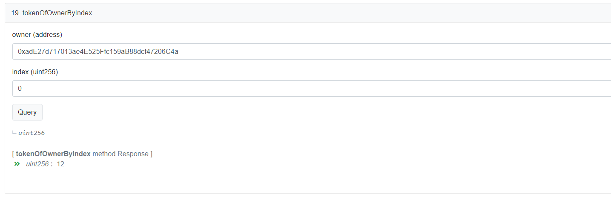


---

`totalSupply（）`：显示目前已被`mint`且可被追踪到的NFT数量


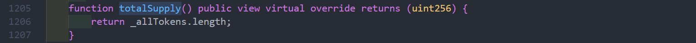

---

`walletOfOwner()`:返回当前地址中所有的tokenID。

原理：

①建立一个*(地址 => ( NFT索引 => NFT TokenID )) 的二级映射表`_ownedTokens`，将某个地址下的所有NFT编号记录下来；（个人觉得也可以* 建立一个*(地址 => address[] )的映射表实现同样的功能，但后者会随着NFT的交易时频繁操作数组空间而增加gas消耗）* 

②`walletOfOwner（）`函数首先查询当前地址有多少个NFT，并以此为长度建立一个临时数组`tokenIds`，之后调用`tokenOfOwnerByIndex(_owner, i)）`；

③`tokenOfOwnerByIndex(_owner, i)）`返回当前地址下，索引为`i`的位置对应的NFT编号，并将他们记录临时数组`tokenIds`中；

④之后在`walletOfOwner（）`将数组`tokenIds`的数据返回；


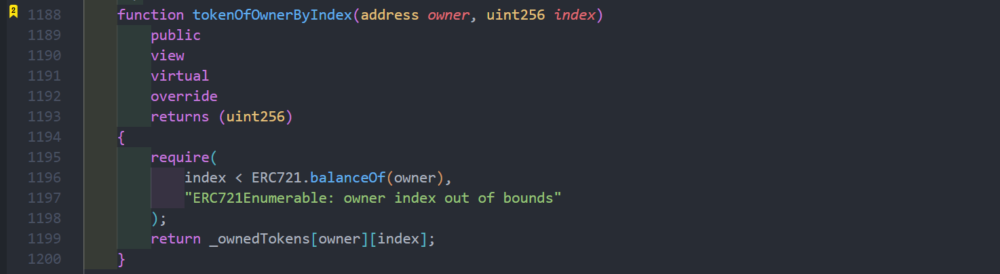


---

`tokenURI（）`：返回某个输入`tokenID`对应的`tokenURI`。


怎么理解这个函数呢？还要从NFT元文件的存储方式说起。

当前技术条件下，直接将NFT图像本身以及对应的json属性数据直接存放在寸土寸金的区块链上是不现实的（区块链的共识机制会在每一个全结点上备份全网的区块数据，1M的文件在100个结点上备份就会产生100M的数据量，其中99M都是冗余数据，这样不仅造成存储空间的浪费，还会极大增加NFT的发行成本）。为了响应“去中心化”发展趋势，目前主流的NFTMetadata存储方案都是将NFT源文件存放在[IPFS网络中](https://docs.ipfs.io/concepts/what-is-ipfs/)。

关于Metadata可以查看以下链接：

[Metadata Standards](https://docs.opensea.io/docs/metadata-standards)

以#1623号雷达猫的Metadata文件举例说明：


```json
{
  "name": "BanaCat #1623",  // NFT 的名字
    // 项目描述
  "description": "Pixel kitty with different styles, if you're tired of those 'bored' Apes, come and take a look at these cute cats~ Maybe they are the most suitable NFT for avatar and your honey may love them too. Let's explore what the next kitty will wear on his/her head!",
  "image": "ipfs://QmYr9NUaom7uijzTdsjvQ57hRNV4gttnhXF7Sgvt36cUUh/1623.png",  // 图像在IPFS网络的存储位置，类似于HTTP协议中的URL
  "dna": "b39631c09c646593738fa44a1d8665cdb74faf08",  // 以NFT的attributes为输入经过hash算法计算出来的数据摘要，以其为依据保证不会有重复的图片文件
  "edition": 1623,  // 可以理解成ID号
  "date": 1643206138987,  // 生成日期
  "attributes": [  //图片的属性
    {
      "trait_type": "background",  // 背景是橙色
      "value": "Orange"
    },
    {
      "trait_type": "head",  // 灰色的头
      "value": "Gray"
    },
    {
      "trait_type": "blush",  // 粉色的腮红
      "value": "Pink"
    },
    {
      "trait_type": "nose",  // 褐色的鼻子
      "value": "Brown"
    },
    {
      "trait_type": "mouse",  // 微笑的嘴巴
      "value": "Smile"
    },
    {
      "trait_type": "eyes",  //  blingbling的眼睛
      "value": "Blingbling"
    },
    {
      "trait_type": "hat",  // 帽子为雷达（为了致敬西电的雷达通信工程）
      "value": "Radar"
    }
  ],
  "Author": "shuxun"
}

每一个NFT都会有一个与之对应的JSON文件，所有的文件挡在一个文件夹传到IPFS网络中会生成一个文件夹的CID地址，这个地址就是合约中的"baseURI"，项目中每个NFT对应的文件地址都是由这个基地址拼接起来的。
```

`tokenURI（）`：就是将`baseURI`+`tokenID`+文件后缀 拼接起来拿到`tokenID`对应的NFT在IPFS中的存贮地址。

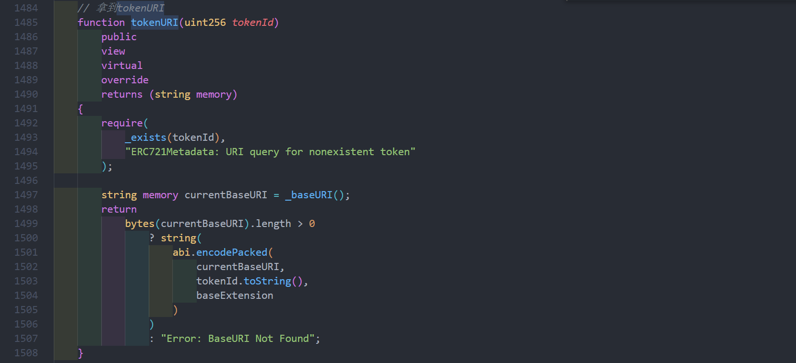


这篇文章主要介绍了猫猫合约中的“读”函数，下一篇我们会介绍合约中的“写”函数。

[BanaCat NFT Contract（2/3）](BanaCat%20NFT%20Contract%EF%BC%882%203%EF%BC%89%202fed2b20e00b4af9acf6104983616ced.md)