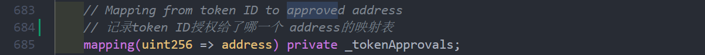
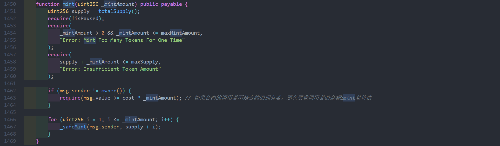
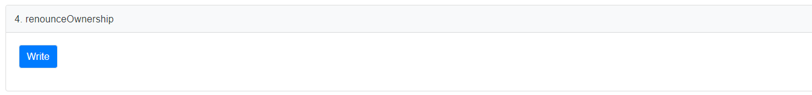
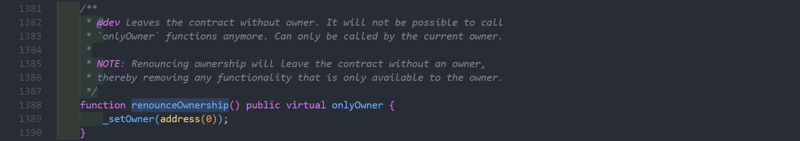
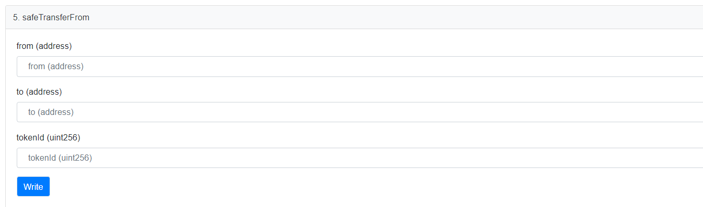
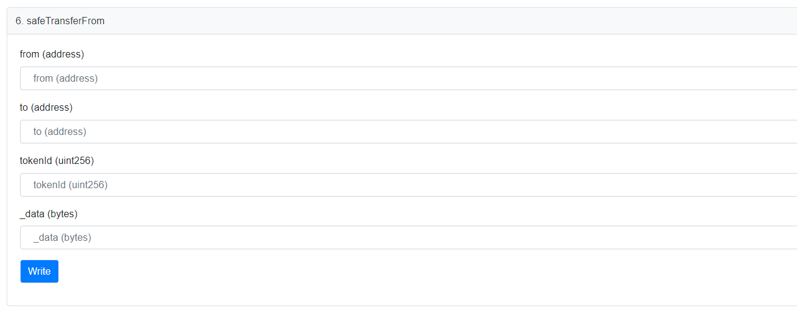
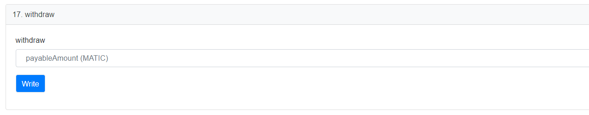

# BanaCat NFT Contract（2/3）

# 关于BanaCatNFT

BanaCat一期项目是一个部署在polygon区块链上的头像数字艺术品

项目链接：[BanaCato_O - Collection | OpenSea](https://opensea.io/collection/banacat-v2)

合约源码地址：https://polygonscan.com/address/0xd2bc5c3990c06ccd26f10a3e9d93b19450136c8d#code

同时，基于这款数字艺术品也设计了配套的表情包周边，目前已经有一款已经上架到微信表情包商城，表情包链接：[香蕉猫看戏篇](https://sticker.weixin.qq.com/cgi-bin/mmemoticon-bin/emoticonview?oper=single&t=shop/detail&productid=aL2PCfwK/89qO7sF6/+I+UDhfwEjhec2ZNvdnLLJRd/N7QVyYnUnFpeB0t9OOOGqFiGlj08OJVil+/ruMQmJp3eFNlkqDVcbCJC9A4/2eWbE=)

# 

---

# “写”函数会改变合约的状态，每一笔交易都会消耗一定的gas。

因为要用自己的私钥为每一笔交易签名，所以在与合约交互之前，要先链接上自己的钱包。

---

`approve（）`：将单个NFT的授权给某个operator，让其可以代理NFT的拥有者进行转出操作，后面会有实例说明。

`_tokenApprovals` 是一个`tokenID`到 `operator`地址的映射表，`approve（）`函数正是以此为依据将NFT授权给某个地址。

---

`mint()`: NFT铸造函数，NFT项目在宣发阶段，无论是白名单铸造还是公售阶段，都是直接或者间接调用`mint（）`函数。币圈中“合约层铸造”就是指跳过项目方官网的铸造流程，直接在区块链浏览器或者通过本地RPC调用的方式直接与合约交互铸造NFT。特别重要的函数，这是NFT发行的起点。

第一个参数`mint`是指要支付的代币总量；

`_mintAmount()`:一次性铸造NFT的数量；

根据有无白名单，铸造的单价会有不同，但是 `总价 = 单价 * 数量`，合约会从铸造者账户中扣除总价的代币（gas另算）；

---

`mint（）`函数中会对`_mintAmount`的数值做合法性检测，要求`_mintAmount`大于0且不大于要求的单次最大铸造量`maxMintAmount`；

同时要求本次铸造的数量`_mintAmount`加上已经铸造的数量`totalsupply`不大于合约NFT的最大供应量`maxSupply`；

之后会对铸造者随交易发送来的代币总数不小于NFT铸造总价；

最后会用循环调用`_safeMint()`函数挨个给用户铸造NFT。（这种循环调用的方式很容易理解，但是单次批量铸造成本会比较高，`Azuki` 提出的ERC721A协议在单次批量铸造的时候会节省gas，这个我们后面再说）

`_safeMint()` 函数之所以“safe”，是因为它会对铸造者的身份做审查，要是铸造者是个合约，则要求这个合约必须实现`IERC721Receiver`接口，关于`IERC721Receiver`可以参考A大的文章：

[Solidity极简入门 ERC721专题：1. ERC721相关库](https://mirror.xyz/ninjak.eth/PAsIFLAmEoMufZsXlX0NWsVF8DHpHz3OrYlooosy9Ho)

有一个小细节：`_checkOn721Received()`的第一个参数 `from` 在 _*safeMint() 调用的时候传入的是 `address（0）`即 `0x0000000000000000000000000000000000000000`，意思是代表这个交NFT是从0地址发来的，后面*`_mint()`函数里触发`Transfer`事件，用来记录一个NFT从`from` 地址转移到 `to` 地址，这里的 `from`也是*`address（0）`，虽然所有的NFT都是从合约中铸造的，但是NFT最初的来源地址却不是合约地址，对于这一现象，我的理解是 烧掉`burn（）`一个NFT其实就是将其发送到`0地址`，代表一个NFT被销毁，从此失去流动性，可能这也包含着着“从哪里来，就到哪里去”的哲理吧。*

在`_mint()`函数中触发事件`Transfer（）`在区块链上生成一条日志文件

---

`pause()`:*设置是否暂停mint活动 true表示暂停，flase表示可以mint*

---

`renounceOwnership()`：项目方放弃合约的控制权，将合约的`owner`设置为`address（0）`，意味着再也没有谁能控制合约，就像宇宙中的尘埃。

如果合约的余额再也无法取出。高危函数（危险等级：最高⚠︎⚠︎⚠︎⚠︎⚠︎）

---

`safeTransferFrom()`:NFT的转移函数，将一个编号为输入`tokenID`的NFT从`from`地址转移到`to`地址。

---

`safeTransferFrom()`:NFT的转移函数，将一个编号为输入`tokenID`的NFT从`from`地址转移到`to`地址，只不多多了一些附加性质的data，可以做一些说明性的活动（比如往区块链上写一些永久存档的文字）。

名字为什么叫`safeTransferFrom`而不是`safeTransfer`？看似只是名字少了一个from，其实是涉及到代理权的问题。

ERC721合约中一共有两类角色可以将NFT转移走：一是NFT的owner，二是当前NFT的授权代理。函数名称中的“from“ 就是代表从哪个账户中将NFT转移走，很多时候转移走NFT的地址不一定是NFT的实际拥有者。我们接下来举个小例子说明这个现象。

[_safeTransferFrom()使用代理转移NFT (1)](https://github.com/ShuxunoO/WTFSolidity/blob/main/Topics/ERC721%E6%8E%A5%E5%8F%A3%E8%A7%A3%E6%9E%90/Notes_02_%E5%AE%9E%E4%BE%8B%E5%88%86%E6%9E%90_ShuxunOo/_safeTransferFrom()%E4%BD%BF%E7%94%A8%E4%BB%A3%E7%90%86%E8%BD%AC%E7%A7%BBNFT%20.md)

但是操作的目的是啥呢？

我个人的理解是，NFT从出生起就带有金融属性，授权操作给NFT的质押提供了可行方法，授权者可以通过质押拿到贷款，放贷机构可以拿着质押得到的NFT发行NFT衍生金融资产……NFT的应用空间远超我的想象！

---

`setApprovalForAll（）`：将`owner`地址下的所有NFT一次性授权给`operator`

高危函数（危险等级：⚠︎⚠︎⚠︎⚠︎）

`_operatorApprovals` 是一个（ ownerAddress ⇒（ operatorAddress ⇒ bool））的二级映射表，`setApprovalForAll（）`通过修改`bool`值来设定是否将自己的NFT全部授权给`operator`

[setApprovalForAll（）的实例](BanaCat%20NFT%20Contract%EF%BC%882%203%EF%BC%89%202fed2b20e00b4af9acf6104983616ced/setApprovalForAll%EF%BC%88%EF%BC%89%E7%9A%84%E5%AE%9E%E4%BE%8B%2006a266d055b346cfb592940ae772bd9a.md)

---

`setBaseExtension（）`：设置`Metadata`文件的扩展名，一般不用这个函数，扩展名默认为`“json”`

---

`setBaseURI（）`：设置NFT的`BaseURI`，高危函数（危险等级：⚠︎⚠︎⚠︎）一般只用作项目开图，开图之后不再使用。

---

`setCost()`:*设置公售NFT时的`mint`价格*

---

`transferFrom（）：`NFT的转移函数，将一个编号为输入`tokenID`的NFT从`from`地址转移到`to`地址。不会对`to`地址做风险检测，所以也不在”safe“

---

`transferOwnership（）`：将合约的归属权移交给新地址。

高危函数（危险等级：⚠︎⚠︎⚠︎⚠︎）

`Ownable.sol`扩展文件中的功能函数，详情看以下链接：

[openzeppelin-contracts/Ownable.sol at master · OpenZeppelin/openzeppelin-contracts](https://github.com/OpenZeppelin/openzeppelin-contracts/blob/master/contracts/access/Ownable.sol)

---

`withdraw（）`：将合约中的余额转给合约的`owner`。估计绝大多数的项目方都在等这最后一下吧。

下一篇会介绍BanaCatNFT合约中设计的一种密码白名单机制

[BanaCat NFT Contract（3/3）](BanaCat%20NFT%20Contract%EF%BC%883%203%EF%BC%89%20c1e94cb165ab49c09020284e3cdc3189.md)
