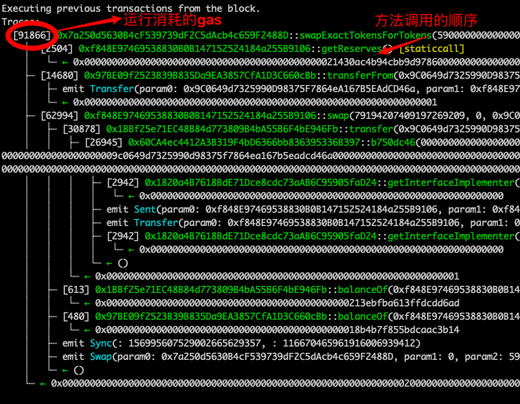

# WTF Solidity极简入门-工具篇7: Foundry，以Solidity为中心的开发工具包

我最近在重新学solidity，巩固一下细节，也写一个“WTF Solidity极简入门”，供小白们使用），每周更新1-3讲。

推特：[@0xAA_Science](https://twitter.com/0xAA_Science)

社区：[Discord](https://discord.gg/5akcruXrsk)｜[微信群](https://docs.google.com/forms/d/e/1FAIpQLSe4KGT8Sh6sJ7hedQRuIYirOoZK_85miz3dw7vA1-YjodgJ-A/viewform?usp=sf_link)｜[官网 wtf.academy](https://wtf.academy)

所有代码和教程开源在github: [github.com/AmazingAng/WTF-Solidity](https://github.com/AmazingAng/WTF-Solidity)

-----

## 什么是 Foundry?
来自 Foundry [官网 (getfoundry.sh) ](https://getfoundry.sh) 对该工具的介绍：

> Foundry是 一个用 Rust编写的用于以太坊应用程序开发的极快、可移植和模块化的工具包 ( Foundry is a blazing fast, portable and modular toolkit for Ethereum application development written in Rust.)

项目设施：
- 官网：[https://getfoundry.sh](https://getfoundry.sh)
- Github 仓库：[https://github.com/foundry-rs/foundry](https://github.com/foundry-rs/foundry)
- 文档：[https://book.getfoundry.sh](https://book.getfoundry.sh)

介绍的解释：
- **用 Rust 语言编写**： Foundry 完全采用 Rust 语言开发， [Github 上的源代码仓库](https://github.com/foundry-rs/foundry) 是一个 Rust 语言工程。我们可以通过获取 [Release 的二进制文件](https://github.com/foundry-rs/foundry/releases)，也可以通过 Rust 语言的 cargo 包管理[工具编译&构建安装](https://github.com/foundry-rs/foundry#installing-from-source);
- **用于以太坊应用程序开发**： Foundry 作为 以太坊（Solidity语言）项目/应用程序开发的 “工程化” 工具，提供专业 Solidity 开发环境与“工具链”。**通过它你可以快速、方便的完成依赖项管理、编译、运行测试、部署，并可以通过命令行和 Solidity 脚本与链进行交互**;
- **极快**： Foundry 利用 [ethers-solc](https://github.com/gakonst/ethers-rs/tree/master/ethers-solc/) 比较于传统通过 Node.js 辅助完成的测试用例/工程，Foundry 构建、测试的执行速度很快（创建一个工程，写一些测试用例跑一下会感受到震撼）;
- **可移植**: Foundry 工程支持与其他类型的工程集成（如：[与 Hardhat 集成](https://book.getfoundry.sh/config/hardhat)）;
- **模块化**：通过 git submodule & 构建目录映射，快速方便的引入依赖;

<!--👆TODO: some 🔗 LINKS can be added when our Hardhat tutorial is complete -->

## 为什么选择 Foundry？

如果你满足以下条件或有过类似体验，你一定要试试 Foundry：

- ~~如果你有 Rust “语言信仰”~~，如果你是个专业的 以太坊（Solidity语言）应用开发者；
- 你曾经用过类似 Hardhat.js 这样的工具；
- 你厌倦了大量测试用例的等待，需要有工具**更加快速**的跑完你的测试用例；
- 你觉得处理 BigNumber 稍微有一点点🤏麻烦;
- 有过**通过 Solidity 语言本身完成测试用例**（或测试合约的合约）的需求；
- 你觉得通过 git submodule 的方式管理依赖更加方便（而不是 npm）；
- ···


如果有以下情况 Foundry 可能不适合你：
- Solidity 初学者；
- 你的项目不需要写测试用例、不需要过多在 Solidity 工程方面的自动化操作；


## Foundry 的主要功能
> 该部分源于 Foundry book ([https://book.getfoundry.sh](https://book.getfoundry.sh))，让章节的理解更容易。

- [创建以太坊（Solidity）智能合约应用开发项目](https://book.getfoundry.sh/projects/creating-a-new-project)，[开发已有的项目](https://book.getfoundry.sh/projects/working-on-an-existing-project);
- [管理以太坊(Solidity)智能合约的依赖项目](https://book.getfoundry.sh/projects/dependencies);
- [创建由 Solidity 语言编写的测试用例（并且能很快速的执行测试用例）](https://book.getfoundry.sh/forge/writing-tests): 并且支持[模糊测试](https://book.getfoundry.sh/forge/fuzz-testing)与[差异测试](https://book.getfoundry.sh/forge/differential-ffi-testing)等方便、专业的测试方式;
- 通过 [Cheatcodes（作弊码）](https://book.getfoundry.sh/forge/cheatcodes) 在 Solidity语言 编写的测试用例中**进行 “EVM环境之外” 的 vm 功能进行交互与断言**：更换测试用例语句执行者的钱包地址（更换 `msg.sender`）、对 EVM 外的 Event 事件进行断言；
- 执行过程与错误追踪：[“函数堆栈”级的错误追踪（Traces）](https://book.getfoundry.sh/forge/traces)；
- [部署合约和自动化的完成scan上合约的开源验证](https://book.getfoundry.sh/forge/deploying)；
- 在项目中支持[完整的gas使用情况追踪](https://book.getfoundry.sh/forge/gas-tracking)：包括合约测试细节的gas用量和gas报告；
- 交互式[调试器](https://book.getfoundry.sh/forge/debugger)；

## Foundry 的组成

Foundry 项目由 `Forge`, `Cast`, `Anvil` 几个部分（命令行工具）组成

- Forge: Foundry 项目中**执行初始化项目、管理依赖、测试、构建、部署智能合约**的命令行工具;
- Cast: Foundry 项目中**与 RPC 节点交互**的命令行工具。可以进行智能合约的调用、发送交易数据或检索任何类型的链上数据;
- Anvil:  Foundry 项目中**启动的本地测试网/节点**的命令行工具。可以使用它配合测试前端应用与部署在该测试网的合约或通过 RPC 进行交互; 

## 快速使用 --- 创建一个 Foundry 项目

> 内容出自 Foundry book 的 Getting Start 部分

即将完成的过程：
1. 安装 Foundry;
2. 初始化一个 Foundry 项目;
3. 理解初始化过程中添加的智能合约、测试用例；
4. 执行构建&测试;
  
  
### 安装 Foundry

对于不同的环境：
- MacOS / Linux （等 Unix like 系统）：
  - 通过 `foundryup` 安装（👈Foundry 项目首页推荐的方式）;
  - 通过 源代码构建 安装;
- Windows
  - 通过 源代码构建 安装;
- Docker 环境
  - 参考 Foundry Package: [ https://github.com/gakonst/foundry/pkgs/container/foundry](https://github.com/gakonst/foundry/pkgs/container/foundry)
- Github Action： 用于构建完整的 Action 流程
  - 参考 [https://github.com/foundry-rs/foundry-toolchain](https://github.com/foundry-rs/foundry-toolchain)

---

#### 通过[脚本](https://raw.githubusercontent.com/foundry-rs/foundry/master/foundryup/install)快速安装
通过有`bash`的（或者类Unix环境）快速安装
```shell
$ curl -L https://foundry.paradigm.xyz | bash
```
执行后将会安装 `foundryup`，在此后执行它
```shell
$ foundryup
```
如果一切顺利，您现在可以使用三个二进制文件：`forge`、`cast` 和 `anvil`。


<!--

---

#### [通过源代码构建安装（需要你了解一点 Rust 环境）](https://book.getfoundry.sh/getting-started/installation#building-from-source)

要从源代码构建，您需要获取 `Rust` 和 `Cargo`。获得两者的最简单方法是使用 `rustup`。

```shell
# clone 项目目录至本地
git clone https://github.com/foundry-rs/foundry

# 进入项目目录
cd foundry

# 安装 cast + forge
cargo install --path ./cli --profile local --bins --locked --force

# 安装 anvil
cargo install --path ./anvil --profile local --locked --force
```
-->
### 初始化一个 Foundry 项目

通过 `forge` 的 `forge init` 初始化项目 "hello_wtf"
```shell
$ forge init hello_wtf

Initializing /Users/username/hello_wtf...
Installing forge-std in "/Users/username/hello_wtf/lib/forge-std" (url: Some("https://github.com/foundry-rs/forge-std"), tag: None)
    Installed forge-std
    Initialized forge project.
```
该过程通过安装依赖`forge-std`初始化了一个 Foundry 项目

在项目目录中看到

```shell
$ tree -L 2 
.
├── foundry.toml        # Foundry 的 package 配置文件
├── lib                 # Foundry 的依赖库
│   └── forge-std       # 工具 forge 的基础依赖
├── script              # Foundry 的脚本
│   └── Counter.s.sol   # 示例合约 Counter 的脚本
├── src                 # 智能合约的业务逻辑、源代码将会放在这里
│   └── Counter.sol     # 示例合约
└── test                # 测试用例目录
    └── Counter.t.sol   # 示例合约的测试用例
```
提示：
- 依赖项作为 git submodule 在 `./lib` 目录中
- 关于 Foundry 的 package 配置文件请详细参考: [https://github.com/foundry-rs/foundry/blob/master/config/README.md#all-options](https://github.com/foundry-rs/foundry/blob/master/config/README.md#all-options)


### 理解初始化过程中添加的智能合约、测试用例

#### src 目录

主要由业务逻辑构成
`src` 目录中的 `./src/Counter.sol`:
```solidity
// SPDX-License-Identifier: UNLICENSED
pragma solidity ^0.8.13;

contract Counter {          // 一个很简单的 Counter 合约
    uint256 public number;  // 维护一个 public 的 uint256 数字

    // 设置 number 变量的内容
    function setNumber(uint256 newNumber) public { 
        number = newNumber;
    }

    // 让 number 变量的内容自增
    function increment() public {
        number++;
    }
}
```

#### script 目录

参考 Foundry 项目文档中的 [Solidity-scripting](https://book.getfoundry.sh/tutorials/solidity-scripting) 该目录主要由“部署”脚本构成（也可通过该脚本调用 Foundry 提供的 `vm` 功能实现应用业务逻辑之外的高级功能，等同于 Hardhat.js 中的 scripts）。

详见script 目录中的 `./script/Counter.s.sol`：

```solidity
// SPDX-License-Identifier: UNLICENSED
pragma solidity ^0.8.13; // 许可 和 Solidity版本标识

import "forge-std/Script.sol"; // 引入foundry forge中的Script库
import "../src/Counter.sol"; // 引入要部署的Counter合约

// 部署脚本继承了Script合约
contract CounterScript is Script {
    // 可选函数，在每个函数运行之前被调用
    function setUp() public {}

    // 部署合约时会调用run()函数
    function run() public {
        vm.startBroadcast(); // 开始记录脚本中合约的调用和创建
        new Counter(); // 创建合约
        vm.stopBroadcast(); // 结束记录
    }
}
```

Foundry的部署脚本是一个用Solidity写的智能合约，虽然它不会被部署，但符合Solidity的规范。你可以用`forge script`运行脚本并部署合约。

```shell
forge script script/Counter.s.sol:CounterScript
```


#### test 目录

主要由合约的测试用例构成

test 目录中的 `./test/Counter.t.sol`

```solidity
// SPDX-License-Identifier: UNLICENSED
pragma solidity ^0.8.13;

import "forge-std/Test.sol";        // 引入 forge-std 中用于测试的依赖
import "../src/Counter.sol";        // 引入用于测试的业务合约

// 基于 forge-std 的 test 合约依赖实现测试用例
contract CounterTest is Test {      
    Counter public counter;

    // 初始化测试用例
    function setUp() public { 
       counter = new Counter();
       counter.setNumber(0);
    }

    // 基于初始化测试用例
    // 断言测试自增后的 counter 的 number 返回值 同等于 1
    function testIncrement() public {
        counter.increment();
        assertEq(counter.number(), 1);
    }

    // 基于初始化测试用例
    // 执行差异测试测试
    // forge 测试的过程中
    // 为 testSetNumber 函数参数传递不同的 unit256 类型的 x
    // 达到测试 counter 的 setNumber 函数 为不同的 x 设置不同的数
    // 断言 number() 的返回值等同于差异测试的 x 参数
    function testSetNumber(uint256 x) public {
        counter.setNumber(x);
        assertEq(counter.number(), x);
    }

    // 差异测试：参考 https://book.getfoundry.sh/forge/differential-ffi-testing
}
```

### 执行构建&测试

在项目目录中通过执行 `forge build` 完成构建
```shell
$ forge build

[⠒] Compiling...
[⠢] Compiling 10 files with 0.8.17
[⠰] Solc 0.8.17 finished in 1.06s
Compiler run successful
```

完成构建后 通过 `forge test` 完成测试
```shell
$ forge test

[⠢] Compiling...
No files changed, compilation skipped

Running 2 tests for test/Counter.t.sol:CounterTest
[PASS] testIncrement() (gas: 28312)
[PASS] testSetNumber(uint256) (runs: 256, μ: 27609, ~: 28387)
Test result: ok. 2 passed; 0 failed; finished in 9.98ms
```

至此，您已完成上手使用 Foundry 并且初始化一个项目。

<!--

  TODO: For foundry advanced usage ...

  We need cover: 
  
  - cli forge `test` : reference https://book.getfoundry.sh/forge/writing-tests
  - cheatcode.
  - Logs and traces levels.

... etc.

-->


## Foundry Cast的进阶使用
主要介绍Foundry Cast的使用，使用Cast在命令行下达到[Ethereum (ETH) Blockchain Explorer](https://etherscan.io/) 的效果。

练习如下目标
* 查询区块
* 查询交易
* 交易解析
* 账户管理
* 合约查询
* 合约交互
* 编码解析
* 本地模拟链上交易


## 区块相关

### 查询区块

```shell
# $RPC_MAIN 替换成需要的RPC地址
cast block-number --rpc-url=$RPC_MAIN
```

输出结果：

```
15769241
```
> 将环境变量的ETH_RPC_URL设置为 --rpc-url 你就不需要在每个命令行后面增加 --rpc-url=$RPC_MAIN 我这里直接设置为主网

### 查询区块信息

```shell
# cast block <BLOCK> --rpc-url=$RPC_MAIN

cast block 15769241 --rpc-url=$RPC_MAIN

# 格式化

cast block 15769241 --json --rpc-url=$RPC_MAIN


```

输出结果：

```shell 
baseFeePerGas        22188748210
difficulty           0
extraData            0x
gasLimit             30000000
gasUsed              10595142
hash                 0x016e71f4130bac96a20761acbc0ba82a77c26f85513f1661adfd406d1c809543
logsBloom            0x1c6150404140580410990400a61d01e30030b00100c2a6310b11b9405d012980125671129881101011501d399081855523a106443aef3ab07148626315f721550290981058030b2af90b213961204c6103d2002a076c9e12d0800475b8231f0d06a20100da57c60aa0c008280128284418503340087c8650104c34500c18aa1c2070878008c21c64207d1424000244811415afc507640448122060644c181204ba412f0af11365020880508105551226004c0801c1840183003a42062a5a2444c13266020c00081440008038492740a8204a0c6c050a29d52405b92e4b20f028a97a604c6b0849ca81c4d06009258b4206217803a168824484deb8513242f082
miner                0x4675C7e5BaAFBFFbca748158bEcBA61ef3b0a263
mixHash              0x09b7a94ef1d6c93caaff49ca8bf387652e0e33e116076b61f4d5ee79f0b91f92
nonce                0x0000000000000000
number               15769241
parentHash           0x95c60d89f2275a6a7b1a9545cf1fb6d8c614402cd7311c82bc7972c177f7812d
receiptsRoot         0xe0240d60c448387123e412114cd0165b2af7b926d34bb824f8c544b022aa76f9
sealFields           []
sha3Uncles           0x1dcc4de8dec75d7aab85b567b6ccd41ad312451b948a7413f0a142fd40d49347
size                 149912
stateRoot            0xaa3e9d839e99c4791827c81df9c9129028a320432920205f191e3fb261d0951c
timestamp            1666026803
totalDifficulty      58750003716598352816469
transactions:        [
	0xc4f5c10e4419698edaf7431df464340b389e4b79db959d58f42e82e8d1ed18ae
	0xb90edeacf833ac6cb91a326c775ed86d8047a467404bd8c69782d2260983eaad
	0x6f280650e35238ab930c9a0f3163443fffe2efedc5b553f408174d4bcd89cd8d
	0x2e0eafea64aaf2f53240a16b11a4f250ba74ab9ca5a1a90e6f2a6e92185877d2
	0x34f41d22ed8209da379691640cec5bfb8bf9404ad0f7264709b7959d61532343
	0x7569ab5ce2d1ca13a0c65ad52cc901dfc186e8ff8800793550b97760cbe34db2
	0xcdeef0ffe859fcf96fb52e22a9789295c6f1a94280df9faf0ebb9d52abefb3e7
	0x00d6793f3dbdd616351441b9e3da9a0de51370174e0d9383b4aae5c3c9806c2a
	0xff3daf63a431af021351d3da5f2f39a894352328d7f3df96afab1888f5a7093f
	0x7938399bee5293c384831c8e5aa698cdb491d568f9ebfb6d5c946f4ef7bf7e51
	0x20e7dda515f04ea6a787f68689e27bcadbba914184da5336204f3f36771f59f0
	0x0435d78a1b62484fbe3a7680d68ba4bdf0d692f087f4a6b70eb377421c58a5dd
	0xe16d1fa4d60cca7447850337c63cdf7b888318cc1bbb893b115f262dc01132d7
	0x44af4f696dcfedee682d7e511ad2469780443052565eea731b86b652a175c05e
	0xe88732f92ac376efb6e7517e66fc586447e0d065b8686556f2c1a7c3b7a519ce
	0x7ee890b096e97fc0c7e3cf74e0f0402532e0f3b8fa0e0c494d3d691d031f57e7
	...]
```

## 交易相关

### 查询交易

```shell
# 跟ethersjs中的 provider.getTransaction 类似
# cast tx <HASH> [FIELD] --rpc-url=$RPC

# 跟ethersjs中的 provider.getTransactionReceipt类似
# cast receipt <HASH> [FIELD] --rpc-url=$RPC 

cast tx 0x20e7dda515f04ea6a787f68689e27bcadbba914184da5336204f3f36771f59f0 --rpc-url=$RPC 

cast receipt 0x20e7dda515f04ea6a787f68689e27bcadbba914184da5336204f3f36771f59f0 --rpc-url=$RPC

# 只获取logs

cast receipt 0x20e7dda515f04ea6a787f68689e27bcadbba914184da5336204f3f36771f59f0 logs --rpc-url=$RPC

```

第一条命令行结果：

```shell
blockHash            0x016e71f4130bac96a20761acbc0ba82a77c26f85513f1661adfd406d1c809543
blockNumber          15769241
from                 0x9C0649d7325990D98375F7864eA167B5EAdCD46a
gas                  313863
gasPrice             35000000000
hash                 0x20e7dda515f04ea6a787f68689e27bcadbba914184da5336204f3f36771f59f0
input                0x38ed173900000000000000000000000000000000000000000000000332ca1b67940c000000000000000000000000000000000000000000000000000416b4849e6ba1475000000000000000000000000000000000000000000000000000000000000000a00000000000000000000000009c0649d7325990d98375f7864ea167b5eadcd46a00000000000000000000000000000000000000000000000000000000634d91c1000000000000000000000000000000000000000000000000000000000000000200000000000000000000000097be09f2523b39b835da9ea3857cfa1d3c660cbb0000000000000000000000001bbf25e71ec48b84d773809b4ba55b6f4be946fb
nonce                14
r                    0x288aef25af73a4d1916f8d37107ef5f24729a423f23acc38920829c4180fe794
s                    0x7644d26a91da02ff1e774cc821febf6387b8ee9f3e3085140b781819d0d8ede0
to                   0x7a250d5630B4cF539739dF2C5dAcb4c659F2488D
transactionIndex     10
v                    38
value                0
```

第二行命令行结果：

```shell
blockHash               0x016e71f4130bac96a20761acbc0ba82a77c26f85513f1661adfd406d1c809543
blockNumber             15769241
contractAddress
cumulativeGasUsed       805082
effectiveGasPrice       35000000000
gasUsed                 114938
logs                    [{"address":"0x97be09f2523b39b835da9ea3857cfa1d3c660cbb","topics":["0xddf252ad1be2c89b69c2b068fc378daa952ba7f163c4a11628f55a4df523b3ef","0x0000000000000000000000009c0649d7325990d98375f7864ea167b5eadcd46a","0x000000000000000000000000f848e97469538830b0b147152524184a255b9106"],"data":"0x00000000000000000000000000000000000000000000000332ca1b67940c0000","blockHash":"0x016e71f4130bac96a20761acbc0ba82a77c26f85513f1661adfd406d1c809543","blockNumber":"0xf09e99","transactionHash":"0x20e7dda515f04ea6a787f68689e27bcadbba914184da5336204f3f36771f59f0","transactionIndex":"0xa","logIndex":"0x2","removed":false},{"address":"0x1bbf25e71ec48b84d773809b4ba55b6f4be946fb","topics":["0x06b541ddaa720db2b10a4d0cdac39b8d360425fc073085fac19bc82614677987","0x000000000000000000000000f848e97469538830b0b147152524184a255b9106","0x000000000000000000000000f848e97469538830b0b147152524184a255b9106","0x0000000000000000000000009c0649d7325990d98375f7864ea167b5eadcd46a"],"data":"0x0000000000000000000000000000000000000000000000044b0a580cbdcfc0d90000000000000000000000000000000000000000000000000000000000000060000000000000000000000000000000000000000000000000000000000000008000000000000000000000000000000000000000000000000000000000000000000000000000000000000000000000000000000000000000000000000000000000","blockHash":"0x016e71f4130bac96a20761acbc0ba82a77c26f85513f1661adfd406d1c809543","blockNumber":"0xf09e99","transactionHash":"0x20e7dda515f04ea6a787f68689e27bcadbba914184da5336204f3f36771f59f0","transactionIndex":"0xa","logIndex":"0x3","removed":false},{"address":"0x1bbf25e71ec48b84d773809b4ba55b6f4be946fb","topics":["0xddf252ad1be2c89b69c2b068fc378daa952ba7f163c4a11628f55a4df523b3ef","0x000000000000000000000000f848e97469538830b0b147152524184a255b9106","0x0000000000000000000000009c0649d7325990d98375f7864ea167b5eadcd46a"],"data":"0x0000000000000000000000000000000000000000000000044b0a580cbdcfc0d9","blockHash":"0x016e71f4130bac96a20761acbc0ba82a77c26f85513f1661adfd406d1c809543","blockNumber":"0xf09e99","transactionHash":"0x20e7dda515f04ea6a787f68689e27bcadbba914184da5336204f3f36771f59f0","transactionIndex":"0xa","logIndex":"0x4","removed":false},{"address":"0xf848e97469538830b0b147152524184a255b9106","topics":["0x1c411e9a96e071241c2f21f7726b17ae89e3cab4c78be50e062b03a9fffbbad1"],"data":"0x00000000000000000000000000000000000000000000213ebfba613ffdcdd6ad0000000000000000000000000000000000000000000018b4b7f855bdcaac3b14","blockHash":"0x016e71f4130bac96a20761acbc0ba82a77c26f85513f1661adfd406d1c809543","blockNumber":"0xf09e99","transactionHash":"0x20e7dda515f04ea6a787f68689e27bcadbba914184da5336204f3f36771f59f0","transactionIndex":"0xa","logIndex":"0x5","removed":false},{"address":"0xf848e97469538830b0b147152524184a255b9106","topics":["0xd78ad95fa46c994b6551d0da85fc275fe613ce37657fb8d5e3d130840159d822","0x0000000000000000000000007a250d5630b4cf539739df2c5dacb4c659f2488d","0x0000000000000000000000009c0649d7325990d98375f7864ea167b5eadcd46a"],"data":"0x000000000000000000000000000000000000000000000000000000000000000000000000000000000000000000000000000000000000000332ca1b67940c00000000000000000000000000000000000000000000000000044b0a580cbdcfc0d90000000000000000000000000000000000000000000000000000000000000000","blockHash":"0x016e71f4130bac96a20761acbc0ba82a77c26f85513f1661adfd406d1c809543","blockNumber":"0xf09e99","transactionHash":"0x20e7dda515f04ea6a787f68689e27bcadbba914184da5336204f3f36771f59f0","transactionIndex":"0xa","logIndex":"0x6","removed":false}]
logsBloom               0x00200000000000000000000080000000000000000000000000010000000008000000000000800000000000000000000000000000002000000000000000000000000000000000000000000008000000200000000000000000000000400000100000000000800000002000000000000000000000400000000000000010000000000000000000000000005000000000040000000000000000080000004004000000000000084100000000000000000000000000000040000000000000000000040000000002000000000000000000000000000000000000001000002000000020000000000000000000000000000000000000004000000000000000000000000000
root
status                  1
transactionHash         0x20e7dda515f04ea6a787f68689e27bcadbba914184da5336204f3f36771f59f0
transactionIndex        10
type                    0

```

### 交易解析

Cast 会从 [Ethereum Signature Database](https://sig.eth.samczsun.com.) 解析对应的方法名称

```shell
# cast 4byte <SELECTOR> 解析交易的名称
cast 4byte 0x38ed1739
```

输出结果：

```shell
swapExactTokensForTokens(uint256,uint256,address[],address,uint256)
```

### 交易签名 

> 使用 Keccak-256 能够计算出方法名
> 函数名为被调函数原型[1]的Keccak-256哈希值的前4个字节。这允许EVM准确无误地识别被调函数。

交易签名：

```shell
# cast sig <SIG>

cast sig "swapExactTokensForTokens(uint256,uint256,address[],address,uint256)"

```

输出结果：

```shell
0x38ed1739
```

所以你可以看到最终都是 `0x38ed1739`

有些方法名称可能没有，你可以通过`cast upload-signature <SIG> `上传给 [Ethereum Signature Database](https://sig.eth.samczsun.com) 

### 交易解码

```shell
# 获得calldata
cast tx 0x20e7dda515f04ea6a787f68689e27bcadbba914184da5336204f3f36771f59f0 input --rpc-url=$RPC

# 可以通过该方法decode交易的数据，类似etherscan中的decode方法
# cast pretty-calldata <CALLDATA>
cast pretty-calldata 0x38ed173900000000000000000000000000000000000000000000000332ca1b67940c000000000000000000000000000000000000000000000000000416b4849e6ba1475000000000000000000000000000000000000000000000000000000000000000a00000000000000000000000009c0649d7325990d98375f7864ea167b5eadcd46a00000000000000000000000000000000000000000000000000000000634d91c1000000000000000000000000000000000000000000000000000000000000000200000000000000000000000097be09f2523b39b835da9ea3857cfa1d3c660cbb0000000000000000000000001bbf25e71ec48b84d773809b4ba55b6f4be946fb
```

输出结果：

```shell
 Possible methods:
 - swapExactTokensForTokens(uint256,uint256,address[],address,uint256)
 ------------
 [0]:  00000000000000000000000000000000000000000000000332ca1b67940c0000
 [1]:  00000000000000000000000000000000000000000000000416b4849e6ba14750
 [2]:  00000000000000000000000000000000000000000000000000000000000000a0
 [3]:  0000000000000000000000009c0649d7325990d98375f7864ea167b5eadcd46a
 [4]:  00000000000000000000000000000000000000000000000000000000634d91c1
 [5]:  0000000000000000000000000000000000000000000000000000000000000002
 [6]:  00000000000000000000000097be09f2523b39b835da9ea3857cfa1d3c660cbb
 [7]:  0000000000000000000000001bbf25e71ec48b84d773809b4ba55b6f4be946fb
```

### 模拟运行

```
# Usage: cast run --rpc-url <URL> <TXHASH>

cast run 0x20e7dda515f04ea6a787f68689e27bcadbba914184da5336204f3f36771f59f0
```

运行结果：



可以在结果中看到运行消耗的gas，以及方法顺序调用的过程，以及释放的emit的事件。通过这个可以了解一个hash的内在过程。类似 [BlockSec Building BlockChain Security Infrastructure](https://blocksec.com/) 和 [Tenderly | Ethereum Developer Platform](https://tenderly.co/) 可以结合使用。

## 账户管理

### 新建账户

```shell
# 新建一个账号
# cast wallet new [OUT_DIR] 
cast wallet new

# 新建一个keystore的账号，带有密码
# cast wallet new <PATH>
cast wallet new  ~/Downloads
```

第一条命令行结果输出：

```shell
Successfully created new key pair.
Address: 0xDD20b18E001A80d8b27B8Caa94EeAC884D1c****
Private Key: edb4444199bddea91879c0214af27c0c7f99****bf18e46ba4078a39ccdbe0bc
```

第二条命令行结果输出：

```shell
Enter secret:
Created new encrypted keystore file: `/Users/EasyPlux/Downloads/b5832df5-21e9-4959-8c85-969eec9c0***`\nPublic Address of the key: 0x58c1C8f6A7D92A9b20A5343949cd624570Ab****
```

### 账户签名

```shell
# 两种方法都可以使用签名，第一种载入刚才生成的keystore私钥，第二种直接输入自己的私钥。
cast wallet sign <MESSAGE> --keystore=<PATH> 
cast wallet sign <MESSAGE> -i
```

### 账户验证

```shell
cast wallet verify --address <ADDRESS> <MESSAGE> <SIGNATURE> 
```

## 合约交互

### 获取合约

```shell
cast etherscan-source <contract address>

cast etherscan-source 0xC02aaA39b223FE8D0A0e5C4F27eAD9083C756Cc2 --etherscan-api-key='key'

```

### 下载合约

```shell
#cast etherscan-source -d <path>
# 我这里已经将$WETH的地址写入环境变量，如果没写入的，可以写成合约地址
cast etherscan-source $WETH -d ~/Downloads
```

### 调用合约(读数据)

`cast call` 用于从区块链上读取数据（调用只读函数），该操作不会改变区块链状态，也不需要支付 Gas 费用。
调用 WETH合约的`balanceOf`方法,查看`0xC02aaA39b223FE8D0A0e5C4F27eAD9083C756Cc2`账号的余额

```shell
#cast call [OPTIONS] [TO] [SIG] [ARGS]... [COMMAND] --rpc-url=$RPC

cast call $WETH "balanceOf(address)" 0xC02aaA39b223FE8D0A0e5C4F27eAD9083C756Cc2 --rpc-url=$RPC

# 输出
# 0x0000000000000000000000000000000000000000000000230d12770f2845219c

# 格式化输出 在参数后面加一个返回值的格式

cast call $WETH "balanceOf(address)(uint256)" 0xC02aaA39b223FE8D0A0e5C4F27eAD9083C756Cc2 --rpc-url=$RPC

# 输出
# 646577988758891995548

```

### 调用合约(写数据)

`cast send` 用于发送交易并修改区块链状态（调用改变状态的函数），该操作会消耗 Gas 费用，需要签名并发送交易。

```shell
#cast send [OPTIONS] [TO] [SIG] [ARGS]... [COMMAND] --rpc-url=$RPC

cast send 0x... "deposit(address,uint256)" 0x... 1 --rpc-url=$RPC

```


### 解析ABI

可以根据ABI反向解析出solidity代码
```shell
# cast interface [OPTIONS] <PATH_OR_ADDRESS>
cast interface ./weth.abi
```

## 编码解码

```shell
cast --to-hex 

cast --to-dec 

cast --to-unit 

cast --to-wei 

cast --to-rlp 

cast --from-rlp

```

## Tips

### 设置ETH_RPC_URL
将环境变量的`ETH_RPC_URL`设置为 `--rpc-url`的值，这样你就不需要在每个命令行后面增加 `--rpc-url=$RPC_MAIN`，我这里直接设置为主网，如下：
``` shell
export ETH_RPC_URL=your_rpc_url
source ~/.bashrc  # 如果你使用的是 Bash
source ~/.zshrc   # 如果你使用的是 Zsh
cast block-number # 不用再配置 --rpc-url 参数
```

### 设置ETHERSCAN_API_KEY
设置`ETHERSCAN_API_KEY`环境变量可以直接代替 `--etherscan-api-key`

### JSON格式化

加上 `--json`  可以格式化输出

```shell
cast block 15769241 --json --rpc-url=$RPC_MAIN
```

## Anvil本地节点的使用

### 基本命令行

anvil 跟 hardhat 还有 truffle中的ganache都是一样的，是一个本地的eth节点，同样拥有各种fork的功能。

```shell
anvil 
anvil --accounts=<NUM> --balance=<NUM> 
anvil --mnemonic=<MNEMONIC> 
anvil --fork-url=$RPC --fork-block-number=<BLOCK>
```

### RPC的使用

```shell
anvil_* -> hardhat_* 

anvil_impersonateAccount 

anvil_setStorageAt
```

## Forge命令行进阶的使用

代码存放在`WTFSolidity/Topics/Tools/TOOL07_Foundry/hello_wtf`

代码目录树如下：

```shell
.
├── broadcast
│   └── Counter.s.sol 
├── foundry.toml        # foundry配置文件
├── lib
│   └── forge-std
├── node_modules        # 使用npm依赖包目录，你也可以直接使用forge install
│   └── @openzeppelin
├── package-lock.json
├── package.json
├── script
│   └── Counter.s.sol   # 脚本合约
├── src
│   └── Counter.sol
└── test
    ├── Counter.t.sol
    └── Test.t.sol      # 测试合约
```

### 初始化项目
```shell

forge init <dir_name> 

# 使用模板初始化项目
forge init --template <template_path> <dir_name>

```

## 热更新

```shell
forge build -w
```


### 测试

```shell
# 三个v会现实详细的log信息，还显示失败测试的堆栈跟踪
forge test -vvv
# 四个v显示所有测试的堆栈跟踪，并显示失败测试的设置（setup）跟踪。
forge test -vvvv
# 热更新模式
forge test -vvv -w

# log打印 需要 - vv 2个v以上才可以
```

使用 console2.log("test") 来打印

```js


function testSetNumber(uint256 x) public {
        console2.log("testNumber: %s==============", x);
        counter.setNumber(x);
        assertEq(counter.number(), x);
    }
```


使用 emit log 来打印

```js
function testNumberIs42() public {
        emit log("test");
        assertEq(testNumber, 42);
    }
```

改变 block.timestamp

```js

function testCheatCode()public {
  console2.Log("before:"block.timestamp);
  vm.warp(1000);
  console2.log("after:"block.timestamp);
}

```

改变msg.sender 【可以模拟管理员账户】

```js
// 只有第一次有影响
vm.prank(address)


// 多次影响
vm.startPrank(address)
...code
vm.stopPrank()

```


改变账户余额（也可以用于改变大多数ERC20代币余额）

```js
function testCheatCode()public{
	console2.Log("before:"alice.balance);
	vm.deal(alice,1 ether);
	console2.Log("after:"alice.balance);
}

```

## 安装插件

### 使用forge安装插件

```shell
forge install [OPTIONS] <github username>/<github project>@<tag>
```

### 使用npm安装插件

```shell
npm init -y
npm i @openzeppelin/contracts 
// yarn add @openzeppelin/contracts
```

安装完成之后需要配置`foundry.toml`方法，在libs中添加 `node_modules`文件夹。

```toml
[profile.default]
src = 'src'
out = 'out'
libs = ['lib','node_modules']
```


## 测试一

新建`test/Test.t.sol`

```js
// SPDX-License-Identifier: SEE LICENSE IN LICENSE
pragma solidity ^0.8.13;

import "forge-std/Test.sol";
import "../src/Counter.sol";
// 导入IERC20的接口，通过该接口可以调用对应的方法
import {IERC20} from "@openzeppelin/contracts/token/ERC20/IERC20.sol";

contract IERC20Test is Test {
  // 声明Counter合约对象变量
  Counter public counter;
  // 声明一个地址变量
  address public alice;
  // 声明一个msgSender
  address public msgSender;
  // 声明帮助合约函数
  Helper public h;

  //定义一个IERC20 合约对象
  IERC20 public dai;

  function setUp() public {
    // new测试合约对象
    counter = new Counter();
    // 调用对象方法
    counter.setNumber(0);
    // new helper对象
    h = new Helper();

    alice = address(10086);
    console2.log(alice);
    dai = IERC20(0x6B175474E89094C44Da98b954EedeAC495271d0F);
  }

  // 测试给合约地址转账
  function testCheatCode() public {
    console2.log("before:", dai.balanceOf(alice));
    deal(address(dai), alice,1 ether);
    console2.log("after:", dai.balanceOf(alice));
  }
  // 测试改变合约msg.sender
  function testCheatAddress() public {
    console2.log("before:", h.whoCalled());
    vm.prank(address(1));
    console2.log("after:", h.whoCalled());
  }
}


contract Helper {
  function whoCalled() public view returns (address) {
    return msg.sender;
  }
}
```


运行测试：

因为本地没有dai的部署合约，所以我们直接fork主网， -vvv可以现实console2.log，-w表示watch模式。

```shell
forge test -vvv --fork-url=$ETH_RPC_URL -w
```

输出结果：

```shell
Running 2 tests for test/Test.t.sol:IERC20Test
[PASS] testCheatAddress() (gas: 12873)
Logs:
  0x0000000000000000000000000000000000002766
  before: 0xb4c79daB8f259C7Aee6E5b2Aa729821864227e84
  after: 0x0000000000000000000000000000000000000001

[PASS] testCheatCode() (gas: 153596)
Logs:
  0x0000000000000000000000000000000000002766
  before: 0
  after: 1000000000000000000

Test result: ok. 2 passed; 0 failed; finished in 5.61s
```

### 代码中fork网络

```js
function testCodeFork() public {
    console2.log(address(dai));
    string memory rpc = vm.envString("ETH_RPC_URL");
    uint256 mainnet = vm.createFork(rpc);
    vm.selectFork(mainnet);
    // 这边下面开始就是直接fork网络了
    console2.log("before:",dai.balanceOf(alice));
    deal(address(dai),alice,1 ether);
    console2.log("after:",dai.balanceOf(alice));
  }
```

### 从代码中读取环境变量

```js
// 通过 vm.envAddress 获取环境变量中的地址
    dai = IERC20(vm.envAddress("DAI"));
```

### 完整代码

```js
// SPDX-License-Identifier: SEE LICENSE IN LICENSE
pragma solidity ^0.8.13;

import "forge-std/Test.sol";
import "../src/Counter.sol";
// 导入IERC20的接口，通过该接口可以调用对应的方法
import {IERC20} from "@openzeppelin/contracts/token/ERC20/IERC20.sol";

contract IERC20Test is Test {
  // 声明Counter合约对象变量
  Counter public counter;
  // 声明一个地址变量
  address public alice;
  // 声明一个msgSender
  address public msgSender;
  // 声明帮助合约函数
  Helper public h;

  //定义一个IERC20 合约对象
  IERC20 public dai;

  function setUp() public {
    // new测试合约对象
    counter = new Counter();
    // 调用对象方法
    counter.setNumber(0);
    // new helper对象
    h = new Helper();

    alice = address(10086);
    console2.log(alice);
    // 通过 vm.envAddress 获取环境变量中的地址
    dai = IERC20(vm.envAddress("DAI"));
  }


  // 测试给合约地址转账
  function testCheatCode() public {
    console2.log("before:", dai.balanceOf(alice));
    deal(address(dai), alice,1 ether);
    console2.log("after:", dai.balanceOf(alice));
  }
  // 测试改变合约msg.sender
  function testCheatAddress() public {
    console2.log("before:", h.whoCalled());
    vm.prank(address(1));
    console2.log("after:", h.whoCalled());
  }

  function testCodeFork() public {
    console2.log(address(dai));
    string memory rpc = vm.envString("ETH_RPC_URL");
    uint256 mainnet = vm.createFork(rpc);
    vm.selectFork(mainnet);
    // 这边下面开始就是直接fork网络了
    console2.log("before:",dai.balanceOf(alice));
    deal(address(dai),alice,1 ether);
    console2.log("after:",dai.balanceOf(alice));
  }

}


contract Helper {
  function whoCalled() public view returns (address) {
    return msg.sender;
  }
}
```

### vm.sol

`vm.sol` 中还有很多封装好的方法可以直接使用

```js
// Sets the *next* call's msg.sender to be the input address
    function prank(address) external;
    // Sets all subsequent calls' msg.sender to be the input address until `stopPrank` is called
    function startPrank(address) external;
    // Sets the *next* call's msg.sender to be the input address, and the tx.origin to be the second input
    function prank(address,address) external;
    // Sets all subsequent calls' msg.sender to be the input address until `stopPrank` is called, and the tx.origin to be the second input
    function startPrank(address,address) external;
    // Resets subsequent calls' msg.sender to be `address(this)`
    function stopPrank() external;
    // Sets an address' balance, (who, newBalance)
    function deal(address, uint256) external;
    // Sets an address' code, (who, newCode)
    function etch(address, bytes calldata) external;
    // Expects an error on next call
    function expectRevert(bytes calldata) external;
    function expectRevert(bytes4) external;
    function expectRevert() external;
    // Records all storage reads and writes
    function record() external;
    // Gets all accessed reads and write slot from a recording session, for a given address
    function accesses(address) external returns (bytes32[] memory reads, bytes32[] memory writes);
```


##  运行脚本

```shell
forge script [OPTIONS] <PATH> [ARGS]...
forge script script/Counter.s.sol:CounterScript
```

`script/Counter.s.sol` 脚本代码

```js
// SPDX-License-Identifier: UNLICENSED
pragma solidity ^0.8.13;

import "forge-std/Script.sol";

contract CounterScript is Script {
// 每次初始化会运行
    function setUp() public {
        console2.log("setup ");
    }

    function run() public {
        vm.broadcast();
        console2.log("run");
    }

    function someFunction(uint256 x) public {
        console2.log("some other func");
        console2.log(x);
    }
}

```

指定方法，带参数的测试运行

```shell
forge script script/Counter.s.sol --sig="someFunction(uint256 x)" 10
```

## 脚本部署合约

编写部署脚本：
```solidity
// SPDX-License-Identifier: UNLICENSED
pragma solidity ^0.8.13;

import "forge-std/Script.sol";
// 引入合约
import "../src/Counter.sol";

contract CounterScript is Script {
  function setUp() public {
    console2.log("setup ");
  }

  function run() public {
    // 开始记录脚本中合约的调用和创建
    vm.startBroadcast();
    //生成合约对象
    Counter c = new Counter();
    // 结束记录
    vm.stopBroadcast();
  }
}

```

测试部署：

```shell
forge script script/Counter.s.sol -vvvv --rpc-url=http://127.0.0.1:8545
```

正式部署：

```
forge script script/Counter.s.sol -vvvv --rpc-url=$RPC_MAIN --broadcast --private-key=privete_key
```

部署完成之后会多一个broadcast文件夹，查看该文件夹有`run-latest.json`可以看到部署的相应信息。

### 部署多个网络

使用fork代码可以部署多个网络


```js
uint256 mainnet = vm.createFork(rpc);
```

## 命令行部署合约

部署并开源合约，其中 `--etherscan-api-key` 为以太坊浏览器（或其他 EVM 浏览器）中申请的 API key，`--verify` 为部署后开源合约。
```solidity
# forge create --rpc-url <your_rpc_url> --private-key <your_private_key> --etherscan-api-key <KEY> --verify src/YourContract.sol:YourContract --constructor-args <constructor_args>
  forge create --rpc-url $RPC_MAIN \ 
   --private-key privete_key  \ 
   --etherscan-api-key xxxx  \ 
   --verify \
   src/Counter.sol:Counter
```

## Tips： 

```shell
forge test --gas-report

# 获取合约相关信息，例如abi、bytecode等等
forge inspect <CONTRACT> <FIELD>

# 生成gas快照
forge snapshot

# 当前快照文件与最新更改进行比较，对比gas是否减少
forge snapshot --diff 

# 交互式Debugger
forge script script/Counter.s.sol --debug

# 链上交易debugger
forge run --debug

```


## 总结

这一讲我们介绍了以Solidity为中心的开发工具，并介绍了如何利用Foundry编译，部署，测试智能合约。由于Foundry的部署和测试脚本都是用Solidity编写，免去了开发者学习javascript的时间成本，并提供了更多练习Solidity的机会，推荐大家使用。


## 参考
[使用 foundry 框架加速智能合约开发](https://www.youtube.com/watch?v=EXYeltwvftw) 
[cast Commands - Foundry Book](https://book.getfoundry.sh/reference/cast/)
[https://twitter.com/wp__lai](https://twitter.com/wp__lai)
