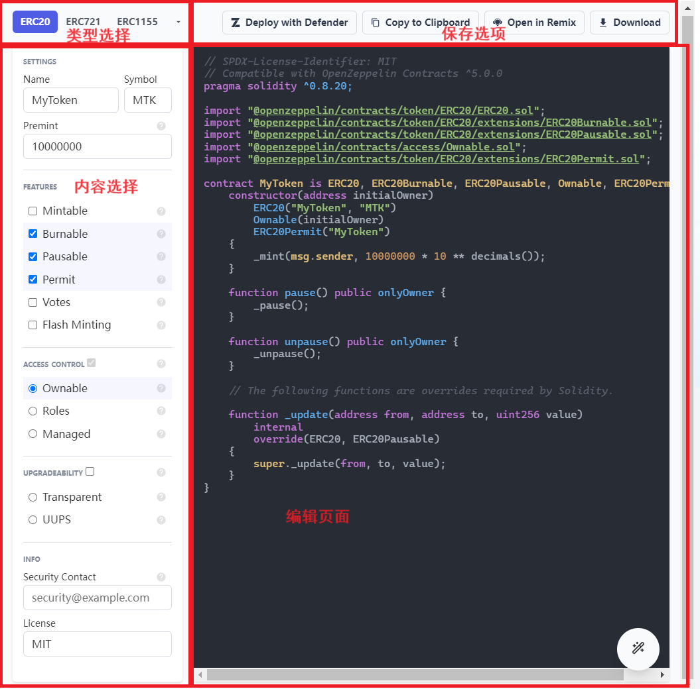
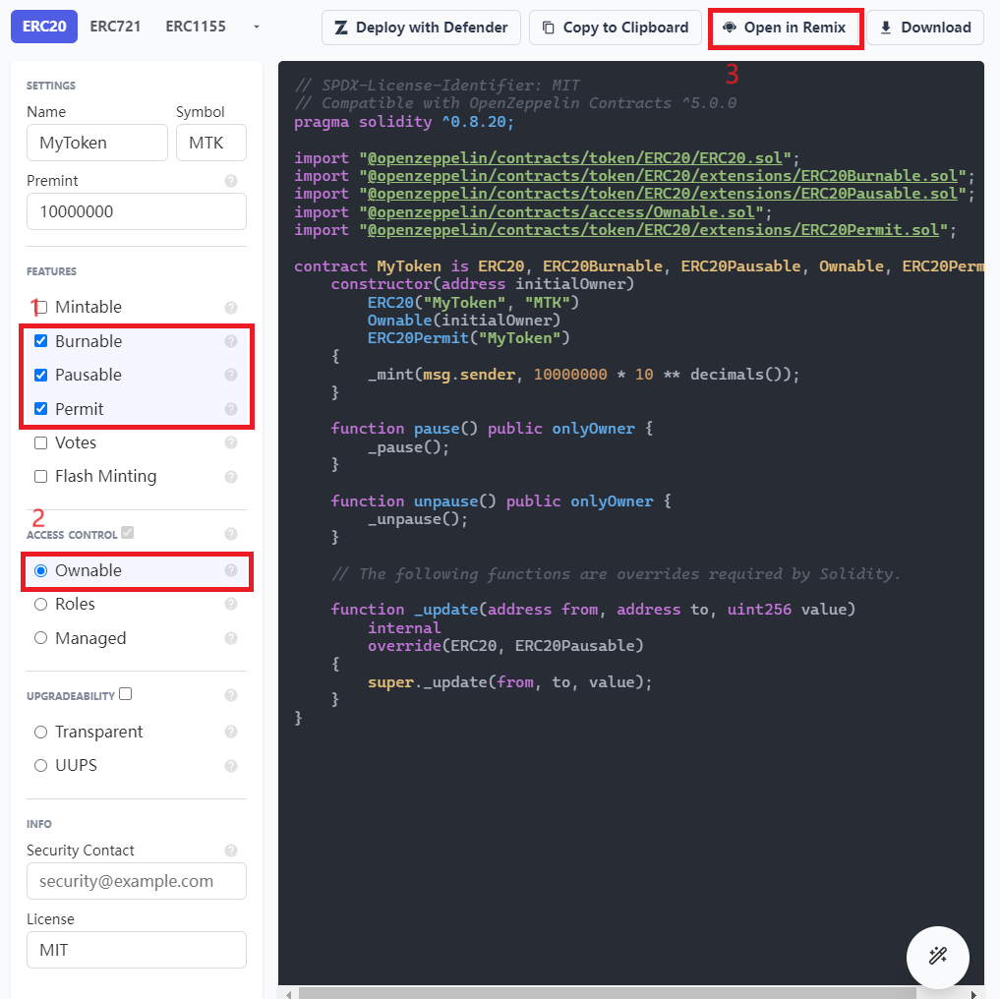
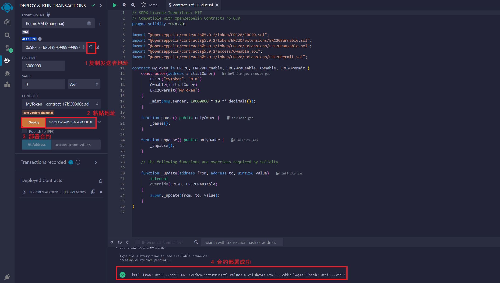
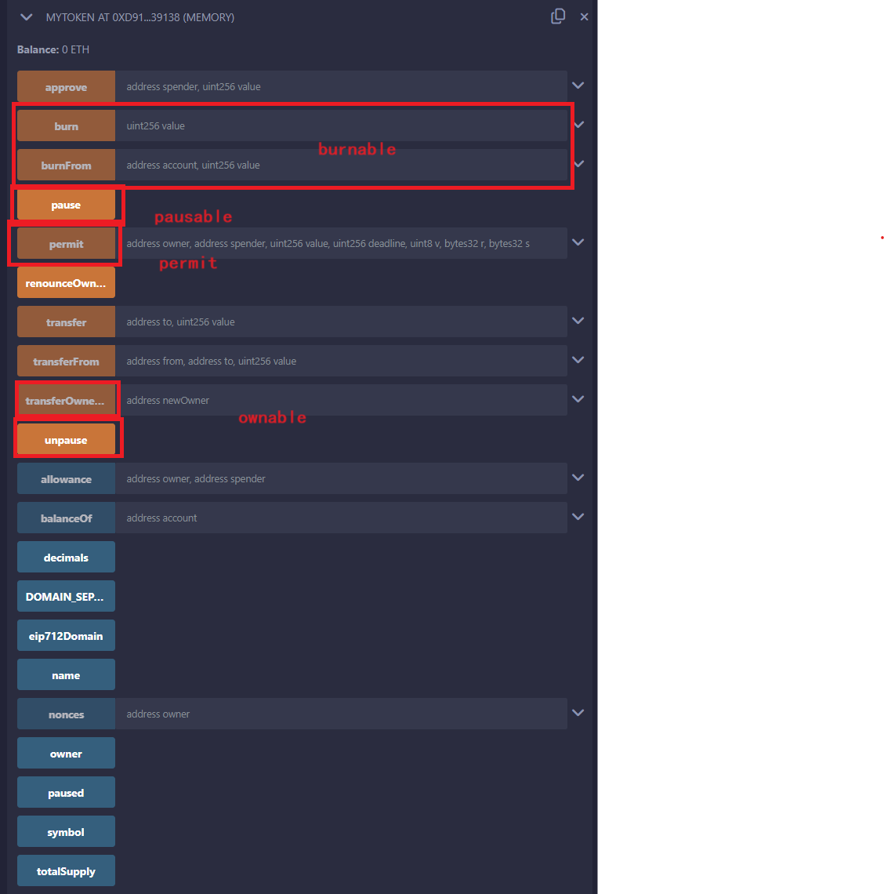

# WTF Solidity极简入门-工具篇8：Openzeppelin, Solidity的安全范式

我最近在重新学solidity，巩固一下细节，也写一个“WTF Solidity极简入门”，供小白们使用），每周更新1-3讲。

欢迎关注我的推特：[@0xAA_Science](https://twitter.com/0xAA_Science)

WTF技术社群discord，内有加微信群方法：[链接](https://discord.gg/5akcruXrsk)

所有代码和教程开源在github: [github.com/AmazingAng/WTFSolidity](https://github.com/AmazingAng/WTFSolidity)

-----
`Openzeppelin`是Solidity安全的最佳实践、拥有众多经过社区审查的库和最常用的 ERC 开发标准，最大程度的降低合约风险。这一讲我们将介绍如何使用Openzeppelin Wizard生成易用安全的Solidity合约。

**Openzeppelin官网**：[openzeppelin.com](https://www.openzeppelin.com/)

## 更安全的范式  

由于区块链是一个使用真实金钱构成的生态系统，对于solidity新手来说，天马行空的代码模式可能造成链上项目或者个人财产的重大损失和安全问题。solidity这门语言的难度更多在于对整个金融系统理念和区块链的理解而不是语言本身。
因此快速构建安全、易用的代码就变得尤为重要。庆幸的是Openzeppelin为这门语言提供了大量久经测试的语言模板，最大程度的保证了安全性。

## 使用Openzeppelin Wizard生成Solidity合约代码

### 1. 打开Openzeppelin官网的合约界面

打开官网进入`Openzeppelin Wizard`，我们可以看到以下几个面板：
1. 类型选择：可以选择不同 ERC 标准的模板合约。
2. 内容选择：可以添加不同合约功能的 `GUI`。
3. 编辑页面：代码编辑器。
4. 保存选项：将文本内容保存到任意位置，支持Remix、本地保存、剪切板。

### 2. 保存生成合约内容
按照图片所示在`features`栏选择复选框`Burnable`,`Pausable`,`Permit`，并在`access control`栏选择Ownable，观察编辑页面会随着复选框的选择而变化，随之代码生成了。最后用remix打开生成的代码(右上角`open in Remix`)

### 3. 在Remix成功部署

选择复制`ACCOUNT`地址，复制到**Deploy**按钮旁边，并且点击**Deploy**按钮部署，这一步是为了给合约的constructor构造函数传参。即可在下角看到合约部署成功。

### 4. 查看部署合约类型

在Remix部署合约之后，展开合约的可调用功能，可以看到合约已经具有了我们刚开始在Openzeppelin Wizard复选框选择的功能，如`Burnable`、`Pausable`、`Permit`、`Ownable`。

## 总结

仅仅通过点选就可以写出经验老道Solidity程序员写出的同款代码，并且久经安全测试，这就是Openzepplin库的强大功能。然而Openzeppelin Wizard只是整个仓库的很小一部分，更多相关库细节内容可以参见官方doc文件。

基本上想写出在商业上可用的Solidity代码的程序员必然需要了解Openzeppelin库，另一个角度参考别人的代码或许能给你更多的灵感，毕竟程序语言的发展就建立在前人造的轮子上面。

同时doc文件可能缺乏一些设计上的用意和思路解释，在此我还推荐Openzeppelin的官方博客，涉及整个仓库设计的更多细节和版本更替思路。

**Openzeppelin doc地址**：[docs.openzeppelin.com](https://docs.openzeppelin.com/)

**Openzeppelin blog地址**：[blogs.openzeppelin.com](https://blog.openzeppelin.com/)
