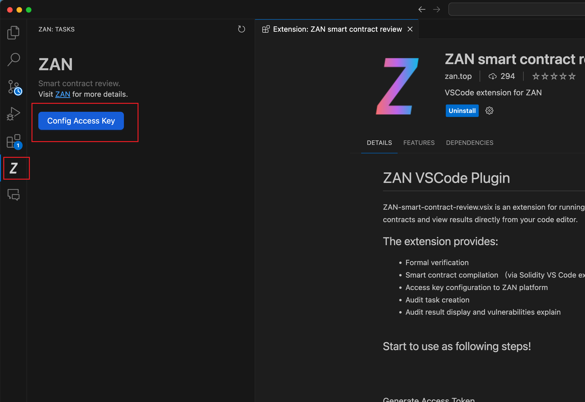

# WTF Solidity 极简入门-工具篇 8：ZAN，节点服务和合约审计等 Web3 技术服务

我最近在重新学 Solidity，巩固一下细节，也写一个“WTF Solidity 极简入门”，供小白们使用（编程大佬可以另找教程），每周更新 1-3 讲。

推特：[@0xAA_Science](https://twitter.com/0xAA_Science)｜[@WTFAcademy\_](https://twitter.com/WTFAcademy_)

社区：[Discord](https://discord.gg/5akcruXrsk)｜[微信群](https://docs.google.com/forms/d/e/1FAIpQLSe4KGT8Sh6sJ7hedQRuIYirOoZK_85miz3dw7vA1-YjodgJ-A/viewform?usp=sf_link)｜[官网 wtf.academy](https://wtf.academy)

所有代码和教程开源在 github: [github.com/AmazingAng/WTFSolidity](https://github.com/AmazingAng/WTF-Solidity)

---

## ZAN 是什么

[ZAN](https://zan.top?chInfo=wtf) 是一家 Web3 技术服务提供商，是蚂蚁集团下的一个技术品牌。它提供多种技术服务，有类似 Infura 和 Alchemy 提供的节点服务，包括各种链的 JSON-RPC 支持，以及其他高级的链 API。还有安全相关的合约审计、链上数据分析、KYC 等服务。另外还提供 toB 的解决方案，包括 RWA 资产的链上发行、零知识证明加速以及提供安全和可定制的区块链等。

接下来会针对开发者常用的节点服务、合约审计和链上数据分析（KNOW YOUR TRANSACTION）功能做介绍。在学习之前你可以先访问 [https://zan.top](https://zan.top?chInfo=wtf) 并完成注册和登录。

## 节点服务

### 创建 API Key

之后进入到节点服务的控制台 [https://zan.top/service/apikeys](https://zan.top/service/apikeys?chInfo=wtf) 创建一个 Key，每个 Key 都有默认的免费额度，对于小项目来说够用了。

创建成功后你会看到如下的页面：


接下来你就可以直接点击网站上的 Copy 按钮复制获取 API Key 了，但是大部分情况我们都是直接复制你需要的链的 RPC 地址，然后在你的 DApp 中使用。

### 使用 RPC 地址

不同的区块链通常都会有自己的基础的 JSON-RPC 的接口规范，比如以太坊的 JSON-RPC 接口规范，你可以在 [https://ethereum.org/en/developers/docs/apis/json-rpc/](https://ethereum.org/en/developers/docs/apis/json-rpc/) 获取。

ZAN 提供的接口自然也遵循这样的规范，比如你可以通过访问 `https://api.zan.top/node/v1/eth/mainnet/{YourZANApiKey}` 来访问以太坊上的数据。当然，我们通常可以直接使用链官方或者生态提供的 SDK 来调用接口。下面我们会介绍如何使用以太坊常用的一些 SDK 来调用 ZAN 提供的节点服务。

需要注意上面代码中的 `YourZANApiKey` 需要替换成你自己的 Key。另外在实际的项目中，为了避免你的 Key 被滥用，建议你将 Key 放到后端服务中，然后通过后端服务来调用节点服务，或者在 ZAN 的控制台中设置域名白名单来降低被滥用的风险。

#### 使用 ethers

在 ethers.js 中，我们可以利用 ZAN 提供的 API Key 来创建 JsonRpcProvider，与链上交互。

```javascript
import { ethers } from "ethers";

const provider = new ethers.providers.JsonRpcProvider(
  "https://api.zan.top/node/v1/eth/mainnet/{YourZANApiKey}"
);

provider.getBlockNumber().then((blockNumber) => {
  console.log("Current block number: " + blockNumber);
});
```

如上所示，我们可以通过 ethers.js 提供的 JsonRpcProvider 来访问 ZAN 提供的节点服务，获取当前区块的高度。更多的 ethers.js 的使用方法可以参考 ethers.js 官方文档：[ethers V5](https://docs.ethers.org/v5/api/providers/jsonrpc-provider/) | [ethers V6](https://docs.ethers.org/v6/api/providers/jsonrpc/#JsonRpcProvider)。

#### 使用 web3.js

在 web3.js 中，我们可以利用 ZAN 提供的 API Key 来创建 Web3Provider，与链上交互。

```javascript
import Web3 from "web3";

const web3 = new Web3(
  "https://api.zan.top/node/v1/eth/mainnet/{YourZANApiKey}"
);
web3.eth.getBlockNumber().then((blockNumber) => {
  console.log("Current block number: " + blockNumber);
});
```

如上所示，我们可以通过 web3.js 提供的 Web3Provider 来访问 ZAN 提供的节点服务，获取当前区块的高度。更多的 web3.js 的使用方法可以参考 [web3.js 官方文档](https://web3js.readthedocs.io/)

#### 使用 wagmi

在 ZAN 的控制台中选择以太坊主网的节点服务地址复制，复制后的地址添加到 wagmi 的 `http()` 方法中，如下：

```jsx
import { createConfig, http, WagmiProvider } from "wagmi";
import { mainnet } from "wagmi/chains";

const config = createConfig({
  chains: [mainnet],
  transports: {
    [mainnet.id]: http(
      "https://api.zan.top/node/v1/eth/mainnet/{YourZANApiKey}"
    ),
  },
});

export default function App() {
  return <WagmiProvider config={config}>{/** ... */}</WagmiProvider>;
}
```

如上，在 `WagmiProvider` 包裹的组件中你就可以使用 wagmi 提供的各种 hook 来访问以太坊的数据了。

### 安全设置

如果你在生产环境中使用，为了避免你的 API Key 被滥用或者攻击，你可以在 ZAN 的控制台中设置域名白名单，这样只有在白名单中的域名才能使用你的 API Key。


还有其他设置你也可以在 ZAN 的控制台中找到，比如你可以设置每个 Key 的访问频率限制，这样可以避免你的 Key 被滥用。也可以查看每个 Key 的使用情况，设置团队共同管理 Key 等。

### 测试网代币水龙头

在开发中，我们经常需要获取测试网的代币，你可以通过水龙头获取测试代币，ZAN 也提供了测试网代币的水龙头服务，你可以在 [https://zan.top/faucet](https://zan.top/faucet?chInfo=wtf) 中获取测试代币。

## 合约安全审计

合约安全审计是一个非常重要的环节，尤其是在 DeFi 项目中，合约的安全性直接关系到用户的资金安全。ZAN 提供了合约安全审计服务，你可以在 [https://zan.top/home/contract-review](https://zan.top/home/contract-review) 中提交你的合约进行审计。ZAN 提供了免费版和专家版，专家版是有人工介入，需要收费。我们以免费版为例，说明如何在 ZAN 中提交合约审计任务。你有两种方法，一种是在网站上提交，另外一种是通过 VSCode 插件提交。

### 通过 ZAN 网站提交

你可以在 [https://zan.top/review/reports/apply](https://zan.top/review/reports/apply?chInfo=wtf) 提交一个合约审计任务：


有多种提交方式，提交后会进入到自动化的程序进行审计，如下图所示，你需要等待几分钟。


需要注意的是，这种方式是自动化的审计，只能检测一些常见的漏洞，并无法保障合约的逻辑正确性，如果你的合约比较复杂，还是需要人工介入审计的。

### 通过 VSCode 插件提交

ZAN 提供了一个 [VSCode 插件](https://marketplace.visualstudio.com/items?itemName=zantop.zan-smart-contract-review)，你可以在你的 VSCode 中安装该插件，直接在 VSCode 中提交合约审计任务。

首先方案插件地址 [https://marketplace.visualstudio.com/items?itemName=zantop.zan-smart-contract-review](https://marketplace.visualstudio.com/items?itemName=zantop.zan-smart-contract-review) 点击 Install 唤起 VSCode 安装插件。

安装成功后左侧会有一个 ZAN 的图标，点击图标后可以看到一个 `Config Access Key` 的按钮。



点击按钮后配置你的 Access Key，Key 需要在 ZAN 的合约审计控制台中获取：


获取 Key 后填入 VSCode 插件配置中，然后你就可以在 VSCode 中提交合约审计任务了。

### 合约报告查看

合约分析完成后你可以在网站上查看报告：


比如上图是对一个简单的 ERC721 的[合约](https://github.com/ourmetaverse/our-metaverse-contract)的分析结果，你可以通过[https://zan.top/review/reports/public/b82c9992-bfce-4986-baff-5bb4e76e1eb9](https://zan.top/review/reports/public/b82c9992-bfce-4986-baff-5bb4e76e1eb9?chInfo=wtf)查看报告。

对于专家服务，会有多轮 AI + 专家人工审计后得到一个 PDF 报告，你可以访问[该链接](https://mdn.alipayobjects.com/huamei_hsbbrh/afts/file/A*tl-PR5pIIt4AAAAAAAAAAAAADiOMAQ/hebao_v3_20240313.pdf) 查看一个示例。


## 链上数据分析（KNOW YOUR TRANSACTION）

区块链上的数据都是公开透明的，然而要在浩瀚的链上数据中分析问题，查找线索也不是那么容易的事情。ZAN 提供了链上数据分析服务，你可以在 [https://zan.top/kyt/controller](https://zan.top/kyt/controller?chInfo=wtf) 中提交你的地址，查看交易的详细信息。


提交的内容可以是一个地址，也可以是一笔交易，如下图所示，你可以看到资金的流动情况，还会标记出有风险的地址：


可以用于资金追踪、巨鲸监控、反洗钱等等服务。对于专业用户，你可以使用 API 来调用，如下图你可以在控制台中获取你的 API Key：


```sh
## Replace {apiKey} with the API key you obtained from the ZAN dashboard.
## You can also replace the "eth" and "mainnet" with any other supported networks.
curl https://api.zan.top/kyt/v1/score \
     -H "Content-Type: application/json" \
     -H "Authorization:Bearer {apiKey}" \
     -X POST \
     -d "{\"objectId\":\"0xA160cdAB225685dA1d56aa342Ad8841c3b53f291\",\"objectType\":\"address\",\"analysisType\":\"\",\"chainShortName\":\"eth\",\"depth\":\"\"}"
```

如上面示例代码，你可以通过访问 `https://api.zan.top/kyt/v1/score` 来获取某一个地址的相关数据。

## 总结

这一讲，我们介绍了如何使用 ZAN 提供的各种 Web3 技术服务。ZAN 提供了丰富的服务，有面向 DApp 开发者的，也有面向商业机构，安全团队，研究机构等的服务，你可以根据自己的需求选择合适的服务。
